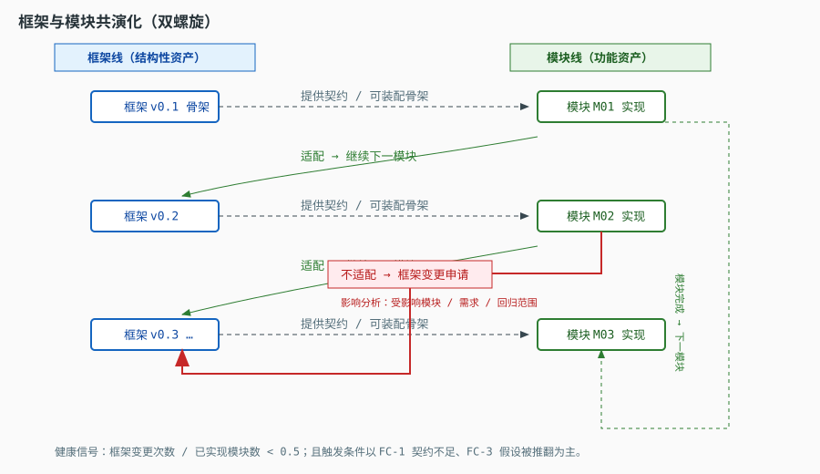

# software-engineering-gb · 国标化软件开发流程落地包

> 把「按国标走流程」和「框架 / 模块反复迭代」这两件事，合成一套**可执行、可门禁、可追溯**的工程规范，
> 并配一个**跑得起来的最小骨架**来证明这套规范不是纸面文章。

---

## 这个仓库要解决的两个核心命题

### 命题一：流程必须锚定现行国标，且每个阶段都有确定的交付物

不是"我们大概按 CMMI/敏捷走"，而是：

- 每个阶段**该产出什么文档**，有国标条款依据；
- 每个阶段**该开什么评审**，有准入/准出准则；
- 每个阶段的产出**如何被验证**（测试、追溯、审计）。

依据见 [`docs/00-标准依据/国标依据与标准矩阵.md`](docs/00-标准依据/国标依据与标准矩阵.md)。

> ⚠️ 最容易踩的坑：网上流传的"软件国标"大量是 1990 年代的老标准或已被替代的版本。
> 本仓库只以[国家标准全文公开系统](https://openstd.samr.gov.cn/bzgk/gb/)核验为**现行**的标准为锚点
> （例如软件测试的主标准是 **GB/T 38634 系列**，而不是常被引用的 GB/T 15532-2008）。

### 命题二：框架不是一次设计出来的，是被模块"逼"出来的

真实过程是一个**双螺旋**：框架先行 → 最小可运行 → 逐模块实现 → 实现暴露框架缺陷 → **框架再基线化** → 继续。

这不是"设计没做好"，这是**受控的迭代**。关键在于：
每一次框架变更都必须走**变更控制**，留下版本与追溯记录，否则迭代就退化成失控的返工。



详见 [`docs/01-流程与阶段/框架与模块共演化.md`](docs/01-流程与阶段/框架与模块共演化.md)。

---

## 阶段模型一览

| 阶段 | 核心动作 | 主要交付物 | 门禁（准出） |
|---|---|---|---|
| S0 立项 | 可行性、范围、约束 | 可行性研究报告、项目开发计划 | 立项评审通过 |
| S1 需求 | 需求获取、规格化、可验证化 | 软件需求规格说明、需求追溯矩阵 | 需求评审通过、需求基线建立 |
| S2 框架设计 | 架构框架、模块划分、接口契约 | 概要设计说明、模块清单、接口契约 | 框架评审通过、框架基线 v0.x |
| S3 骨架跑通 | 最小可运行骨架（Mock 模块） | 可运行骨架、CI 流水线、冒烟测试 | 骨架冒烟通过（**先跑起来**） |
| S4 模块实现 | 逐模块实现 + 单元测试 | 详细设计说明、模块代码、单元测试 | 模块评审 + 单元测试覆盖率达标 |
| S5 集成与系统测试 | 集成、系统级验证 | 集成测试报告、系统测试报告 | 测试准出评审通过 |
| S6 验收 | 合格性/验收测试 | 验收测试报告、用户手册 | 验收评审通过、产品基线 |
| S7 交付与维护 | 版本发布、问题回归 | 版本说明、回归测试报告、变更记录 | 发布评审通过 |

**门禁不是建议，是硬闸。** 见 [`docs/02-评审与门禁/评审门禁与检查单.md`](docs/02-评审与门禁/评审门禁与检查单.md)。

---

## 目录结构

```
06-swe-gb/
├── README.md                        ← 你在这里
├── CHANGELOG.md                     变更记录
├── CONTRIBUTING.md                  贡献与门禁执行方式
├── docs/
│   ├── 00-标准依据/                  国标依据与标准矩阵（含现行性核验结论）
│   ├── 01-流程与阶段/                阶段模型、交付物、框架-模块共演化
│   ├── 02-评审与门禁/                评审类型、准入准出、检查单
│   ├── 03-测试与回归/                测试级别/类型、缺陷管理、回归策略
│   ├── 04-配置与版本/                配置项、基线、版本号、变更控制
│   ├── 05-AI协作/                    AI 在流程各环节的用法与红线
│   └── demo/                        门禁工具用的示例 RTM 与 SRS
├── templates/                       20 份国标式文档模板（可直接填）
├── skeleton/                        最小可运行骨架（Python，零依赖）
├── tests/                           单元测试（L1）
├── tools/                           门禁工具：追溯矩阵、范围检查
├── .github/workflows/gate.yml       CI：门禁自动执行
└── .github/PULL_REQUEST_TEMPLATE.md PR 即 R4 模块评审检查单
```

---

## 快速开始

```powershell
# 1) 跑通骨架（含骨架自检 / 模块注册 / 依赖拓扑 / 模块号生成）
python skeleton/run_skeleton.py

# 2) 跑测试
python tests/test_module_system.py     # 零依赖可直接运行
python -m pytest tests -q              # 若已安装 pytest，则功能更完整

# 3) 跑门禁：需求-设计-代码-测试 追溯矩阵完整性
python tools/trace_matrix.py

# 4) 跑门禁：改动范围是否越界（相对基线）
python tools/scope_check.py
```

---

## 怎么用这套东西

1. **开新项目**：把 `templates/` 整体拷进你的仓库，按 S0→S7 顺序填，每填完一组就过一次门禁。
2. **只想要流程**：只看 `docs/`，把 `docs/02-评审与门禁/` 的检查单接进你的 PR 模板。
3. **想要自动化**：把 `.github/workflows/` 和 `tools/` 接进你的 CI，门禁自动跑。
4. **要用 AI 写文档**：看 [`docs/05-AI协作/`](docs/05-AI协作/)，那里规定了 AI 能写什么、必须人工确认什么。

---

## 免责与使用边界

- 本仓库是**工程实践参考**，不复制任何国标正文（国标正文有版权，请通过
  [国家标准全文公开系统](https://openstd.samr.gov.cn/bzgk/gb/) 或正式渠道获取）。
- 文档中引用的标准号、名称、状态以核验日期为准；**标准会被修订**，使用前请到官方平台复核。
- 采标（等同/修改采用 ISO/IEC/IEEE 的国标）部分，本仓库只做**条款级引用与落地映射**，不替代原标准。
