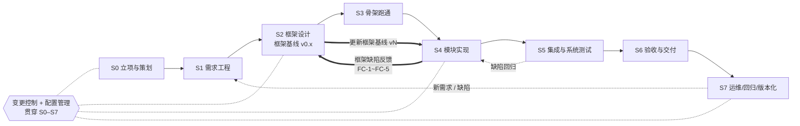

# 附件二 · 阶段流程与交付物

> **本附件回答**：一个软件项目从立项到维护，S0–S7 八个阶段各要**做什么、交出什么、过了什么才算过关**。
>
> 上游：[`../导读本.md`](../导读本.md) ｜ 依据核验日期：**2026-09**
> 配套：[`附件一-标准依据对照.md`](附件一-标准依据对照.md)（凭什么这么规定）、
> [`附件六-档位与裁剪.md`](附件六-档位与裁剪.md)（A/B 档怎么砍、怎么留痕）、
> [`附件三-评审与门禁.md`](附件三-评审与门禁.md)（R0–R8 检查单）

**一句话原则：没有通过门禁，不进入下一阶段。** 门禁不是形式，是风险闸门。

**标注约定**：

| 标记 | 含义 | 可否裁剪 |
|---|---|---|
| **【国标】** | 标准明文要求，标注标准号与条款号 | 强制性条款 ❌ 不可裁；推荐性条款 ✅ 可裁须留痕 |
| **【本仓库】** | 本仓库自行增加的工程强化项 | ✅ 可裁，须在项目开发计划的「裁剪说明」留痕 |

> ⚠️ 本附件引用的标准条款号来自本地 `standards/_md_mineru/` 的 **OCR 提取结果**。
> 过程名与条款号已尽量核对，但 **OCR 存在错字风险，正式对外文件引用前建议回原 PDF 核对**。

### 修订记录

| 版本 | 日期 | 改了什么 | 为什么 |
|---|---|---|---|
| V1.0 | 2026-09-21 | 初版：S0–S7 八阶段 + R0–R8 门禁 + 阶段内「准入 / 活动 / 交付物 / 准出」四段式 | 建立阶段流程 |
| **V1.1** | **2026-09-26** | ① **新增 [`§零 硬条款`](#零硬条款h-01h-26)**：把真实踩过的坑从"常见失败"提醒升格为 **H-01…H-26 可判定条款**（含判据、判定人、判不过怎么办、反例）；② **每个阶段拆为可交付的子步**（`Sx.y`，共 **73** 个子步），每步写死**入口条件 / 动作 / 产出物（编号规则 + 存放位置）/ 准出判据 / 责任人 / 批准人 / 常见失败与防呆 / 对应模板**；③ 各阶段「准出门禁」逐条挂 **H-##** 编号并补可判定项；④ 新增 **§十一 全阶段子步总表**（速查）、**§0.8 双源对照表**、**§0.9 判据面检查单（八个面）**、**§0.10 每道门禁通用检查单（24 项）**、**§0.11 技术评审主链（六环，不可跳）** | 前一版把教训写成"常见失败"表里的提醒，**提醒只被读到一次，违规照旧发生**。本次把教训改写成门禁能判、能红的条款 |
| | | **依据（经验来源，均为只读引用，未在本仓库复算）** | `WC-PD-001-v0.1`（流程缺陷台账 P-01…P-15）、`WC-PF-001-v0.1`（15 条流程反馈）、`WC-SCMP-001-v0.1` §8.4/§8.5、`WC-R4-DISP-001-v0.1` §五/§6.1/§七、`WC-CR-005/006` |

> **本版的自我限制（先说清楚，避免被读成"已经做到了"）**
>
> ⚠️ **H-01…H-20 里的每一处数字（"11 份阶段外产物""3 类 8 处账实不符""6 种以上假门禁形态"
> "批量脚本删掉 4 份文件""HLD 653→1026 行"）均引自经验来源项目的台账，
> 本仓库未复算、也无法复算**——本仓库没有那个项目的仓库与运行环境。
> 它们在本文中的作用是**条款的来源说明**，**不是本仓库的实测数据**（承 H-07、H-09）。
>
> ⚠️ **本版新增的条款是"写下来"，不等于"已经生效"**：按 [`../05-AI协作/AI协作规范.md`](../05-AI协作/AI协作规范.md)
> 与 H-13，条款的生效须由**人**批准；本版所有新增条款在获得批准前，**只作为待批稿**。
>
> ⚠️ **未落项**已逐条标出（如模板缺「证据类型」列、[`附件六`](附件六-档位与裁剪.md) 缺规模裁剪通则），
> 见 [§0.7](#07-不适用降级执行与须人裁的条目)。

---

## 零、硬条款（H-01…H-26）

> **为什么单立这一章。** 前一版把这些教训写在每个阶段的「常见失败」表里。结果是：
> **读的时候点头，做的时候照旧**——因为"常见失败"是**描述**，不是**判据**：
> 它不说谁在哪个阶段拿什么判、判不过怎么办，于是没人能据此判"红"。
>
> 本章把它们改写成 **可判定的硬条款**：每条都有 **条款文本 / 判据（可判定）/ 判定人与时点 /
> 判不过怎么办 / 反例（用于门禁自证）/ 来源**。**判据一律写成能变红的形式**（承 H-04）。

### 0.1 速查表

| 编号 | 名称 | 一句话 | 判定时点 | 承载 |
|---|---|---|---|---|
| **H-01** | 阶段外产物 | 超前起草必须**登记 + 带横幅 + 在所属阶段重做**，未撤销不得入基线；累计 > 3 份触发流程复盘 | 每道门禁 | R0–R8 通用检查单第 3 项 |
| **H-02** | 账实对账 | 登记行必须与**实存**逐行对账，且对账**必须由会失败的命令执行** | R0 建表、每次冻结前、R8 审计 | 配置审计 / 冻结前置 |
| **H-03** | 判据可判定性 | 每条判据必须有**操作定义 + 比对对象 + 期望值/阈值 + 一个反例**；评审**逐条判可判定性** | 每道门禁首项 | 全部 R0–R8 |
| **H-04** | 门禁自证与会红 | 每道门禁**自证会红**；**「未能校验」按「校验不通过」**（fail-closed） | CI + 每次门禁 | CI `gate.yml` + 本仓库 `tools/ci_self_check.py` |
| **H-05** | 判据辖区 | 凡决定产物**字节/身份**的配置面必须**有门禁归属**，不得留"无主判据面" | R0 建表、R5/R8 复核 | 判据辖区表 |
| **H-06** | 单一出处 | 每个事实只有一个**权威载体**，其它文档只能引用、**不得复述数值** | 每道门禁 + R8 全量 | 权威载体登记表 |
| **H-07** | 数字三要素 | 凡数字落笔必附**复算命令 + 时点 + 对象**；"实测"必须能指向一条命令 | 落笔即办 + 评审抽查 | 评审记录 / 报告 |
| **H-08** | 引用锚点 | 文档间引用用**节号 + 锚点原文**；**行号只用于代码与制品（+提交号）** | 落笔即办 + 评审抽查 | 全部文档 |
| **H-09** | 证据四要素 | 实测证据 = **命令 + 原始输出 + 环境版本号 + 提交号**；文档核查 = **路径 + 逐字引用**；`证据类型` 栏留空即不合格 | 每道门禁 | 评审记录（模板待补列） |
| **H-10** | 冻结 | **每完成一份产物即提交**；**评审对象 = 冻结提交的 blob**；冻结摘要**以仓库 blob 字节为准且命令写进表内** | 每份产物完成时 | Git 提交 + 评审记录 |
| **H-11** | 批量操作纪律 | 禁与内建别名同形的函数名；一律绝对路径；**先打印命中集合**；**改后复读断言**；**未提交状态下禁批量操作** | 每次批量操作前 | 变更单 / PR 描述 |
| **H-12** | 席位与"部分" | **有几部分技术就设几位专家**；无主部分不可；不得一位专家跨部分下判断；专家**评审文档、不写代码**；席位表随部分清单**一起冻结** | 评审组会时 | 评审记录 1.2 角色齐备性 |
| **H-13** | AI 不代签不代裁 | AI 只给**建议值 + 各选项代价**；**勾选与签字留人**；必须写明**"建议不等于是"** | 一切结论处 | 全部产物 + 评审记录 |
| **H-14** | 追认出口 | "先实施后补批"唯一合法出口 = **事后追认**（登记追认时点 + 批准人 + 回退点）；**追认不得成为默认路径** | 发生即登记 | 追认登记表 + R0/R6/R8 |
| **H-15** | 判据载体 | 每份产物必须写明**它对应阶段的准出判据由哪一份文档承担**；写不出的阶段**不得声称完成** | 产物首部 | 每份产物 + 门禁清单 |
| **H-16** | 验证面独立 | 验证面**不得使用被测实现自身的解析器/校验器/常量**；每条判定配**真的会失败的反例** | 测试设计 + R6 | 测试设计表 |
| **H-17** | 默认值覆盖 〔追加〕 | 交付形态存在默认值时，验收/系统用例**至少覆盖一次默认形态** | 测试设计 + R6/R7 | 用例设计表 |
| **H-18** | 未决项引用 〔追加〕 | `TBD-##` 引用必须写全 `<文档编号> 附录<X> TBD-##`；**裸写视为无效引用**；每条有责任人与关闭时点 | R1 | 未决项台账 |
| **H-19** | 反规模裁剪 〔追加〕 | **不得以"现状规模小"为由裁剪或合并文档形态**；引用规模理由必须回答"增长到 N 倍如何承载"；**接口类文档必须独立成文** | R0 裁剪批准 | 裁剪说明 + 附件六 |
| **H-20** | 机制必须有消费者 〔追加〕 | 每条机制必须写清**谁读 / 记在哪 / 不读会怎样**；三者缺一不得写进流程 | R0 建表 + 每道门禁 | 机制登记表 |
| **H-21** | 承诺可实测 〔追加〕 | 每处 `已实现/已防护/不存在/没有` 都要能指向**命令或测试位置**；给不出的降级为"未验证"；**不得留一句做不到的承诺** | R6/R7 前 + R8 | 能力声明清单 |
| **H-22** | 辩证处置 〔追加〕 | 专家意见**先复算前提**再决定；处置表**四态 + 代价 + 落笔坐标 + 谁定**；**反驳是合法输出**；**按部分归口**；获批前不改效力 | 每轮评审后 1 个工作日 | 处置表（[附件三](附件三-评审与门禁.md) §5.8） |
| **H-23** | 部分清单是一等公民 | 每阶段开工前**先冻结"本阶段技术部分清单"**；**按部分设技术官员（1:1）**；席位表与部分清单**同时冻结**；**不得有无主部分** | 每阶段开工前 | 部分清单 + 席位表 |
| **H-24** | 技术评审看内容 | **每阶段必有技术评审**（含立项）；「**格式/模板齐备**」与「**技术内容被评审并裁定**」**分列两条准出**，**只有前者不算过** | 每道门禁 | 反面清单（§0.2 H-24） |
| **H-25** | 反复评审到定案 | **轮次不设上限**直到无保留意见；**分歧不得上抛**：胜负只由**标准条款**或**实测**判定；判不了的**当场做实验** | 每轮评审 | 轮次记录 + 实验记录 |
| **H-26** | 无效轮次判据 | 一轮评审**未产生任何技术内容改动或明确裁定** ⇒ **无效、须重做**；**立项阶段的中心是"需求与目标口径"** | 每轮评审后 | 轮次前后冻结 blob 比对 |

> **效力**：H-01…H-26 与各阶段「准出门禁」同级，**全部不可裁剪**（A 档亦不可）。
> 它们不是"多做一点"，而是"不做则门禁不成立"——理由与 [§10.1](#101-不可裁剪项速查打印版) 的九条机制相同。

### 0.2 条款全文

#### H-01 阶段外产物：必须登记、必须带横幅、必须在原阶段重做

**条款.** 任何在上一道门禁通过之前产出的下游阶段产物，一律为**阶段外产物**，必须：

1. **登记**（产出当刻，不是事后补）：文件名与路径 / 产出日期 / 所属阶段 / **未过的那道门禁编号** / 登记人；
2. **带横幅**（文件首部 3 行，固定文案）：

   ```
   > ⚠️ 阶段外提前起草：本文件在 <Rx> 通过前产出，**不得作为任何门禁判据**。
   > 定版前必须在 <Sx> 阶段按 <Sx.y> 重做一遍，并回该阶段门禁重评。
   > 未撤销前**不得进入任何基线**。
   ```

3. **在其所属阶段重做**（是**重做**，不是"复核一下就算"）；重做后横幅改为
   `> 已经 <评审记录编号> 复核（原阶段外产物，<日期>）`——**标注不得删除**（删标注等于删证据）；
4. **入基线禁令**：未撤销者不得进入任何基线，基线记录 `纳入基线` 列须能逐行体现；
5. **超前起草不得成为惯例**：同一项目累计阶段外产物 **> 3 份**即触发流程复盘（暂停推进，先复盘为什么事前做不到）；
6. **必须能回答"不做它，本阶段结论会不会变"**：答"**不会变**"⇒ 该产物无存在价值，**删除**；
   答"**会变**"⇒ 说明它其实属于本阶段，**并入本阶段产物清单并补登**，不再以"超前起草"名义存在。

**判据（可判定）.** ① 阶段外产物登记表存在且每行 5 个字段齐全；② 文件前 10 行匹配 `阶段外提前起草`
（可直接 `Select-String -LiteralPath <path> -Pattern '阶段外提前起草'`）；③ 基线记录的 `纳入基线` 列中，
不存在未撤销的阶段外产物；④ 每份阶段外产物有一条书面的"不做它结论会不会变"回答。

**判定人与时点.** 配置管理员；**每道门禁**的通用检查单第 3 项。
**判不过怎么办.** 门禁**不准出**；该产物按"未授权开工的产出"处理，不得进入基线
（依据 **GB/T 8567-2006 §7.17 §4.1.1 a)**：对每个基线必须描述包含哪些配置项）。
**反例（用于门禁自证）.** 造一份无横幅、未登记的"已完成"HLD ⇒ 检查必须报红。

**来源.** 经验项目一次出现 **11 份**阶段外产物（`WC-SCMP-001` §8.4 `G-20`）；
`WC-PD-001` **P-10**（"阶段外产物在规范里无定义"）；`WC-PF-001` **P-10**。

#### H-02 登记行必须与实存对账，且对账要由会失败的命令执行

**条款.**

1. 任何登记表（配置项登记表、交付物清单、基线清单、证据清单）的每一行，
   其 `存放位置` 必须与**仓库实存逐行对账**；
2. `✅` 的语义**限定为**"该行 `存放位置` 路径在当前工作区存在**且在 Git 追踪内**"；
   **目标形态**（如"v1.0（待发布）"）**不得用 ✅**，须写出实存路径或写 `待冻结`；
3. 登记表必须有 **`登记状态`**（枚举：`已入库` / `待编制` / `待冻结` / `已废止`）与
   **`实存`**（`✅` / `⛔` + **证据命令**）两列——**禁止裸 ✅**（一个符号不承载两种含义）；
4. **对账必须是会失败的门禁，不是人工抽查**：对账命令逐行执行并打印命中集合与总数，
   任一行不通过 ⇒ 退出码非 0 ⇒ 门禁红。命令模板：

   ```powershell
   # 逐行对账：路径存在 + 在 Git 追踪内；任一失败即非 0 退出
   $rows = Select-String -LiteralPath <登记表> -Pattern '^\|\s*<?(?<p>[^\s|]+)>?\s*\|'
   foreach ($r in $rows) {
       git ls-files --error-unmatch -- ($r.Matches[0].Groups['p'].Value) *> $null
       if ($LASTEXITCODE -ne 0) { Write-Error "账实不符: $($r.Line)"; exit 1 }
   }
   ```

5. 机器核对的能力边界**必须写进条款**：**只能发现"不存在的"路径，发现不了"存在但绑错"的**
   （绑定错误只能靠提交号与内容抽样）；
6. **登记之前先查实存**：每一行写入登记表**之前**必须先 `Test-Path` / `git ls-files --error-unmatch`，
   **并把命令输出留在登记依据里**（先登记后补查 = 账实不符的制造方式）；
7. **编号全局唯一，行序按编号单调**；**标识不得复用**（作废项的编号不得回收给新项）；
   "**文件在哪**"本身就是标识的一部分（同一编号指向两处 ⇒ 缺陷）；
8. **空目录不算存在**：文件类存在判据 = **≥ 1 个受控文件在 Git 追踪内**；
9. **`存放位置` 列只写存放位置**：**"入参形态""调用方式""默认值"不得写进 `存放位置` 列**
   （写进去就会让"实存核对"永远对不上）；
10. **区分"未到阶段故不存在"与"该存在却不存在"**：前者记**起始状态 + 关闭时点**，后者是**缺陷**。
    **"状态过期"会把"已有"说成"没有"，也会把"没有"说成"已有"**——两个方向都算账实不符。

**判据（可判定）.** 登记表有 `登记状态` / `实存` / `存放位置` 三列；对账命令存在且**故意制造一行不存在的路径时非 0**；
`实存` 列每格有证据命令或 `⛔`；编号列无重复、无"跳号后回收"；每行能追溯到一条"登记前的查询输出"。

**判定人与时点.** 配置管理员；**R0 建表**、**每次基线冻结前**、**R8 配置审计**。
**判不过怎么办.** 门禁不准出；差异逐条登记为不符合项并给责任人与关闭日期。

**来源.** 经验项目一次查出 **3 类 8 处**账实不符（标"✅ 已入库"而文件不存在 / 位置写的是别的路径）；
`WC-SCMP-001` §8.4 `G-19`/`G-17⑤`/`G-21`；`WC-PD-001` **P-08**、**P-09**；
依据 **GB/T 8567-2006 §7.17 §4.1.1 a)**（基线逐项描述）与 **§7.17 §4.3 a)**（配置项状态须可收集/验证/存储/处理/报告）。

#### H-03 判据四要素，评审逐条判"可判定性"

**条款.** 每条判据（质量目标、准出条件、验收准则、用例预期结果、裁剪理由）必须给出**四要素**：

| 要素 | 要求 | 反例（缺它的样子） |
|---|---|---|
| **操作定义** | 怎么算、算哪个量、在哪个对象上算 | "响应可接受" |
| **比对对象** | 跟谁比：基线 / 阈值 / 上一版 / 合同条款号 | "符合要求" |
| **期望值或阈值** | 含**统计口径与容差**（如 P95、±5%、连续 72h） | "快" |
| **一个反例** | 什么结果判"**不通过**" | 只写通过条件，不写不通过条件 |

1. 四要素缺一即判 **不可判定**，不得进入评审结论；
2. 落笔**禁用词**：`可接受范围` / `合理` / `若干` / `待定` / `基本` / `符合要求`（无量化时） / `显示正确`；
3. 每道门禁的**首项**就是"**判据可判定性检查**"：逐条判，判不了的**当场退回**；
4. 强判据标准：**两个不同的人按同一判据应得到同一结论**——做不到的就是不可判定。

**判据.** 判据登记表（见 [§0.3](#03-判据登记表模板每道门禁首项要交的就是这张表)）逐行四要素非空；
禁用词零命中（可扫）；每条判据有一个**具体的反例**（不是"若不符合则退回"这种同义反复）。

**三条附加要求（来自经验来源的判据失效形态）：**

- **判据对象必须是本项目产物**：不得用上游模板的占位数据、示例数据、`docs/demo` 数据来判本项目的账；
  **未产出时应告警跳过并记「未校验」，禁止退回模板/示例**
  （经验来源的原话：「**"未校验"要说出来，不能假装校验过**」；
  其门禁的失败模式"**不是报错太多，而是该报错时不报错**"）。
- **性能、规模、容量类判据必须给两列环境**：`被测环境` 与 `目标环境`，并写明差异与折算依据。
  经验来源实测：同一性能量在 tmpfs 与 btrfs 上相差 **2300 倍**，据非目标环境数字下的结论已作废。
  **在非目标环境测出的数字不得作为判据**，只能作为参考值。
  规模上限必须**换算为可判定的资源预算**（如"100 万条 ⇒ 冷启动 ≤ T 秒、峰值 RSS ≤ M MB"），
  不得只写"支持大数据量"。
- **缺陷严重度只升不降**：同一缺陷的级别一旦判定，后续只能维持或上调；
  下调必须由**原判定人的上级**书面说明理由。

**判定人与时点.** 评审主持人 + 质量保证；**每道门禁的首项**。
**判不过怎么办.** 当场退回该判据；若它是准出条件，则该阶段**不得声称完成**（承 H-15）。

**来源.** 经验项目判据写成"可接受范围 / 合理 / 若干 / 待定"；
`WC-PD-001` **P-03**（"三列齐备"≠"可判定"）、**P-04**（同一条度量规程给出两个相反读法 ⇒ 判据本身坏了）。

#### H-04 每道门禁必须自证会红；「未能校验」按「校验不通过」处理

**条款.**

1. **自证会红**：每个门禁脚本/检查项必须提供**负向自证**（`--self-test` 或一条被记录的变异实测）；
   自证输出**必须打印被注入的失败断言与观察到的非零退出码**。**只打印 `✅ passed` 者视为"未自证"**；
2. **未自证者不从清单移出**：标注「**未自证**」并列为 **R6 不准出项**
   （**宁可有名无实被看见，不可无声消失**——"移出清单"是用不可检出的删除提升可信度）；
3. **fail-closed**：工具因环境、配置、**未声明**而无法校验时，必须按**校验不通过**处理（退出码非 0）；
   CI 作业**禁止** `continue-on-error: true`（本仓库已于 2026-09-21 移除 `scope` 作业的该项，
   见 [`附件八`](附件八-责任时间与阶段分解.md) §6.3「**未能校验 ≠ 校验通过**」——本条把它升格为通用条款）；
4. 用于**判定**的命令不得把管道放进 `$( )` 当 `echo` 的参数（管道失败会被吞掉）；
   判定行必须**先赋值再判定**；
5. 门禁自检工具必须**校验内容，不只校验存在性**（只验作业名 = 假门禁）；
6. **"跳过"不构成验证**：`#[ignore]`、`skip`、`if: false`、被注释掉的检查项一律记 `未执行`，
   **不得计入"通过"**；被判定的门禁必须实际执行；
7. **门禁正确 ≠ 门禁被强制**：本条款只保证"门禁判得对"；
   若仓库无分支保护（CI 红了仍可直接推主线），则必须在项目开发计划里**明文写出这一残余风险**，
   并用**打标签前置动作**（见 H-02）补上强制力；
8. **长期红灯也不再是检查**：一个**长期失败**的检查只会训练人忽略红色。
   门禁一旦连续 **2 个里程碑**处于红态而未被处置，必须**要么修它、要么把它降级为观察项并写明原因**
   ——不允许"红着红着就习惯了"；
9. **关键承诺必须做一次变异实测（mutation）**：对"删掉它系统就坏了"的关键实现，
   至少做一次**注入失败**（把该实现改成空操作/返回成功），并记录"**测试套件是否变红**"。
   **注入失败后仍然全绿的检查，等于没有检查**（这是 H-04 最硬的判据，见下反例）；
10. **门禁必须打印它判定的输入来源**：结论之前先打印"本次判定读的是哪个文件/哪份声明/哪个提交"。
    **示例数据、模板数据、占位数据一律不得产出"通过"**——只能产出"未校验"；
11. **「不可满足的门禁」等于没有门禁**：门禁强度是**阶段属性**，必须用**显式的阶段开关**表达
    （而不是把某个门槛硬编码成永远达不到的值）。**阶段开关本身必须被断言存在**
    （"有定义"这件事要被检查，否则删掉开关常量就等于永久放宽且不报错）；
    **未翻转的阶段开关必须在每次门禁输出里点名告警**，不得静默流传；
12. **解析失败必须报错退出，不得静默降级**：参数解析、配置解析、策略解析出现坏值时，
    必须**拒绝启动或拒绝判定**（非 0 退出），**不得用 `ok()` 之类把它关掉**——
    "判据静默降级"与"判据不通过"是完全不同的两件事，前者会让安全参数形同虚设；
13. **门禁报告必须打印执行/跳过/忽略三组计数**：只报"通过"而不报"跑了多少、跳过多少"的报告，
    不构成门禁证据。

**判据.** 门禁清单每行有 `自证方式` 列并指向一条实际命令与输出；CI 中无 `continue-on-error: true`、
无 `if: false`、无 `#[ignore]` 计入通过；**故意注入失败时门禁必须非 0**（这条自证本身要留输出）；
至少有一次变异实测记录，且**对照组**（一个必然会被发现的改动）**确实变红**
（对照组不变红说明方法本身无效，必须重做）；报告含执行/跳过/忽略计数。

**判定人与时点.** 质量保证；CI 每次运行 + 每次门禁。
**判不过怎么办.** 该门禁视为"装了但判不了"，登记不符合项；**R6 不准出**。

**反例（经验项目实测，本仓库未复现）.** ① 门禁工具在"**没有声明**"时返回**成功**；
② 门禁自检工具**只验作业名、不验内容**。两者都是"看起来在跑，其实判不了"。

**来源.** 经验项目出现 **6 种以上**假门禁形态；`WC-PD-001` **P-12**、`WC-R4-DISP-001` **§七**、
`WC-CR-005`；本项目 `tools/ci_self_check.py` 与 `.github/workflows/gate.yml`。

#### H-05 判据辖区：不得留"无主判据面"

**条款.**

1. 凡**决定产物字节或身份**的配置面——`.gitattributes`（换行/编码/二进制判定）、`.gitignore`、
   `.editorconfig`、CI 工作流、**模板文件本身**、门禁工具脚本、版本号与标签规则、依赖锁定文件——
   **必须纳入某一道门禁的辖区**，并在门禁清单中写明；
2. 若确不纳入，必须**明文写出由谁判、判什么、多久判一次**；
3. **禁止**出现"另属他门"而实际**没有别的门**的情况；
4. 落地载体：**判据辖区表**（配置面 / 归属门禁 / 判定人 / 判定命令或依据 / 复核时点），
   **表中不得有空行，也不得有指向不存在门禁的行**；
5. **每条检查必须同时登记两样东西：「受审集合（面）」与「判据（点）」**——
   只登记判据而不登记它扫哪些文件/哪些目录，就会出现"**判得了，但没让它判**"：
   经验来源的原话是「不是"没有检查"，而是"**检查存在、面没盖到**"」
   ——即"检查在文档这一面**目前就是装饰**"。**扩面之前必须先归零历史违规**，否则扩面即全红；
6. **"装置存放位置"本身是判据**：CI 工作流放在子目录里等于不存在（平台只发现仓库根的工作流），
   门禁脚本放在仓库外等于没有入口——**结构的可达性必须先被判定，再谈它判什么**；
7. **辖区外变更必须逐条列出，不得静默丢弃**：门禁遇到不在自己辖区的改动，
   必须打印 `[另属他门] <路径>` 并**指明那扇门是谁**；指不出来的，按"无主判据面"登记缺陷。

**判据.** 判据辖区表存在且被引用的门禁编号都在 R0–R8 或 CI 作业清单中可命中；
新增配置面（新文件类型、新 CI 作业、新工具脚本）时该表在同一提交内更新；
每条检查有「受审集合」列且非空；辖区外变更在门禁输出里可被检出；CI 工作流与门禁脚本的**存放位置**可被平台发现（有真实运行编号）。

**判定人与时点.** 质量负责人（表的所有者）；**R0 建立**，**R5/R8 复核**。
**判不过怎么办.** R0 不准出（表未建立）；已存在无主面时登记不符合项并指定**临时判定人**。

**反例（经验项目实测）.** `.gitattributes` **决定全仓文件的字节**，却**不在任何门禁辖区内**，
被判为"另属他门"，而**没有别的门**。
> 本仓库 `.gitattributes` 已存在（`*.md text eol=lf`、`*.ps1 text eol=crlf` 等）——
> 它正是本条要管的对象：**换行/编码错了，全部制品的字节都错**。

**来源.** `WC-SCMP-001` §8.4 `G-07`；本轮坑 5。

#### H-06 单一出处：每个事实只有一个权威载体

**条款.**

1. 每个**事实类信息**（数值、条数、清单、编号、口径）**只有一个权威载体**；
   其它文档**只能引用**（写 `见 <文档编号> §<节>`），**不得复述数值**；
2. **权威载体登记表**（事实 / 权威载体（文档编号 + 节）/ 引用方清单 / 裁定人）；
3. **同一编号只在一个编号空间内使用**；跨文档引用未决项须全限定（见 H-18）；
4. **发现即登记为缺陷**：同一量在不同文档出现两个及以上不同写法，
   或同一编号在两套体系中同号不同义 ⇒ **当日登记为不符合项**，
   由权威载体持有者裁定唯一值，其余文档改为引用；
5. **"自称以 X 为准"不构成"已对账"**：只写一句"本表以另一份文档为准"而从未逐项比对，
   等于**把唯一基准写在注释里**——必须**逐项对账并留下对账输出**，不一致处逐条处置（不删数）；
6. **更正必须回灌全部受影响文档**：一处数值更正后，必须给出**检索命令**并在全仓执行，
   把其余受影响处一并改掉；**被废止的关键名必须是"零命中"或显式标注"已废止"**
   （零命中类结论也要留命令与输出，见 H-09 否证子档）。

**判据.** 权威载体登记表存在；同一量在全仓的取值集合大小为 1（可扫）；
"以 X 为准"类表述旁有对账输出；更正后有全仓检索命令与其输出；废止名零命中或标"已废止"。
**判定人与时点.** 质量负责人 + 配置管理员；**R0 建表**；**每道门禁**加"单一出处"检查项；**R8 全量复核**。
**判不过怎么办.** 门禁不准出；差异登记后限期消解。

**反例（经验项目实测）.** 同一个量在不同文档里 **6 / 8 / 9** 三种写法；`TBD-##` 在两套体系里同号不同义。
**来源.** `WC-PD-001` **P-05**（两套质量目标并存且不等值）、**P-06**（TBD 跨文档重号）；`WC-PF-001` P-05/P-06。

#### H-07 数字三要素：凡数字落笔，必须附「复算命令 + 时点 + 对象」

**条款.**

1. 文档/报告/评审记录中任何**计数型数字**（"48 项测试""154 个文件""13 条"），
   必须在该数字**同一处**给出三要素：**复算命令**（可直接粘贴执行）、**复算时点**（YYYY-MM-DD）、
   **对象**（对哪个提交 / 哪个路径 / 哪个版本复算）；
2. **"实测"两个字必须能指向一条命令**；指不到 ⇒ 视为**未实测**，必须改写为 `未核实` 或补齐命令；
3. **能力边界必须写明**：机器抽查**只能发现"不存在的"与"同文档内自相矛盾的"**，
   **发现不了"存在但绑错"的**（如提交号写成了另一个真实存在的提交）；
4. **不做全量计数核对**（计数天然漂移，全量核对会产生大量误报并吃掉 CI 额度）——
   只核两类：**同文档内自相矛盾**、**"实测"无命令**。

**判据.** 抽查每个"实测/实测数据"字样附近 200 字符内是否有命令与提交号；
同文档内同一量出现两个值 ⇒ 报错。**留空或指不到命令 ⇒ 该数字降级为"未核实"。**

**判定人与时点.** 质量负责人；落笔即办 + 每道门禁抽查。
**判不过怎么办.** 该数字不得作为判据使用；补齐后可复评。

**来源.** 经验项目把未复算的数字都写成"实测"（`WC-PD-001` **P-11**、`WC-PF-001` **P-11**；
其台账本身也出现过"8 处 / 9 处"的自相矛盾，靠**当场复算**订正）。

#### H-08 引用锚点：文档间用「节号 + 锚点原文」，代码与制品才用「行号 + 提交号」

**条款.**

1. **文档 → 文档**的引用一律写 **`<文档编号> §<节号>「<锚点原文片段>」`**；
   **禁止**只写行号；也**禁止**只写节号而无锚点原文（节号会重排，锚点原文不会）；
2. **代码 / 脚本 / 制品 / 配置**的引用才用 **`<路径>:<行号> @<提交号>`**（行号必须与提交号绑定）；
3. 理由：**文档行号在同一轮修订中会分钟级漂移**。

**判据.** 抽查引用可在被引文档中按锚点原文**逐字命中**：
`Select-String -LiteralPath <被引文档> -Pattern '<锚点原文>' -SimpleMatch` 有命中。
**判定人与时点.** 评审记录人；落笔即办 + 每道门禁抽查。
**判不过怎么办.** 登记为不符合项，限期改为可命中的锚点。

**反例（经验项目实测）.** 同一轮修订中 HLD 从 **653 行漂到 1026 行**，此前所有行号引用同时失效。
**来源.** 本轮坑 8；`WC-R4-DISP-001` **§6.1 落笔纪律**。

#### H-09 证据四要素，并按证据类型分档（`EV-11a` / `EV-11b`）

**条款.**

1. **实测数据**证据（`EV-11b`）= **可复现命令 + 原始输出 + 环境版本号 + 代码提交号**；**缺一即"未归档"**；
2. **文档核查**证据（`EV-11a`）= **文件路径 + 逐字引用原文**；
3. 评审记录必须设 **`证据类型`** 栏，取值 `EV-11a 文档核查` / `EV-11b 实测证据归档编号`；
   **该栏留空即判证据不合格**；
4. **分档按证据类型，不按阶段**：凡引用运行结果者**一律按实测档**，
   **不得以"阶段早"降档**（"S0 阶段所以证据可以弱"是错误推理）；
5. 若某类证据在所评阶段确实无法产生，须在记录中显式写"**本项为文档核查 + 能力边界**"，
   **不得写成"已实测"**；
6. **证据档六字段**（`EV-11b` 归档件的固定结构）：
   ① 可复现命令 ② **原始输出（粘贴，不改写）** ③ 环境版本号（OS/运行时/依赖版本）**＋代码提交号**
   ④ 执行人 ⑤ 执行时点 ⑥ 所在机器；
7. **「待归档」与「不合格」严格分开，不得混用**：
   「待归档」= 数据可得但尚未归档，**可限期补**；
   「不合格」= 数据不可得或已作废，**结论必须撤回**；
8. **取不到原始输出者一律写 `【待验证】` 并附验证命令，不得编造**；
9. **每份证据档必须写一节「本档不能证明的事」**（写明能力边界）——
   不写这一节的证据档视为**未完成**；
10. **正反例必须同档**：只给单侧结论（只给通过条件，不给反例）的判据视为**未校验**；
11. **复核意见与处置表本身也要标证据等级**：必须标出"**哪一步是事实、哪一步是推论**"；
    执行员对处置表同样适用"**先核实再执行**"——处置表是"意见的合并"，它本身也会失真。

**判据.** 评审记录逐行有 `证据类型`；`EV-11b` 行六字段齐全（③ 含提交号）；`EV-11a` 行有两要素；
证据档有「本档不能证明的事」一节；存在"已实测"字样但指不到命令者 ⇒ 不合格；
「待归档」与「不合格」未被混用。

**判定人与时点.** 评审记录人 + 质量保证；每道门禁。
**判不过怎么办.** 证据不合格 ⇒ 该项判据**不得计入结论**（等同不通过）。

> ⚠️ **待落项（未完成，不得读成已完成）**：本仓库模板
> [`../../templates/06-评审类/01-阶段评审记录.md`](../../templates/06-评审类/01-阶段评审记录.md)
> **目前尚无 `证据类型` 列**（本版实测：对 `templates/` 全库检索 `证据类型` **零命中**）。
> 在该列补齐之前，**B 档评审记录须手工加列**；模板增列归**模板维护方**办理。

**来源.** `WC-PD-001` **P-07**、`WC-PF-001` **P-14**；经验项目 `EV-001`…`EV-008` 证据归档件。

#### H-10 冻结：每完成一份产物即提交；评审对象 = 冻结提交的 blob

**条款.**

1. **每完成一份产物即提交**（不得攒着一起提）；提交信息含产物编号与阶段；
2. **评审对象 = 冻结提交的 blob**：评审材料表中必须写 `<提交号>`，
   评审记录"评审对象"格必须写 **`<path> @ <commit>`**；
3. **冻结摘要一律以仓库 blob 字节为准，且把命令写进表内**，
   **不得用工作区字节**（工作区随时可变，用工作区字节等于没冻结）。
   固定命令：

   ```bash
   git rev-parse HEAD                                  # 冻结提交
   git ls-tree <commit> -- <path>                      # 该提交下该路径的 blob 与哈希
   git hash-object <path>                              # 工作区字节（仅作对照，不作判据）
   git status --porcelain                              # 必须为空（就本次被评审对象而言）
   ```

4. **任何"未提交的修订"不构成评审对象**，也不得作为门禁判据。

**判据.** 评审记录 `评审对象` 栏含提交号；冻结摘要表内有命令与输出；
被评审对象对应的文件在 `git status --porcelain` 中不出现。

**判定人与时点.** 配置管理员；每份产物完成时 + 每次评审组会前。
**判不过怎么办.** 评审**无效**（等同未评审）；不得进入基线。

**来源.** 经验项目**真发生过**：**未提交的修订被误删，无法从 git 恢复，只能重做**；本轮坑 10。

#### H-11 批量操作纪律（文件系统与文本替换）

**条款.** 一切批量文件操作与批量文本替换，必须同时满足：

1. **禁止定义与内建别名同形的函数名**（`rd` / `del` / `rm` / `cp` / `mv` / `cat` / `ls` 等）——
   **别名优先级高于同名函数**，会造成静默误伤；
2. 一律使用**绝对路径**；中文路径**从目录枚举取，不手打**；
3. **先打印命中集合**（含命中数与逐条路径），**断言命中数符合预期**后再执行；
4. **改后复读断言**（重新读取并断言替换后的内容）；
5. **禁止在"有未提交成果"的状态下做批量文件操作**（先提交或先 stash）；
6. 多行插入用**编辑器/工具**，不用 shell 拼长多行字符串；
7. **`Set-Location` 不改变 .NET 的相对路径基准**：`[System.IO.File]` 类调用只认
   `[Environment]::CurrentDirectory`——**混用两者会造成"看着改了，其实改的是另一个文件"**。
   凡用 .NET 文件 API，必须同时设置两者或（更稳的）**只用绝对路径**；
8. **数组字面量必须显式定型并断言元素数**：用 `[string[]]@("a","b","c")`，
   循环前 `if ($files.Count -ne 3) { throw }` 并逐个 `Test-Path`——
   否则逗号优先级会造出**嵌套数组**，`foreach` 只跑一次，
   形态是"**看着像报错、其实什么也没查**"；
9. **编辑后把该文件行尾统一为 LF**（Windows 上编辑器常写 CRLF，而仓库侧是 LF）；
10. **提交信息里的每一个结论都必须在暂存区上复算，而不是在工作区上**——
    **工作区有、索引没有，就等于没有**（这正是 `git add -A` 会骗人的地方）；
11. **只写纪律不够，必须机械化**：同一条批量操作纪律**被写下来之后仍然复发**过，
    因此凡能机械化的（命中集合打印、复读断言、行尾检查、路径存在性）**必须做成脚本或门禁**，
    不得以"下次注意"结案。

**判据.** 操作记录（PR 描述 / 变更单 / 运行日志）含**命中集合输出**与**复读断言输出**；
操作前 `git status --porcelain` 为空；批量操作脚本中无与内建别名同形的函数名（可扫）；
数组赋值处有 `Count` 断言；被编辑文件行尾为 LF（可扫 CRLF）。

**判定人与时点.** 实施者自查 + R8 配置审计抽查。
**判不过怎么办.** 视为高风险变更，须在变更单中补**回退点**与**恢复演练结论**。

**反例（经验项目实测）.** 同一陷阱**两次触发**，第二次**删掉 4 份文件（含两份签署对象）**，
根因是 PowerShell 别名 `rd` = `Remove-Item` 优先级高于同名函数。
**来源.** 本轮坑 11；`WC-CR-006`。

#### H-12 评审席位与"部分"一一对应

**条款.**

1. **有几部分技术就设几位专家**；**不得出现"无主的部分"**；
2. **不得一位专家跨部分下判断**（跨部分结论无效）；
3. 专家**评审文档、不写代码**：评审人不得是同一交付物的实现者；
4. 席位表逐行：**部分 / 该部分评审专家 / 判定范围 / 回避关系**；
5. **席位表必须随"部分清单"一起冻结**（同一提交）——部分清单变了，席位表**同一次**跟着改，
   不得会后临时调整；
6. 部分清单的划分口径由项目负责人在 R0 定；本文建议按**框架分层 + 接口契约边界**划分，
   使每一部分都有明确的契约面与责任人。

**判据.** 席位表与部分清单**逐项对齐**（数量相等、覆盖完备、无跨部分）；
评审记录 1.2「角色齐备性核对」表无缺项、无跨部分。

**判定人与时点.** 评审主持人；**组会前**（材料送达时即核对）。
**判不过怎么办.** 评审**无效**（承 [`附件三`](附件三-评审与门禁.md) §1.4 铁律二：未签字的评审记录 = 未评审），
须重新组会。

**来源.** 项目负责人的直接要求（本轮坑 12）。

#### H-13 AI 不得代签、不得代裁

**条款.**

1. AI 只能给「**建议值 + 各选项代价**」；**勾选与签字留给人**；
2. 任何文档中出现的 **AI 裁定 / 批准 / 验收 / 关闭结论一律无效**；
3. AI 产出处必须写明 **「建议不等于是」**，并标注
   `本结论为建议，须经 <角色> 批准后生效`；
4. **质量保证（SQA）与配置管理（CM）角色不得由 AI 担任**；
5. AI 可以起草条款文本、跑命令、出证据；**不可以主张某条款"适用"或"不适用"**。

**判据.** 签署栏签署人非 AI；AI 代拟结论处有"建议不等于是"标注；
全仓无"AI 已批准 / AI 已确认"类表述。

**判定人与时点.** 质量保证 + 批准人；一切结论处。
**判不过怎么办.** 该结论无效，回退到人重签；据此已推进的工作按 H-14 追认或回退。

**来源.** `WC-PD-001` §三「需要重新指派人」；`WC-SQAP-001` §3.1（AI 不得任 SQA/CM、不得签）；
[`../05-AI协作/AI协作规范.md`](../05-AI协作/AI协作规范.md)。

#### H-14 事前授权与事后追认：给"先实施后补批"一个唯一合法出口，且不得做成默认路径

**条款.**

1. 未过门禁即推进，**只有两条合法路径**：
   **(a) 事前授权**——授权记录须在推进**之前**产生，含授权人 / 范围 / 期限 / **回退点**；
   **(b) 事后追认**——既已发生，则必须登记：**追认时点 + 批准人 + 回退点 + 原门禁编号**，
   并同时登记为「**阶段顺序偏离**」；
2. **不得把追认做成默认路径**：同一项目**追认 ≥ 2 次**即触发流程复盘（停止推进，
   先复盘"为什么事前授权做不到"）；
3. 未能事前授权且未获追认的推进，其产出按 **H-01 阶段外产物**处理，**不得进入基线**；
4. **因签名阻塞而停等是合法状态**，**不计为进度缺陷**——
   不要为了"看起来有进度"而制造追认；
5. **不引入**"阶段外并行推进"的模板化授权机制（见 [§0.7](#07-不适用降级执行与须人裁的条目) 理由）；
6. **追认的实质判据（最关键的一条）**：**批准必须是对"尚未发生的事实"的判断，
   而不是对"既成事实"的追认**。据此，先实施后补批**只在同时满足两个条件时**才可能被追认：
   **(i) 该变更"只增强、不放宽"**（不降低任何判据、不删除任何检查、不缩小任何辖区）；
   **(ii) 变更时点确实无人在场可批**（须写明是谁、为何不在、何时可批）。
   凡**放宽门禁、删除判据、缩小检查范围**的变更，**一律不得先实施**——这类变更没有追认出口；
7. 追认案件的仓库状态要求：**获批之前，仓库里不得出现该变更的任何一行改动**（先拟稿、不动手）。
   这样"批准"才是**可验证的判断**，而不是对既成事实的追认；
8. 追认登记表另设 **`只增强不放宽`** 栏（是/否），填"否"者**直接判违规**，不进入追认流程。

**判据.** 追认登记表逐行含 4 字段 + `只增强不放宽` 栏；同一项目追认次数可计数且 ≤ 1；
被追认的变更在批准提交之前无对应代码/文档改动（可用提交历史核对）。
**判定人与时点.** 项目负责人；发生即登记；R0/R6/R8 复核。
**判不过怎么办.** R0/R6/R8 **不准出**（存在未追认的推进或追认超阈值）。

**来源.** 经验项目"**先实施后补批**"实际发生而受控通道**四样留痕全无**
（`WC-PD-001` **P-01**、`WC-PF-001` **P-01**）；
`WC-PF-001` §三强调该类问题的药是"**写责任人与日期**"，不是再加一条新条款。

#### H-15 每份产物必须写明"它对应阶段的准出判据由哪一份文档承担"

**条款.**

1. 每份产物（文档 / 报告 / 记录）首部必须有**一行**：
   `> **准出判据载体**：<文档编号> §<节>（本产物 <承担/不承担> 该阶段准出判据）`；
2. 承载判据的那一份文档必须在**同一阶段内唯一**、且其判据**可判定**（H-03）；
3. **写不出判据载体的产物，其阶段准出无据，该阶段不得声称完成**；
4. 产物**不得**一边声明"本产物不得作判据"、一边被当作判据使用：
   若确不作判据，门禁清单里必须**另行指明**判据在哪一份文档的哪一节。

**判据.** 产物首部有该行且指向的节可**逐字命中**（H-08）；
门禁清单中每条判据**有且只有一个**判据载体。

**判定人与时点.** 质量保证；每份产物完成时 + 每道门禁。
**判不过怎么办.** 该阶段**不准出**；补写判据载体或补做判据。

**来源.** 本轮坑 15；`WC-PD-001` **P-03**（形式上齐备、实际判不出）；
经验项目 FSR 自称"以 SQAP 为准"却从未对账（`WC-SCMP-001` §8.4 `G-22`）。

#### H-16 验证面必须独立于被测实现，并给出反例用例

**条款.**

1. 验证 / 测试的**判定面不得使用被测实现自身的**解析器、校验器、序列化器或常量（**同源自证**）；
2. 判定面必须**独立**：独立复算、独立解析、手工构造的期望值、独立的第二种实现；
3. 每条判定必须配**至少一个反例用例**（断言"**应当失败**"的输入），且**反例必须真的失败**
   （"反例也通过"本身就是缺陷）；
4. 若因客观原因无法独立（如只有一份实现可用），必须在测试记录中写明 **同源风险** 与补偿措施
   （如与规格逐字比对、与外部实现交叉验证）；
5. 同源判定**不得计入需求覆盖率**；
6. **每个关键承诺必须做一次"删掉它会红吗"的实测**（与 H-04 第 9 条联动）：
   对"删掉它系统就坏了"的实现（落盘、鉴权、校验、幂等、边界判断）做一次**注入空操作**，
   记录测试套件是否变红。**如果删掉实现仍然全绿，说明该承诺没有任何检查在守它**——
   此时必须先补检查，再谈该承诺"已验证"。

**判据.** 测试设计表有 `判定面来源` 列（独立 / 同源自证 + 补偿）；
反例用例存在且执行结果为"**失败（符合预期）**"；同源处有风险声明；
关键承诺清单每项有"删掉它会红吗"的实测结论。

**判定人与时点.** 测试负责人 + 质量保证；测试设计时 + **R6**。
**判不过怎么办.** R6 **不准出**。

**来源.** 本轮坑 16（用被测模块自己的解析器去证明它自己）；
`WC-PD-001` **P-12**（门禁工具自身从不失败）、`WC-PF-001` **P-15**（验收只覆盖显式形态）；
`WC-R4-DISP-001` **§七**（变异实测：**把唯一的生产性落盘调用整个删掉，68 项测试 0 红**；
而对照组——改一个版本号常量——**14 项变红**，证明方法本身有效；
其判词：「**一个从不失败的检查不是检查，是装饰**」）。

#### H-17 〔追加〕验证用例必须覆盖交付形态的默认值

**条款.** 凡交付形态存在**默认值**（默认路径、默认配置、默认端口、缺省参数、相对路径），
验收 / 系统测试用例**至少覆盖一次该默认值形态**，**不得全部使用显式传参或绝对路径**。

**判据.** 用例设计表有 `是否默认形态` 列；每个默认值至少一条 `是`。
**判定人与时点.** 测试负责人；测试设计时 + R6/R7。
**判不过怎么办.** R6 / R7 **不准出**（验收覆盖面缺口）。

**来源.** `WC-PF-001` **P-15**：经验项目的验收链**一律传绝对路径**，
而交付形态的默认值是相对路径 ⇒ **默认形态下的失效整条验收链都看不见**（已登记为其 §8.5 `T-01`）。

#### H-18 〔追加〕未决项（TBx）的全限定引用与关闭责任

**条款.**

1. 任何 `TBD-##` / `TBS-##` / `TBR-##` 引用必须写全 **`<文档编号> 附录<X> TBD-##`**；
   **裸写视为无效引用**；
2. 每个未决项必须登记 **责任人 + 关闭时点**；**无责任人的未决项不许过门禁**；
3. 依据 **GB/T 45802-2025 §5.2.6**：需求集**不应含"待决定（TBD）"等条款**。

**判据.** 同一行含裸 `TBD-\d+` 且无文档编号 ⇒ 报错；未决项台账每行有责任人与关闭时点。
**判定人与时点.** 需求负责人 + 质量保证；**R1**。
**判不过怎么办.** R1 **不准出**（承本文 §3.5 既有条款"无 TBD 残留；若有，TBD 有责任人与关闭日期"）。

**来源.** `WC-PD-001` **P-06**、`WC-PF-001` **P-06**（不重编号，改为**强制全限定引用**
——重编号的迁移面达 60–100 处，且旧引用会**静默指错**）。

#### H-19 〔追加〕不得以"现状规模小"为由裁剪或合并文档形态

**条款.**

1. **不得**以"接口极少""契约几乎不变"等**现状规模**理由裁剪或合并文档形态；
2. 凡引用规模理由，必须**先回答"规模增长到 N 倍时如何承载"**；答不出 ⇒ **不予批准**；
3. **接口类文档（接口需求规格说明 IRS / 接口契约 IC）必须独立成文**；
4. 任何裁剪都必须有**补偿措施**，且补偿措施**必须实际存在**（不得写"并入某章"而该章不存在）。

**判据.** 裁剪说明每条含「**规模增长承载方案**」栏；接口类裁剪申请一律不予批准；
补偿措施指向的章节/文件可**逐字命中**。

**判定人与时点.** 项目负责人（裁剪批准人）；**R0 裁剪批准时**（裁剪批准作为 **R0 议程项当场办理**）。
**判不过怎么办.** 该裁剪**未获批准** ⇒ 承各阶段既有条款"**未获批准的裁剪视为未批准，门禁不通过**"。

**来源.** `WC-PD-001` **P-13**（已由项目负责人当场裁定并登记为通则）；
`WC-PF-001` **P-13**。

> ⚠️ **待同步项（未完成）**：本条在 [`附件六-档位与裁剪.md`](附件六-档位与裁剪.md) 的裁剪原则节
> 与 [`../../templates/01-策划类/02-项目开发计划.md`](../../templates/01-策划类/02-项目开发计划.md)
> 的「裁剪说明」表需**同款落地**（增加「规模增长承载方案」栏）。本附件不代改那两处。

#### H-20 〔追加〕每条机制必须有"消费者"，否则不许写进流程

**条款.** 任何新增的**机制、工具、检查项、观察输出**（`[OBS]`、告警、报告、观察项），
必须同时写清三件事：① **谁读**（消费者角色，具名）；② **读到的结论记在哪里**（载体路径 + 节）；
③ **不读会怎样**（失效后果或门禁后果）。三者缺一 ⇒ **该机制不得写进流程**。

**理由.** 经验来源里最反复出现的形态就是"**机制写了却从未启用**"：
受控通道四样留痕全无、观察项只打印没人读、脚本早就有了 `--self-test` 却没有任何条款要求它。
**一个没有消费者的检查，其存在只会产生"我们已经有这个检查了"的错觉**——
这比没有检查更危险（承 H-04：宁可有名无实被看见，不可无声消失）。

**判据.** 机制登记表（机制 / 消费者 / 载体 / 不读的后果）逐行三字段非空；
观察项类输出必须有一个**具名的读取时点**（如"并入 R6 评审材料第 4 项"），
且该读取时点在对应门禁的检查单里可**逐字命中**。

**判定人与时点.** 质量保证；**R0 建表**，每道门禁复核本阶段新增的机制。
**判不过怎么办.** R0 **不准出**（存在无消费者的机制）；已上线的无消费者机制，限期指定消费者或废止。

**来源.** `WC-PD-001` **P-01**（规范给了通道，但通道的第一步无法由 AI 完成
⇒ 事实上"**要么停、要么违规**"）；`WC-CR-005` **§九**（三项观察项**没有消费者**——
没有条款说谁读、记在哪；若不实现，该变更单就会"**重演它自己警告过的形态**"）；
`WC-PF-001` **§三 1**（把不该改的也改成新条款，结果是"**规范更厚、执行照旧**"）。

#### H-21 〔追加〕承诺必须可实测：不得留一句做不到的承诺

**条款.** 文档里每一处**能力声明**都必须能被一条命令复核。

1. 能力声明包括：`已实现` / `已防护` / `已堵` / `已有` / `**不存在** X` / `**没有** Y` / `不适用`；
2. 每一处必须给出：**实测命令**（或测试用例位置）——**零命中类声明也要留命令与输出**
   （"不存在的东西无文可引"，所以走否证子档：命令 + 输出摘要 + 环境版本号）；
3. **"已防护"必须给出检查位置与测试位置**；给不出的，一律降级为"**未防护**"或"**未验证**"；
4. **不得把"本项目不使用 X"写成"已堵 X"**——范围外 ≠ 已防护；
5. **能力新增之后必须回灌**所有曾声明"没有它"的文档（与 H-06 第 6 条同一机制）；
6. **注释、选项名、报错文案与实现必须一致**——经验来源的原话是
   「**注释与实现必须一致——留着一条做不到的承诺，比没有承诺更坏**」；
7. **CLI / 接口能力以实测 `--help`、契约表为准**，并随交付文档同步更新；
8. **技术债 / 遗留项必须带关闭判据**；已过期的债务条目按缺陷处理，不得留在台账里当装饰。

**判据.** 能力声明清单逐行有"**声明原文 → 实测命令 → 观测结果**"三列；
零命中类声明有 grep 命令与输出；债务台账每行有关闭判据；全仓无"注释说 A、实现是 B"的条目。

**判定人与时点.** 质量保证；**R6/R7 之前** + 每次发布（R8）。
**判不过怎么办.** R7 / R8 **不准出**；该声明改写为"未验证"。

**来源.** `WC-SCMP-001` §8.5 的「**承诺与实现不符**」清单
（`T-22`（"因为没有锁"而实际已有锁）、`T-23`（承诺的 `--version` 不存在）、
`T-24`（"已显式堵 io_uring/memfd" 零命中；技术债条目已过期））与其 §8.5.3 六条；
`WC-CIL-001`（**承诺与实现不符清单**，其自述"**不是规范条款，也不是评审记录**……
**不作为任何门禁的判据或准出依据**"——正是 H-15 要消灭的形态）；
`WC-CR-006` §零：「代码里三句核心承诺，目前的证据链都断在最关键的一环上——
而**断点不在文档，在"没有任何检查在守它"**」。

#### H-22 〔追加〕评审意见的辩证处置：处置表四态 + 先复算前提 + 按部分归口

> **本项目自定机制，无国标直接对应**（GB/T 8566-2022 只要求"进行必要的管理和技术评审"，
> 不规定意见如何处置；GB/T 32421-2015 讲评审怎么做，也不规定处置表形态）。
> **它解决的是本项目实际吃过的亏**：把"专家意见"当成必须照抄的指令，
> 于是**规范越改越多、执行的还是那几条**；以及一条被两位评委先后提出、两次都被实测推翻的 P0 判词。

**条款.**

1. **专家意见不一定要采纳**。收到意见后**先做一件事：当场复算它的前提**——
   **前提不成立的意见，无论提的人是谁、措辞多重，一律不采纳，并记入处置表的"反驳"态**；
2. **处置表（每位/每轮意见合并成一张表）逐条给四态之一**：
   `采纳` / `部分采纳` / `反驳（给理由与依据）` / `属本项目执行问题（不是条款缺陷）`，
   并逐条给出 **代价 / 落笔坐标（文件:节 + 改前改后原文）/ 谁定**；
3. **反驳是合法输出，但必须给理由与依据**（引标准条款或引实测输出）；
   **"为了显得配合而照抄"明列为反模式**——它与"降低标准"是同一个后果的两种外观；
4. **每一条必须可核**：`落笔坐标` 要能指向**具体位置与改前改后原文**；
   **不接受"已处理""已优化"这类无坐标的说法**（承 [`WC-R4-DISP-001` §五 #3]：
   "**'已完成'必须附可核坐标（文件:节/行）**"）；
5. **处置表在获批前不改变任何规范条款的效力**——它是**执行计划**，不是新法；
   据此产生的改动一律标注"**本修订须经人批准后生效**"（承 H-13）；
6. **按"部分"归口**：一位专家**只判他那一部分**；**跨部分的结论必须由该部分的专家出**（与 H-12 配套）；
   汇总人**不得替某部分下判断**；
7. 处置表必须**单列两节**：
   - 一节「**被评审方自己造成的错误**」（不混入"项目问题"）——这是本项目已经用出来、被证明有效的形态；
   - 一节「**各评委确认站得住、不得为统一格式而改写**的部分」——防止"为了整齐"把对的东西改坏。

**判据.** 处置表存在且**逐条**有 四态 + 代价 + 落笔坐标 + 谁定；
`反驳` 态条目有理由与依据；`采纳` 态条目能按坐标**逐字命中**改后原文；
处置表含"自己造成的错误"与"不得改写"两节；表中无"已处理"类无坐标表述。

**判定人与时点.** 评审主持人（汇总人）+ 项目负责人（定案人）；**每轮评审结束后 1 个工作日内**。
**判不过怎么办.** 该轮评审**不闭环**，不得进入下一道门禁；无坐标的条目退回重写。

**片面看问题的四种典型形态（写进来，便于当场识别）.**

| # | 形态 | 当场怎么识别 |
|---|---|---|
| 1 | **只看自己那一部分，却给出影响别部分的结论** | 问"这条结论落在哪一部分？该部分专家是谁？"——答不出即越界 |
| 2 | **把"条件性推论"当成"代码/文档事实"陈述** | 问"这一步是代码事实，还是需要额外前提的推论？前提是什么？" |
| 3 | **给出无法判定的判据**（"合理""可接受范围"） | 按 H-03 四要素逐条判，缺一即退回 |
| 4 | **要求改别部分的载体** | 问"这份载体的所有者是谁？"——改它要走该部分的评审 |

**反例记录的位置（前提复算的留痕）.** 前提被推翻的意见**不得被删除**，
必须记在处置表的**「被推翻的判词」行**，写明：原判词 / **复现命令** / **观察到的不符合判词的输出** /
提出人 / 提出轮次。经验来源的原话：
「**"`check.sh` 吞掉失败"这一断言，凡再出现，必须先复跑 A–E 五个实验，不得直接采信**」
——即**同一断言再次出现时，先跑反例记录里的命令**。

**来源.** `WC-PD-001` §五（三评委联合推翻 AI 原建议 **5 处**；`P-01` 的处置从"改机制"降为"合法化停等"；
`P-05` 的"改为引用"被反方指出**会静默删数**而否决）；`WC-R4-DISP-001` **§五 / §6.1 #5 / §7.5.1**
（"`check.sh` 吞掉失败"被两位评委先后各提一次，**两次都被实测推翻**——判词把"没有 `pipefail` 时的行为"
当成了"有 `pipefail` 时的行为"）；`WC-PF-001` §三 1（"**规范更厚、执行照旧**"）。

#### H-23 技术部分清单是一等公民：每阶段开工前冻结"部分清单"，**按部分设技术官员（1:1）**

> **【本项目自定机制，无国标直接对应】** 国标要求"进行必要的管理和技术评审"（GB/T 8566-2022 **6.3.2.3 b) 7)**），
> 并要求架构定义识别系统元素及接口（**6.4.4.2 f)**），但**不规定"技术部分"如何划分、由谁负责**。
> ISO/IEC 29110 **中国未采标**，不得据它论证符合国标。本条来自项目负责人的直接要求。

**条款.**

1. **每阶段开工前**，必须先冻结一份「**本阶段技术部分清单**」：每部分有**编号、名称、边界描述**
   （建议按**框架分层 + 接口契约边界**划分，使每部分都有明确的契约面）；
2. **按部分设技术官员，一位官员管一部分技术内容**（**1:1**）；**不得出现"无主的部分"**；
3. **席位表与部分清单同时冻结**（同一提交）；部分清单变更 ⇒ 席位表**同一次**跟着改，
   **不得会后临时调整**；
4. 一位技术官员**只对他那一部分下技术判断**；**跨部分的结论必须由该部分的官员出**；
5. 技术官员**评审文档与内容，不写代码**；同一交付物的实现者不得担任其评审人；
6. **部分清单是所有后续动作的前置**：它是主链的第①环（见 [§0.11](#011-技术评审主链六环不可跳)）。

**判据（可判定）.** 部分清单存在且有编号与边界描述；席位表与部分清单**数量相等、覆盖完备、无跨部分**；
清单与席位表在**同一个提交**里（`git show --stat <commit>` 两者同时出现）；每个部分有**具名**技术官员。

**判定人与时点.** 项目负责人（清单与席位的定案人）+ 质量保证（对齐性核对）；**每阶段开工前**。
**判不过怎么办.** 该阶段**不得开工**；已开工的按 H-01（阶段外产物）处理。

**经验依据（真实教训）——三个"长期没有主"的东西：**

| 没有主的东西 | 后果 | 出处 |
|---|---|---|
| **门禁工具链** | 三项观察项**没有消费者**（没有条款说谁读 `[OBS]`、记在哪）；若不实现就"**重演它自己警告过的形态**" | `WC-CR-005 §九` |
| **`.gitattributes`** | 决定**全仓每个文件的检出字节**，却被判 `[另属他门]`，而**没有别的门** | `WC-SCMP-001 §8.4 G-07`，另见 `WC-R4-DISP-001 §7.3 #8` |
| **五份新载体 / 登记面** | 框架基线清单"**只寄生在另一文档、未进本台账**"（登记面漏登记）；`AC-07` 判据存在但**审计面不含任何文档** ⇒ 装饰 | `WC-SCMP-001 §8.4 G-21`、`G-27` |
| **四个角色** | 项目负责人 / 技术负责人 / 质量负责人 / 配置管理员**全部 `<待人工>`**，事实上由一人兼任，而门禁共 9 道 | `WC-SQAP-001 §3.2`；`WC-PD-001 §三` |

#### H-24 每阶段必有技术评审，且**不得用"格式合规"冒充**

> **项目负责人的原话**：「**无论什么时候一定要有技术评审**，就是**立项阶段**，那肯定得需要技术评审呀。
> 每一个技术官员要负责一部分技术内容呀，要**反复地有技术评审做定**呀，
> **不能光是形式上文档格式对了，那不行，内容上要有**。」

**条款.**

1. **每个阶段（含 S0 立项）必须有技术评审**——**没有技术评审的阶段不存在"准出"**；
2. 准出条件里「**文档格式 / 模板齐备**」与「**技术内容被评审并裁定**」必须**分列两条**；
   **只有前者不算过**（格式齐备是必要条件，不是充分条件）；
3. 每条技术结论必须给**依据**：标准条款 或 实测输出；**"综合考虑""经验判断"不构成依据**；
4. 技术官员在自己的部分内**必须给出明确裁定**（选哪个方案、为什么、代价是什么）；
   **不裁定 = 未评审**；
5. **反面清单（"格式对但内容是空的"典型形态）**——出现任一形态即判**内容未评审**：

| # | 反面形态 | 为什么它是空的 | 对应条款 |
|---|---|---|---|
| 1 | 判据写成"合理 / 可接受范围 / 若干 / 待定" | 没有阈值就没有判定点 | H-03 |
| 2 | 数字无复算命令 / 时点 / 对象，却标"实测" | "实测"两字指不到命令 | H-07 |
| 3 | 结论无依据（"综合考虑""经验判断""通常做法"） | 无法复核，等于没判 | H-24 第 3 条 |
| 4 | **只填模板不给判断**（表填满了，但没有"为什么选 A 不选 B"） | 模板是骨架，不是判断 | H-24 第 4 条 |
| 5 | 把"**未落实**"写成"**已落实**"（含"已实施（待批准）"被称"已全部实施"） | 这是**承诺与实现不符**，比留白更坏 | H-21；`G-18` |
| 6 | 假设清单没有**验证时点** | 没有验证时点的假设是定时炸弹 | 本文 §4.3 |
| 7 | 接口契约**只有成功路径** | 异常语义到集成时靠猜 | 本文 §4.6 |
| 8 | 风险清单没有**触发信号** | 写不出触发信号说明没想清楚 | 本文 §2.6 |
| 9 | 能力声明给不出**检查 / 测试位置**（"已防护""已堵"） | 没有检查在守它 | H-21；`T-24` |
| 10 | 关注点 ↔ 视角**双向覆盖没做**（孤儿项） | 架构描述没回应关切 | GB/T 45630-2025 6.9 |
| 11 | 表格**逐项勾选但无证据位置** | 勾选而无证据的记录视为无效 | `WC-SCMP-001 R-27` |
| 12 | 评审记录里**全是"符合""通过"**，没有一条裁定或反对 | 该轮很可能是无效轮次 | H-26 |

**判据.** 每个阶段的门禁清单里**同时存在**"格式齐备"与"技术内容已裁定"两条，且后者**有裁定条目与依据**；
反面清单 12 条**逐条对照**给出结论；评审记录中有**至少一条实质性技术裁定**（否则按 H-26 判无效轮次）。

**判定人与时点.** 技术官员（各自部分）+ 项目负责人（定案）；**每道门禁**。
**判不过怎么办.** 该阶段**不准出**；格式齐备但内容未裁定的，判"**未评审**"（不是"待补格式"）。

**来源（双源）.** 标准依据：**GB/T 8566-2022 6.3.2.3 b) 7)** 及其注（评审的目的是
"**确定转入生存周期的下一阶段或项目里程碑是否已经就绪**"——就绪指内容，不是格式）、
**6.4.9.2 e)**（须提供**客观证据**）、**GB/T 32421-2015**（评审怎么做）、
**GB/T 45802-2025 §5.2.5**（需求须"明确的、完整的、可验证的"）。
经验依据：`WC-PF-001 §三 1`（**"规范更厚、执行照旧"**）；
`WC-SCMP-001 §8.4 G-15`（纪律可绕过 ⇒ 需机制）、`G-27`（**"判得了，但没让它判"⇒ 装饰**）；
`WC-CIL-001` 自述"**不作为任何门禁的判据或准出依据**"；`WC-PD-001 P-03`（**形式上全齐、实际判不出**）。

#### H-25 评审必须反复，直到定案（轮次机制）

**条款.**

1. **轮次形态**：一轮结论 → 对方**复算前提**并反驳 → 再一轮 → ……**轮次不设上限，直到无保留意见**；
2. **每轮的输入输出必须冻结**（承 **H-10**）：每轮开始时冻结被评对象，结束时记录本轮的裁定与改动；
   否则讨论会漂移，第 3 轮时已无人知道第 1 轮判的是什么；
3. **分歧不得上抛**：胜负只由 **①标准条款** 或 **②实测输出** 判定；
   **"我认为""通常做法""外部都这么做"不构成理由**；
4. **判不了的当场做实验**——把分歧转成一条可执行的命令，跑它，看输出；
5. **上一轮未闭环的保留意见，下一轮必须逐条回应**（逐条，不是整体回应）；
6. 上抛的**唯一合法情形**：需要**人的价值判断**（如范围取舍、风险承受度），
   且必须附「**建议值 + 各选项代价**」（承 **H-13**）；
7. 每轮的处置按 **H-22** 记表（四态 + 代价 + 落笔坐标 + 谁定）。

**判据.** 轮次记录逐轮有：被评对象的冻结 blob、本轮裁定条目、未闭环意见的逐条回应；
分歧项要么指向**标准条款**、要么指向**实测命令与输出**；
上抛项附建议值与各选项代价。

**判定人与时点.** 评审主持人（轮次推进人）；每轮评审。
**判不过怎么办.** 保留意见未闭环 ⇒ **不得准出**；以"我认为"结案的分歧 ⇒ **该条裁定无效**，退回重判。

**成功范例（经验来源，本仓库未复现）——这条就是"反复 + 实测定案"的样板：**

> 一条"**`check.sh` 吞掉失败**"的 **P0 判词**，被**两位不同评委先后各提一次**。
> 项目方**没有上抛、也没有照抄**，而是**当场做了五组 bash 实验（A–E）**：
> `set -euo pipefail; false | tail -2 | sed ...; echo REACHED` ⇒ **rc=1，REACHED 未打印**（上游失败**会**传播）；
> 去掉 `pipefail` 的对照组才"被吞"；`check.sh:20` **确为** `set -euo pipefail`；真判定器 + CRLF 探针 ⇒ `门禁结论：不通过` rc=1。
> ⇒ **判词被推翻**——它把"**没有 `pipefail` 时的行为**"当成了"**有 `pipefail` 时的行为**"。
> ⇒ 并立下一条纪律：**该断言凡再出现，必须先复跑 A–E，不得直接采信**。
>
> **另一个反面样板**：同一批里，AI 的复核意见**把"条件性推论"当成"代码事实"**陈述，
> 被被复核方用代码逐字定位**反驳并纠正**（`checkpoint.rs:52` 的 `capture()` 就是 `base_seq: state.last_seq()`，
> ⇒ `filter` 本身**不吞**缺口）。⇒ **复核意见同样必须标出"哪一步是事实、哪一步是推论"**（承 H-09 第 11 条）。

#### H-26 无效轮次的判据（防走过场）+ **立项阶段的中心是"需求与目标口径"**

**条款.**

1. **无效轮次判据（可判定）**：一轮评审结束后，
   **若本轮未产生任何"技术内容上的改动"、也未产生任何"明确裁定"（含明确的不改理由），
   该轮视为无效轮次，必须重做**——重做不是"再开一次会念一遍"，而是**换材料 / 换问法 / 补证据后重评**；
2. 判定的机器部分：比对**本轮前后被评对象的冻结 blob**（承 **H-10**）——
   无内容变更 **且** 无新增裁定条目 ⇒ 无效；
   注意：**"无变更"只有在给出"为什么不改"的明确理由时才算裁定**（H-22 四态里的"反驳"与"属执行问题"都算裁定）；
3. **立项阶段（S0）的中心是"需求与目标口径"，不是文档格式**。S0 技术评审**必须**回答四问：
   - **要什么**（范围，含**不做什么**）
   - **给谁**（用方与验收方，具名）
   - **怎么算做成了**（验收方式与判据载体）
   - **目标值多少**（可度量的数值 + 口径 + 反例）
4. 立项评审的**次之**内容：可行性技术面（候选方案与淘汰理由）、初步模块划分与关键技术风险；
   **再次之**：计划、资源、格式。
   **四问答不出 ⇒ 立项评审不得通过**（无论文档多齐备）。

**判据.** 有"无效轮次"的判定记录（含 blob 比对结论）；
S0 技术评审记录里**四问逐条有答案**且答案**可判定**（"怎么算做成了"必须指向判据载体，"目标值多少"必须有数值与反例）。

**判定人与时点.** 项目负责人 + 质量保证；**每轮评审后**、**S0 门禁**。
**判不过怎么办.** 无效轮次 ⇒ **重做**（并记入评审效率观察）；S0 四问答不出 ⇒ **R0 不准出**。

**来源（双源）.** 标准依据：**GB/T 8566-2022 6.3.1**（项目规划过程：定范围、进度、资源、计划）、
**6.4.2 / 6.4.3**（相关方需要与需求定义过程——"要什么/给谁/怎么算做成"的标准出处）、
**GB/T 45802-2025 §5.2.5 / §5.2.6**（需求集的"完整的、一致的、可确认的"、"不应含 TBD"）、
**GB/T 25000.51-2016 5.1.5~5.1.12**（质量特性必须**取值**）；
"无效轮次"这一可判定形态是**本项目自定机制**。
经验依据：`WC-RV-R0-001`（R0 记录**自认**其"实测"栏未达三要素、**不主张已达标**；
且 R0 曾因判据不可判定而处于"**必不通过**"状态）；`WC-PD-001 P-03/P-04`（判据形式齐备而不可判定）；
`WC-SQAP-001`（六项质量目标**全为【候选】**⇒ 格式全齐、实际判不出）；
`WC-R4-DISP-001 §五 #12`（"**只写纪律不够，必须机械化**"——无效轮次判据就是这种机械化）。

### 0.3 判据登记表模板（每道门禁首项要交的就是这张表）

| 判据编号 | 判据原文（逐字） | 操作定义 | 比对对象 | 期望值 / 阈值（含口径与容差） | **反例**（什么结果判不通过） | 判定人 | 判定命令 / 依据 |
|---|---|---|---|---|---|---|---|
| `<C-01>` | `<照抄原文>` | `<怎么算、算哪个量>` | `<基线 / 阈值 / 合同条款号>` | `<如 P95 ≤ 200ms，采样 ≥ 1000>` | `<如 P95 > 200ms 即不通过>` | `<角色>` | `<命令或节号>` |

> **填写纪律**：`判据原文` 一栏**必须逐字照抄**，不得改写——
> 改写判据原文是"降低标准"的最常见形态，而且事后无法举证（承 H-10：冻结对象是 blob）。
> 本表**逐行四要素非空**才算"判据可判定"。

### 0.4 门禁自证清单模板（H-04 的载体）

| 门禁编号 | 脚本 / 检查项 | **自证方式（命令）** | **注入的失败断言** | **观察到的退出码** | 状态 | 无声明 / 无输入时的行为（必须非 0） |
|---|---|---|---|---|---|---|
| `<G-01>` | `<tools/xxx.py>` | `<python tools/xxx.py --self-test>` | `<故意把 <某> 改成不存在的值>` | `<1>` | `已自证` / `⛔ 未自证` | `<如：无 .scope-declaration.json 时退出 2>` |

> **判读纪律**：输出里**只有 `✅ passed`、看不到被注入的失败断言与退出码**的，
> 一律记 `⛔ 未自证`，并列入 **R6 不准出项**（不从清单移出）。

### 0.5 证据登记表模板（并入评审记录）

| 序号 | 判据 | **证据类型** | 可复现命令 | 原始输出（粘贴） | 环境版本号 | 代码提交号 | 归档位置 |
|---|---|---|---|---|---|---|---|
| 1 | `<C-01>` | `EV-11a 文档核查` | `<路径/查询>` | `<逐字引用原文>` | —（文档核查免填） | `<commit>` | `<文件路径 + 节>` |
| 2 | `<C-07>` | `EV-11b 实测证据` | `<可粘贴命令>` | `<原始输出>` | `<OS / 运行时 / 依赖版本>` | `<commit>` | `docs/records/EV-###.md` |

> `证据类型` **留空即判证据不合格**（H-09）。**不得以"阶段早"降档**。

### 0.6 硬条款 × 阶段承载矩阵

| 条款 | S0 / R0 | S1 / R1 | S2 / R2 | S3 / R3 | S4 / R4·R5 | S5 / R6 | S6 / R7 | S7 / R8 | CI |
|---|---|---|---|---|---|---|---|---|---|
| H-01 阶段外产物 | ●建表 | ● | ● | ● | ● | ● | ● | ●复核 | ●扫横幅 |
| H-02 账实对账 | ●建表 | ○ | ● | ○ | ○ | ○ | ● | ●审计 | ●对账 |
| H-03 判据可判定性 | ● | ● | ● | ● | ● | ● | ● | ● | ○ |
| H-04 门禁自证 | ●清单 | ● | ● | ● | ● | ●（未自证=不准出） | ● | ● | ●自测 |
| H-05 判据辖区 | ●建表 | ○ | ○ | ○ | ●复核 | ○ | ○ | ●复核 | ○ |
| H-06 单一出处 | ●建表 | ● | ● | ○ | ● | ● | ● | ●全量 | ●扫冲突 |
| H-07 数字三要素 | ● | ● | ● | ● | ● | ● | ● | ● | ●扫 |
| H-08 引用锚点 | ● | ● | ● | ● | ● | ● | ● | ● | ○ |
| H-09 证据四要素 | ● | ● | ● | ● | ● | ● | ● | ● | ○ |
| H-10 冻结 | ● | ● | ● | ● | ●每模块 | ● | ● | ● | ● |
| H-11 批量操作纪律 | ○ | ○ | ○ | ○ | ● | ○ | ○ | ●审计 | ○ |
| H-12 席位与部分 | ●席位表 | ● | ● | ● | ●逐模块 | ● | ● | ● | ○ |
| H-13 AI 不代签 | ● | ● | ● | ● | ● | ● | ● | ● | ○ |
| H-14 追认出口 | ●建表 | ● | ● | ● | ● | ● | ● | ● | ○ |
| H-15 判据载体 | ● | ● | ● | ● | ● | ● | ● | ● | ○ |
| H-16 验证面独立 | ○ | ○ | ○ | ● | ● | ● | ● | ○ | ○ |
| H-17 默认值覆盖 | ○ | ○ | ○ | ○ | ○ | ● | ● | ○ | ○ |
| H-18 未决项引用 | ●建台账 | ● | ● | ○ | ○ | ○ | ○ | ○ | ●扫裸引用 |
| H-19 反规模裁剪 | ●裁剪批准 | ○ | ○ | ○ | ○ | ○ | ○ | ○ | ○ |
| H-20 机制有消费者 | ●建表 | ● | ● | ● | ● | ● | ● | ● | ○ |
| H-21 承诺可实测 | ○ | ○ | ○ | ○ | ○ | ● | ● | ● | ○ |
| H-22 辩证处置 | ● | ● | ● | ● | ● | ● | ● | ● | ○ |
| H-23 部分清单与席位 | ●清单 | ● | ● | ● | ● | ● | ● | ● | ○ |
| H-24 技术评审看内容 | ● | ● | ● | ● | ● | ● | ● | ● | ○ |
| H-25 反复评审到定案 | ● | ● | ● | ● | ● | ● | ● | ● | ○ |
| H-26 无效轮次判据 | ● | ● | ● | ● | ● | ● | ● | ● | ○ |

`●` = 该阶段必须判定；`○` = 该阶段不判定（但条款仍然有效，随时可被抽查）。

### 0.8 双源对照表（**每条条款必须同时回答"标准依据"与"经验依据"，缺一即不合格**）

> **为什么必须双源。** 只有标准依据 ⇒ 写出的是**看起来完备的空话**（谁都知道要评审，但不知道审什么会真发现问题）；
> 只有经验依据 ⇒ 写出的是**某一个项目的私规**（换个项目就不成立，且无法对外举证）。
> **两源合起来才既普适又可执行。** 编不出标准条款号的，**必须明写"本项目自定，无国标直接对应"并说明理由**
> （不得凭记忆编条款号）；经验依据**不得写"常见问题""一般来说"**——必须指向真实事件。

| 条款 | **标准依据**（具体条款 / 或"自定"） | **经验依据**（台账编号 + 一句话事件） |
|---|---|---|
| **H-01** 阶段外产物 | **GB/T 8567-2006 §7.17 §4.1.1 a)**（每个基线必须描述包含哪些配置项 ⇒ 未撤销不得入基线）；标注格式**本项目自定，无国标直接对应**（且与"铁律一"方向相反，属**受限例外**） | `WC-SCMP-001 §8.4 G-20`：未过 R0 即产出下游产物 **11 份**，且并行通道从未启用（四件留痕全无）⇒ 定性"在无授权状态下产出"；`WC-PD-001 P-10` |
| **H-02** 账实对账 | **GB/T 8567-2006 §7.17 §4.1.1 a)**（基线逐项描述）、**§7.17 §4.3 a)**（配置项状态须可收集/验证/存储/处理/报告）；**§8.2 + 附表 4/5**（硬性） | `WC-SCMP-001 §8.4 G-17⑤`：状态列 ✅ 但文件/版本不存在 **4 行**；`G-19`：**12 份**评审记录登记 ✅ 而文件不存在；`G-21`：框架基线清单含 **3 项不存在 + 1 项版本不符**；`G-28`：登记了不存在的 `channel.json`；`G-05`：空目录不算存在 |
| **H-03** 判据四要素 | **GB/T 45802-2025 §5.2.5 / §5.2.6**（单项需求与需求集特性，含"可验证的""不应含 TBD"）；**GB/T 25000.51-2016 §5.1.5~5.1.12**（质量特性须取值）；**GB/T 38634.3-2020**（测试记录应给出唯一判定，**推荐做法**） | `WC-PD-001 P-03`：R0 判据只查"三列齐备"而【候选】值不作判据 ⇒ 形式全齐、实际判不出；`P-04`：`M-02` 判定①与③互相矛盾 ⇒ 该质量目标不可度量；`WC-SCMP-001 §8.5 T-14`：性能数字量在 tmpfs，与目标环境差 **2300×**；`T-15`：规模代价未入判据 |
| **H-04** 门禁自证会红 | **GB/T 8566-2022 6.4.9.2 e)**（须提供客观证据）、**6.3.2.3 b) 7)**（评审制度化）；**GB/T 32423-2015 §0.1 a)~c)**（"满足启动下一步的所有标准"）；fail-closed 与自证**本项目自定机制** | `WC-SCMP-001 §8.4 G-06`：门禁裸跑读示例数据打印"通过"；`G-09/G-11/G-14`：**不可满足的门禁等于没有门禁**（路径口径/工作流位置/门禁强度三例）；`G-12`：门禁从未在真实 PR 跑过；`WC-R4-DISP-001 §7.2/§7.3`：删掉生产 `fsync` 后 **68 项测试 0 红**（对照变异变红 14 项）；`§7.3 #11`：自检工具**只验作业名不验内容**（改成 `if: false` + `steps: []` 照样通过）；`§7.5.2`：`scope_check.py` 在"没有声明"时 **rc=0** |
| **H-05** 判据辖区 | **GB/T 8567-2006 §7.17 §4.1.1 a)**（配置项与基线的关系须记录）；辖区表**本项目自定机制** | `WC-SCMP-001 §8.4 G-07`：`.gitattributes` 被判 `[另属他门]` 而**没有别的门**，它决定全仓每个文件的检出字节；`G-11`：CI 工作流放在子目录 ⇒ **结构上不可能运行**；`G-27`：`AC-07` 判据会红但**审计面不含任何 `.md`**（"判得了，但没让它判"） |
| **H-06** 单一出处 | **GB/T 8567-2006 第 2 章**（引用文件须列编号与版本，**但只管"文档引用"**）；"唯一权威载体"**本项目自定机制** | `WC-PD-001 P-05`：FSR `Q-01–Q-06` 与 SQAP `QG-01–QG-06` 两套并存且不等值（1 万 vs 10 万），自称"以 SQAP 为准"却**从未对账**；`P-06`：`TBD-##` 三份文档各自编号 ⇒ 裸引用无法定位；`WC-SCMP-001 §8.4 G-22/G-23` |
| **H-07** 数字复算 | **GB/T 8567-2006 第 2 章**（只管文档引用）；数字三要素**本项目自定机制**（其"只核自相矛盾"的能力边界亦为自定） | `WC-PD-001 P-11`：`WC-REL-001` 提交号绑错（写 `90f0fe3`、实为 `7ebfafa`）；"templates 22 个"实测 **21**；其台账自身出现"8 处 / 9 处"自相矛盾；`WC-R4-DISP-001 §五 #4/#8`：**154 vs 155** 文件、**48 vs 68** 项测试；原记 CR 数 837/487/1137 是工作区**瞬态值**，按 `git cat-file blob` 重测冻结提交 **全部为 0** ⇒ 原证据作废 |
| **H-08** 引用锚点 | **GB/T 8567-2006 第 2 章**（引用文件须可定位）；"文档用节号+锚点原文"**本项目自定机制** | `WC-R4-DISP-001 §6.1 #8`：并发修订期间文档行号**逐分钟漂移**（HLD §6.3 数分钟内 L384→L411；MODREG 141→177）；三位起草员独立发现；`WC-SCMP-001 §8.4 G-08`：参照件提交号未登记 ⇒ 引用无效 |
| **H-09** 证据四要素 | **GB/T 8566-2022 6.4.9.2 e) / 6.4.11.2 g)**（客观证据必须在被评审的那一版上当场产生）；**GB/T 38634.3-2020**（评审记录应含证据）；分档与六字段**本项目自定机制** | `WC-PD-001 P-07`：EV-11 对所有阶段一刀切 ⇒ 立项阶段核查必然注水；`WC-PF-001 P-14`：评审记录模板**实测无「证据类型」字段** ⇒ 规则一落地就自我否决；`WC-R4-DISP-001 §6.1 #6`：编辑后行尾须统一 LF（消除"工作区字节 ≠ 仓库字节"）；`WC-SCMP-001 §8.4 G-26`：跨层引号被吃 ⇒ 空模式匹配一切，同一次核对得出"152 个含 CR"与"0 个含 CR" |
| **H-10** 冻结提交 | **GB/T 8566-2022 6.3.5**（配置管理：标识、基线、状态记录）；**GB/T 8567-2006 §7.17 §4.1.1 a)**；"每完成即提交"**本项目自定机制** | `WC-R4-DISP-001 §五 #12`：**未提交的两份修订被误删，git 里没有、无处可恢复 ⇒ 必须重做**；同一时刻已提交的 24 份一份没丢；`WC-SCMP-001 §8.4 G-25`：冻结摘要口径二义（工作区字节 vs 仓库字节 ⇒ 两个 SHA-256）；口径唯一化为 `git cat-file blob <提交>:<路径>` |
| **H-11** 批量操作纪律 | **无国标直接对应（本项目自定）** | `WC-R4-DISP-001 §五 #7`：`function Rd($p)` 撞内建别名 `rd` = `Remove-Item` ⇒ **误删 `.gitattributes`**；`#12`：**同一陷阱第二次触发，删掉 4 份文件（含 2 份未提交修订）**；`#9`：`Set-Location` 不改变 `[System.IO.File]` 的相对路径基准；`#2`：批量替换未先看命中集合 ⇒ 把 4 份**在库**草案说成"已撤出"；`#13`：提交信息在工作区而非暂存区上复算 ⇒ 描述了一个该提交本身不具备的状态 |
| **H-12** 席位与部分 | **GB/T 8566-2022 6.3.2.3 b) 7)**；**GB/T 32421-2015**（评审怎么做）；"按部分设席位"**本项目自定机制**（来自项目负责人直接要求） | `WC-SCMP-001 §8.4 G-27 / G-11 / §8.5 T-13`（"席位与部分不对应"在本项目**无直接条目**，最近似的是"审计面/受审集合缺口"三例——**如实说明，不杜撰条目**）；`WC-SQAP-001 §3.2`：四个角色全部 `<待人工>`，事实上由一人兼任 |
| **H-13** AI 不代签 | **GB/T 8566-2022 6.3.8**（质量保证）；AI 边界**本项目自定机制** | `WC-SQAP-001 §3.1`：AI 不得担任 SQA/CM、不得签署任何结论；`WC-SCMP-001 §8.4 G-19`：AI 不得代签 ⇒ 12 份缺失评审记录只能**明说缺口**；`G-10`：AI 把私有仓库误述为"公开仓库"并当判据 ⇒ **AI 可生成候选，不可生成事实**；`G-16`：AI 不得替人宣布"已实现" |
| **H-14** 追认出口 | **GB/T 8566-2022 6.3.5**（变更控制）；追认机制**本项目自定**，且**明确的受限例外** | `WC-PD-001 P-01`：规范给了通道但**第一步无法由 AI 完成** ⇒ 事实上"要么停、要么违规"；`WC-PF-001 P-01`：**一个无法执行的例外比没有例外更危险**，它把违规变成常态；`WC-CR-005 §零`：`WC-CR-004` 走"先实施、后补批"（理由：只增强、不放宽 + 无人可批）；`WC-CR-005/006` 反其道：**获批前仓库里不出现任何一行相应改动** ⇒ 让"批准"成为**可验证的判断**，而不是对既成事实的追认 |
| **H-15** 判据载体 | **GB/T 8566-2022 6.4.9.2 e)**（客观证据）；"每份产物写明判据载体"**本项目自定机制** | `WC-PD-001 P-03`（形式上齐备、实际判不出）；`WC-SCMP-001 §8.4 G-22`（FSR 自称以 SQAP 为准却从未对账）；`WC-CIL-001` 自述"**不作为任何门禁的判据或准出依据**"却仍被当作交接证据 |
| **H-16** 验证面独立 | **GB/T 38634.2-2020**（测试过程与级别）、**GB/T 38634.4-2020**（测试设计技术）；**GB/T 32423-2015**（V&V 须提供客观证据） | `WC-SCMP-001 §8.5 T-19b`：测试套件**把两处越权当成了基线**（加白名单检查 ⇒ `t1` 变红；默认 actor 改匿名 ⇒ `cli02/cli05` 变红）；`T-20`：投影"同源"是**自述而非自证**，`project check` 在单进程路径下**不可能失败**；`T-06`：零覆盖区（删实现不红） |
| **H-17** 默认值覆盖 | **GB/T 38634.2-2020**（测试设计须覆盖代表性输入）；"默认形态必须覆盖"**本项目自定机制** | `WC-PF-001 P-15`：验收链**一律传绝对路径**，而交付形态默认值是相对路径 ⇒ 默认形态下的失效**整条验收链都看不见**；`WC-SCMP-001 §8.5 T-02`：CLI 默认 actor = `world://user` ⇒ 任何调用者可执行不可逆动作（**默认值过宽的同类形态**） |
| **H-18** 未决项引用 | **GB/T 45802-2025 §5.2.6**（需求集**不应含 TBD**）；**GB/T 8567-2006 第 2 章**（引用文件须列编号）；全限定引用**本项目自定机制** | `WC-PD-001 P-06` / `WC-PF-001 P-06`：`TBD-##` 跨文档重号，裸引用无法唯一定位；`WC-SCMP-001` 三处"承 §三 F-5"**不可解析**（实际出处是另一文档）⇒ 按自订引用纪律属**无效引用** |
| **H-19** 反规模裁剪 | **无国标直接对应**（本项目自定通则，已由项目负责人当场裁定） | `WC-PD-001 P-13`：`CT-04` 以"外部接口极少"为由裁剪 IRS，补偿写"并入 SRS 专门章节"而该章节**实测不存在**（"接口"零命中）⇒ **无补偿的裁剪**；`WC-CR-002 D1` 以"契约内容几乎不变"为由合并接口契约 ⇒ **不予采纳** |
| **H-20** 机制有消费者 | **无国标直接对应（本项目自定）** | `WC-PD-001 P-01`：机制给了，但通道第一步无法执行 ⇒ "要么停、要么违规"；`WC-CR-005 §九`：D2–D4 三项观察项**没有消费者**（没有条款说谁读 `[OBS]`、记在哪）⇒ 若不实现就"重演它自己警告过的形态"；`WC-PF-001 §三 1`："规范更厚、执行照旧" |
| **H-21** 承诺可实测 | **GB/T 8566-2022 6.4.9 / 6.4.11**（验证与确认须提供客观证据）；**GB/T 25000.51-2016 5.2**（用户文档集**不得描述不存在的功能**） | `WC-SCMP-001 §8.5 T-22`：HLD 仍写"因为也没有锁"而实现已有锁；`T-23`：承诺的 `--version` **不存在**；`T-24`：FSR"已显式堵 `io_uring`/`memfd`"**零命中**；`DEBT-05` 台账过期；`§8.5.3 #6`：`checkpoint.rs` 注释写"写后 fsync"而实现是 `std::fs::write` ⇒「**留着一条做不到的承诺，比没有承诺更坏**」 |
| **H-22** 辩证处置 | **GB/T 8566-2022 6.3.2.3 b) 7) + 6.3.8**（评审与质量保证）；**GB/T 32421-2015**（评审怎么做）；处置表形态**本项目自定机制** | `WC-PD-001 §五`：三评委联合推翻 AI 原建议 **5 处**（其中 `P-05` 的"改为引用"被指出**会静默删数**而否决）；`WC-R4-DISP-001 §7.5.1`："`check.sh` 吞掉失败"这一 P0 判词被**两位评委先后各提一次、两次都被实测推翻**；`§五 #10/#11`：复核意见把**条件性推论写成代码事实**，以及"处置表本身也会失真" |

### 0.9 判据面检查单：**八个面 × 每个面 3–5 个问句**

> **怎么用**：门禁评审时**照着问**。**答不上来 = 该面不合格**，按各面末列的"答不上来算什么"处置。
> 这八个面是**横切**的——每一道门禁、每一份产物都要过这八个面。

| 面 | 问句（照着问） | 答不上来算什么 |
|---|---|---|
| **① 可用性**（东西在不在、能不能用） | 1. 这份产物**在哪**（仓库相对路径）？<br>2. 它**在 Git 追踪内**吗（`git ls-files` 能命中吗）？<br>3. **一条命令**能不能把它跑/渲染出来？<br>4. 换一台干净机器，同一条命令还成立吗？ | 判"**不存在**"——按 H-02 记 `⛔`，不得进入任何基线 |
| **② 正确性**（做对了没有） | 1. 它对的是**哪一条基线/需求**（写版本号）？<br>2. 判定用的**判据对象是本项目产物**吗（还是模板/示例）？<br>3. 有没有**反例**？反例**真的失败**吗？<br>4. 关键承诺**删掉实现会不会红**？ | 判"**未校验**"——不得输出"通过"（承 H-04 第 10 条、H-16） |
| **③ 一致性**（几处说法是否同一） | 1. 这个量在**别处**是怎么写的？<br>2. **权威载体**是哪一份（其余是否只引用）？<br>3. 编号有没有**同号不同义**？<br>4. 输出契约（字段/前缀/转义）在**各命令间一致**吗？ | 判"**不符合项**"——当日登记，限期由权威载体持有者裁定唯一值（H-06） |
| **④ 可判定性**（能不能判出红绿） | 1. **操作定义**是什么（算哪个量）？<br>2. **比对对象**是谁（基线/阈值/合同条款）？<br>3. **期望值与口径**（P95？±5%？连续 72h？）？<br>4. **什么结果判不通过**？<br>5. **两个不同的人**按它会不会得到同一结论？ | 判"**不可判定**"——当场退回，不得进入评审结论（H-03） |
| **⑤ 证据完备性** | 1. **证据类型**是哪一档（`EV-11a` / `EV-11b`）？<br>2. 命令能**直接粘贴复现**吗？<br>3. **原始输出**粘了吗（有没有改写）？<br>4. **环境版本号 + 提交号**有吗？<br>5. 有没有**「本档不能证明的事」**？ | 判"**证据不合格**"——该项判据不得计入结论（H-09） |
| **⑥ 边界与不担保** | 1. 这套检查**不覆盖**什么（受审集合的补集）？<br>2. **能力边界**写出来了吗（如"只能发现不存在的，发现不了存在但绑错的"）？<br>3. 有没有**只能人工编辑才能恢复**的状态？<br>4. 未执行/被跳过的项**点名**了吗？<br>5. 已知局限是**公开承认**还是假装满足？ | 判"**边界未声明**"——按"未校验"处理，并把边界补进条款与报告（H-04/H-21） |
| **⑦ 单一出处** | 1. 这个事实的**权威载体**是哪一份的哪一节？<br>2. 其它处**是否复述了数值**（应当只引用）？<br>3. 数字有没有**复算命令 + 时点 + 对象**？<br>4. 引用用的**是不是"节号 + 锚点原文"**（能不能逐字命中）？ | 判"**不符合项**"——复述即缺陷；数字无命令即降级为"未核实"（H-06/H-07/H-08） |
| **⑧ 辖区归属** | 1. 这个配置面（文件类型/CI/工具/模板）**归哪道门禁**？<br>2. 那道门禁**存在吗**、**跑得起来吗**（有真实运行编号）？<br>3. 每条检查的**受审集合**登记了吗？<br>4. 辖区外变更**有没有被列出来**（还是静默丢弃）？<br>5. 这条机制的**消费者是谁**、记在哪、不读会怎样？ | 判"**无主判据面**"——R0 不准出；已存在者登记不符合项并指定临时判定人（H-05/H-20） |

### 0.10 每道门禁通用检查单（24 项，逐项打勾，留证据）

> 这份检查单**每道门禁（R0–R8）都要走一遍**，并在评审记录里逐项给出**结论 + 证据位置**。
> **勾选而无证据的审计记录视为无效**。

```
[ ]  1. 【H-03】本阶段全部判据**逐条判过"可判定性"**，判据登记表四要素齐备（首项，最优先）
[ ]  2. 【H-15】每条判据**有且只有一个判据载体**（文档编号 + 节）
[ ]  3. 【H-01】阶段外产物已**登记 + 带横幅**，未撤销者**未进入基线**；累计是否 > 3（是则触发复盘）
[ ]  4. 【H-02】登记行与实存**已对账**，对账命令**故意制造不存在路径时会红**，`实存` 列有证据命令
[ ]  5. 【H-05】判据辖区表**无空行、无指向不存在门禁的行**；每条检查登记了**受审集合**
[ ]  6. 【H-06】单一出处：**无同量多值、无同号不同义**；"以 X 为准"处**有对账输出**
[ ]  7. 【H-07】全部计数型数字**有复算命令 + 时点 + 对象**；无"'实测'指不到命令"的字样
[ ]  8. 【H-08】跨文档引用**用节号 + 锚点原文**且能**逐字命中**；代码引用为**路径:行号 @提交号**
[ ]  9. 【H-09】证据 `证据类型` 栏**无空**；`EV-11b` 六字段齐备；证据档有「本档不能证明的事」
[ ] 10. 【H-10】评审对象为**冻结提交的 blob**；冻结摘要**以 `git cat-file blob` 为准**且命令在表内
[ ] 11. 【H-11】本次若有批量操作：**有命中集合输出 + 复读断言**，且操作前工作区已提交
[ ] 12. 【H-12】席位表与**部分清单一一对应**，无无主部分、无跨部分结论
[ ] 13. 【H-13】无 AI 代签/代裁；AI 建议处有「**建议不等于是**」标注
[ ] 14. 【H-14】无未追认的推进；若有追认，逐行有 追认时点/批准人/回退点，且**只增强不放宽**
[ ] 15. 【H-16】验证面**独立于被测实现**；反例**真的失败**；同源处有风险声明
[ ] 16. 【H-17】交付形态的**默认值至少被覆盖一次**（用例设计表有"是否默认形态"列）
[ ] 17. 【H-18】无**裸 `TBD-##`** 引用；未决项台账每行有**责任人 + 关闭时点**
[ ] 18. 【H-19】裁剪理由**不含"现状规模小"**；接口类文档**独立成文**；补偿措施**逐字可命中**
[ ] 19. 【H-20】本阶段新增的机制**有消费者**（谁读 / 记在哪 / 不读会怎样）
[ ] 20. 【H-21】能力声明**逐处可实测**；无"注释说 A、实现是 B"；债务条目**带关闭判据**
[ ] 21. 【H-23】本阶段**技术部分清单已冻结**；**按部分设技术官员（1:1）**；无无主部分；席位表与清单**同一提交**
[ ] 22. 【H-24】「**格式/模板齐备**」与「**技术内容已评审并裁定**」**分列两条**，后者有**裁定条目与依据**；反面清单 12 条逐条对照
[ ] 23. 【H-25】轮次记录齐全：每轮冻结 blob + 裁定条目 + **未闭环意见逐条回应**；分歧指向**标准条款**或**实测输出**
[ ] 24. 【H-26】本轮**产生了技术内容改动或明确裁定**（否则**无效轮次，须重做**）；S0 的"**要什么 / 给谁 / 怎么算做成了 / 目标值多少**"四问逐条有可判定答案
```

> **打勾纪律**：勾选必须附**证据位置**（文件路径 + 节，或命令 + 输出摘要）；
> 勾不出来的一律**不勾**——**不勾不是失败，假装勾了才是**（承 H-04：宁可有名无实被看见）。
>
> **第 21–24 项属于"技术内容评审"主链**（见 [§0.11](#011-技术评审主链六环不可跳)），
> **建议在门禁开场先行**——因为"谁有资格判什么"（21）与"判的是不是内容"（22）没定下来时，
> 后面 20 项的结论没有承重墙。

### 0.7 不适用、降级执行与须人裁的条目

> **纪律**：凡判断某条**不适用于本流程**或**与国标冲突**的，**保留原条款**并写清理由，
> **不静默删除**。下表逐条交代。

| 条目 | 处置 | 理由（写清，便于后人复核） |
|---|---|---|
| **H-14(5)：把"并行推进授权"模板化、并用 CI 检查标记存在性** | ❌ **不采纳**（**降级为 H-14 的追认出口 + 停等合法**） | 经验项目三个独立评委**一致反对**：授权记录的第一步只能由**人**做（AI 不得主张适用），等于给唯一签署人再加一道签字；而"标记存在性"CI 检查是**假门禁**——**写上标记就变绿**（正是 H-04 要消灭的形态）。故**不引入**该机制，**保留**"先做着评审后补"的禁止（[`附件三`](附件三-评审与门禁.md) §1.4 铁律一），只给它一个出口：**事后追认** |
| **H-02：把"登记行实存核对"做成阻断式 CI 作业** | ⚠️ **降级执行，但门禁仍会红** | 经验项目环境**无分支保护**（实测 HTTP 403，`push main` 不需检查通过）⇒ 纯 CI 阻断项在该环境下"改了也没用"。**本流程的处置**：门禁由**本地命令 + 打标签前置动作**承担——**打标签前必须跑一次对账并把输出贴进基线记录，输出缺失即视为基线未建立**。这样在有无分支保护的环境里**都会红**（红在"基线记录缺输出"这一条上） |
| **H-07：对"关键计数"做全量自动化抽查** | ❌ **不适用**（**降级为两类确定性核对**） | 计数天然漂移（台账随登记增长），全量核对会造成**大量误报**并吃掉 CI 额度；且经验项目实测 `git cat-file -t` 对**写错的提交号也返回 commit**（两个提交都真实存在）⇒ **存在性检查抓不出"绑错"**。故只核：① 同文档内自相矛盾；② "实测"无命令。**能力边界必须写在条款里** |
| **H-04(2)：把"无自证的门禁"从门禁清单移出** | ❌ **不采纳**（**改为"标注未自证 + 列 R6 不准出项"**） | 反方评委指出：移出清单等于**用不可检出的删除操作提升可信度**（与"删掉常量=永久放弃严格模式且不报错"同构）。故**宁可有名无实被看见** |
| **H-12：A 档（1 人）如何满足"席位与部分一一对应"** | ⚠️ **降级执行，条款保留** | A 档不设评审会，但"**无主的部分**"要求仍然适用：**本人必须按部分逐部分独立过一遍判据并分别留痕**，**不得用一次结论覆盖全部部分**。"一位专家跨部分下判断"在 A 档的等价禁令是"**一次判断覆盖多个部分**" |
| **H-12：席位表的最小规模与"部分"如何划分** | 🔶 **须人裁** | "有几部分技术就设几位专家"在 1 人项目里无法字面满足（人数不足）。**划分口径**（按框架分层？按子系？按质量特性？）本文只给建议（见 H-12 条款 6），**最终划法须由项目负责人在 R0 定并写入席位表** |
| **H-14：追认次数阈值（≥ 2 次触发复盘）** | 🔶 **须人裁** | 该阈值是本仓库自定，无国标依据。取值放宽则追认变成常规路径，收紧则项目寸步难行。**须由项目负责人确认** |
| **H-07 / H-08 的国标依据强度** | ⚠️ **标注为【本仓库】** | **GB/T 8567-2006 第 2 章"引用文件"只管"文档引用"**，不覆盖数字、路径、提交号（经验来源明确指出）。故 H-07 全文与 H-08 的"数字/提交号"部分属【本仓库】强化项，**可裁须留痕**；H-08 的"文档之间不得只写行号"部分仍**不可裁**（它保护的是可追溯性） |
| **H-23～H-26 的性质（技术部分清单 / 技术评审看内容 / 反复轮次 / 无效轮次）** | ⚠️ **明确标注为【本项目自定机制】** | 国标要求"**进行必要的管理和技术评审**"（GB/T 8566-2022 **6.3.2.3 b) 7)**）并要求架构定义识别系统元素及接口（**6.4.4.2 f)**），但**不规定**"技术部分如何划分""由谁负责""轮次如何收敛""无效轮次如何判"。**ISO/IEC 29110 中国未采标，不得据它论证符合国标**。故这四条属本项目自定，**不伪装成国标要求**；其代价是：**增加了会议与轮次成本**，收益是"内容真被评过、且有人对它负责" |

### 0.11 技术评审主链（六环，不可跳）

> **这是本版把四条制度串起来的那条链。** 项目负责人的要求是：**无论什么时候一定要有技术评审**；
> **每一个技术官员要负责一部分技术内容**；**反复地有技术评审做定**；
> **不能光是形式上文档格式对了——内容上要有**。

```
① 部分清单 ──→ ② 席位（1:1）──→ ③ 技术评审（看内容）──→ ④ 逐条辩证处置（允许反驳）
   H-23            H-23                H-24                    H-22
                                                                   │
     ⑦ 才允许准出 ←──────────────── ⑥ 反复轮次收敛 ←──────────── ⑤ 未闭环？回 ③
        R0–R8                          H-25 / H-26
```

| 环 | 做什么 | 不可跳的理由 | 判据（可判定） | 判不过怎么办 |
|---|---|---|---|---|
| **① 部分清单** | 冻结"本阶段技术部分清单"（编号 / 名称 / 边界） | 没有清单就**无法回答"谁有资格判这一部分"**——历史上 `.gitattributes`、门禁工具链、五份新载体都因此**长期没有主** | 清单有编号与边界描述 | 该阶段**不得开工** |
| **② 席位（1:1）** | **按部分设技术官员，一位管一部分**；席位表与清单**同时冻结** | 无主部分 ⇒ 那部分**没人判**；跨部分下判断 ⇒ 结论**超出该官员的判据面** | 席位表与清单**数量相等、覆盖完备、无跨部分** | 评审**无效**，重新组会 |
| **③ 技术评审（看内容）** | 审**技术内容**并**给出裁定**；格式齐备**只是必要条件** | **"格式对了"最容易冒充"内容评过了"**——反例：判据写成"合理"、数字无复算命令、只填模板不给判断 | 有裁定条目 + 依据（标准条款或实测输出）；反面清单 12 条逐条对照 | 判"**未评审**"，**不准出** |
| **④ 逐条辩证处置** | 每条意见**先复算前提**，给**四态 + 代价 + 落笔坐标 + 谁定** | 照抄意见 ⇒ **规范更厚、执行照旧**；不理意见 ⇒ 问题原地保留 | 处置表逐条可核；**反驳有理由与依据**；"被推翻的判词"单列 | 该轮**不闭环** |
| **⑤ 未闭环 ⇒ 回 ③** | 保留意见逐条回应后再评一轮 | 一轮就想过 ⇒ 走过场；把分歧**上抛** ⇒ 判定权旁落 | 未闭环意见**逐条**有回应 | 不得进入 ⑥ |
| **⑥ 反复轮次收敛** | **轮次不设上限**，直到**无保留意见**；分歧只由**标准条款**或**实测**判定；判不了的**当场做实验** | 经验样板：一条 P0 判词被两位评委各提一次，**最终由五组 bash 实验推翻** | 分歧项指向标准条款或实测输出；**本轮有内容改动或明确裁定**（否则按 H-26 判**无效轮次、须重做**） | 保留意见未闭环 ⇒ **不得准出** |
| **⑦ 才允许准出** | 门禁给出二元结论（放行 / 不放行） | 前六环是准出的**承重墙**；缺任一环，准出结论没有依据 | 门禁 24 项通用检查单 + 本门禁专项检查单**逐项**有结论与证据位置 | —— |

> **与档位的关系**：A 档**不设评审会**，但**六环照走**——技术官员由**本人换身份**担任
> （承 [`附件八`](附件八-责任时间与阶段分解.md) §1.1"**换身份审自己**"），
> **第②环的等价要求**是"**逐部分独立过判据并分别留痕，不得一次判断覆盖多个部分**"。
> **"轻"体现在会议形式，不体现在这条链上。**

> **与已有条款的关系**：本链不新增独立要求，它把 **H-22 / H-23 / H-24 / H-25 / H-26** 串成**一条不可跳的顺序**——
> 单看每条都成立，但**只有按顺序走，准出结论才有承重墙**。

---

## 一、全景图

阶段编号 **S0–S7 是本仓库的工程约定，不是国标术语**。
括号内是它对应的 GB/T 8566-2022 过程域。



> **图注**：粗箭头 `==>` 是 **S2 ⇄ S4 框架-模块共演化循环**（本仓库主线，见
> [`../01-流程与阶段/框架与模块共演化.md`](../01-流程与阶段/框架与模块共演化.md)）；
> 虚箭头是缺陷/需求回退路径；`CC` 是配置管理与变更控制，它不是某个阶段的活，而是贯穿全流程的约束。

不渲染 Mermaid 的环境用这张等价图：

```
              ┌──────────────── 框架-模块共演化循环（S2 ⇄ S4）────────────────┐
              │                                                              │
 S0 立项 ─→ S1 需求 ─→ S2 框架设计 ─→ S3 骨架跑通 ─→ S4 模块实现 ─→ S5 集成/系统测试 ─→ S6 验收 ─→ S7 交付维护
   │           │            ↑                │              │                  │              │            │
   │           │            └──── 框架缺陷反馈 ─────────────┘                  │              │            │
   │           │                                            └──── 缺陷回归 ─────┘              │            │
   └───────────┴──────────────── 变更控制贯穿全流程（配置管理）────────────────────────────────┴────────────┘
```

### 1.1 八阶段速查

| 阶段 | 干什么 | 准出门禁 | 主交付物（`templates/` 路径） |
|---|---|---|---|
| **S0** | 定范围、约束、质量目标、**裁剪说明** | **R0 立项评审**通过 | `01-策划类/01~03`、`07-配置与发布类/01` |
| **S1** | 需求获取 + **可验证化改写** + RTM | **R1 需求评审** + **需求基线** | `02-需求类/01~03` |
| **S2** | 架构、模块划分、接口契约、**框架假设** | **R2 框架评审** + **框架基线** | `03-设计类/01~03` |
| **S3** | 最小可运行骨架（桩/Mock） | **R3 评审** + **一条命令跑通** | `04-实现类/03` |
| **S4** | 逐模块：详设 → 编码 → 单测 → **框架回判** | **R4 模块评审**（逐模块）；框架变更走 **R5** | `03-设计类/04`、`05-测试类/03` |
| **S5** | 集成测试 + 系统测试 | **R6 测试准出评审** | `05-测试类/01~04` |
| **S6** | 按 8 个质量特性组织验收 | **R7 验收评审** + **产品基线** | `05-测试类/04`（验收部分）、`07-配置与发布类/02` |
| **S7** | 发布、回归、变更、版本化 | **R8 发布评审** | `07-配置与发布类/02`、`06-评审类/01` |

> 评审编号 R0–R8 的定义、主持人、必参角色见
> [`../02-评审与门禁/评审门禁与检查单.md`](../02-评审与门禁/评审门禁与检查单.md)。
> 本附件只写**门禁判据**，不重复评审组织方式。

### 1.2 阶段 → 国标过程映射

| 阶段 | GB/T 8566-2022 主要过程（条款号） |
|---|---|
| S0 | 项目规划过程 **6.3.1**、风险管理过程 **6.3.4**、配置管理过程 **6.3.5**、质量保证过程 **6.3.8**、生存周期模型管理过程 **6.2.1** |
| S1 | 利益相关方需要和需求定义过程 **6.4.2**、系统/软件需求定义过程 **6.4.3** |
| S2 | 架构定义过程 **6.4.4**；架构描述另依 GB/T 45630-2025 |
| S3 | 实现过程 **6.4.7**（前置装配验证）；【本仓库】独立成阶段 |
| S4 | 设计定义过程 **6.4.5**、实现过程 **6.4.7**、验证过程 **6.4.9** |
| S5 | 集成过程 **6.4.8**、验证过程 **6.4.9** |
| S6 | 确认过程 **6.4.11**、移交过程 **6.4.10** |
| S7 | 维护过程 **6.4.13**、运行过程 **6.4.12**、配置管理过程 **6.3.5** |

### 1.3 子步编号、产物编号与存放位置（**细化到"照着做"的三个坐标**）

上一版每个阶段只有"准入 / 活动 / 交付物 / 准出"四段，粒度太粗——
**执行时最常问的三个问题是"我现在算哪一步""这份东西该叫什么名字""它该放哪"**，四段式答不出来。
本版把每个阶段拆为**子步 `Sx.y`**，并固定三套坐标：

**① 子步编号 `Sx.y`**

| 项 | 规则 |
|---|---|
| 形态 | `S0.1`…`S0.8`、`S1.1`…、……`S7.8`（**共 71 个子步**） |
| 用途 | **本附件内部**的引用、责任分配、门禁清单挂接；**不替代国标过程编号**（国标映射见 §1.2） |
| 引用写法 | 一律 `§<阶段号>.<子步号>` 并带子步名，如 `§2.3 S0.3 范围与目标口径`（承 H-08） |
| 门禁关系 | 一个阶段的全部子步完成 ⇒ 才具备该阶段门禁（R0–R8）的开会条件；**子步未完成不得开会**（见 [§1.4](#14-阶段外产物超前起草的登记与横幅h-01-的载体)） |

**② 产物编号（沿用现有约定，不另造体系）**

| 产物 | 编号规则 | 出处 |
|---|---|---|
| 文档类（FSR/SDP/SQAP/SCMP/SRS/IRS/HLD/MODREG/IC/LLD/TP/TS/UT/TR/RN/CR/PSR/SK） | `<项目代号>-<类别码>-<三位序号>-V<主版本>.<次版本>` | [`附件七`](附件七-模板清单.md) §三（**已知 `v`/`V` 大小写不一致，须在裁剪说明中声明本项目取哪一种**） |
| 评审记录 | `<项目代号>-RV-<评审类型>-<序号>-V<主>.<次>`，例 `PROJ-RV-R4-M01-003-V1.0` | [`附件三`](附件三-评审与门禁.md) §2.1 |
| 需求 / 接口 | `REQ-F-###`（功能）、`REQ-N-###`（非功能）、`IF-###`（接口） | 本文 §3.2 |
| 模块 | `M01`…（**两位数字，模块号是全部文档与代码的主键**） | 本文 §4.4 |
| 测试用例 | `TC-###`（**全域唯一，一旦分配永不复用**） | 本文 §7.4 |
| 缺陷 | `BUG-###`（分级 P0–P4） | 本文 §7.3 |
| 框架变更 / 一般变更 | `FC-YYYY-NNN` / `CR-YYYY-NNN` | 本文 §6.5、[`附件七`](附件七-模板清单.md) §二 |
| 基线标签 | `req-baseline/v1.0`、`framework/v0.x`、`test-baseline/v1.0`、`product/v1.0.0` | 本文 §10 贯穿要求 6 |
| 证据归档 | `EV-###`（`EV-11b` 实测证据的归档载体） | 见 §0.5 |
| **编号体系未覆盖的产物**（如风险清单、假设、席位表） | **沿用其模板既有列**；模板未规定编号的，**以 `<文档编号> §<节>` 作为引用锚点**，**不新造编号体系** | 本行即规则 |

**③ 存放位置**

| 产物类别 | 存放位置 | 说明 |
|---|---|---|
| 阶段文档（策划/需求/设计/测试/配置发布类） | 项目仓库 `docs/<NN-类目>/`（与 `templates/` 的 `01-策划类`…`07-配置与发布类` 同构） | 本仓库自身即按此组织 |
| 评审记录 | `docs/records/` | [`附件三`](附件三-评审与门禁.md) §2.1 已规定归档至 `docs/records/` |
| 证据归档（`EV-###`） | `docs/records/证据/`（或项目自定并在 SCMP 中声明） | 承 H-09：证据档必须有可寻址的载体 |
| 变更记录 | `docs/04-配置与版本/变更记录/` | 本仓库既有约定 |
| 代码 / 脚本 / CI | 仓库对应源码目录；CI 工作流**必须在仓库根 `.github/workflows/`** | 承 H-05 第 6 条：子目录下的工作流**等于不存在** |
| 基线标签 | Git 附注标签（`git tag -a`），**不指向可移动对象** | 承"基线三律"第 1 条 |

**④ 每个子步必须回答的五件事（写不出就写"待定项 + 谁定 + 时点"，不许写空话）**

```
① 入口条件：上一步的什么结果满足了我才能开始
② 动作：   打开哪份文件 / 模板，改什么，拿哪条命令验
③ 产出物： 叫什么名字（编号规则）、放在哪（存放位置）
④ 准出判据：怎么判它过了（可判定，含验证命令）+ 判不过怎么办
⑤ 责任：   谁执行（R）、谁批准（A）、对应哪份模板
```

### 1.4 阶段外产物（超前起草）的登记与横幅：H-01 的载体

**超前起草不是禁止的，放任不管才是。** 现实里会有人（尤其 AI 辅助时）一次把下游产物也写出来——
流程要么给它一条受控通道，要么就只能事后发明处置方式（经验项目就吃过这个亏）。

**登记表（配置管理计划 §配置项登记表 的一节，或独立表）：**

| 序号 | 文件（路径 + 编号） | 产出日期 | 所属阶段 | **未过的门禁** | 登记人 | **不做它，本阶段结论会不会变** | 撤销记录（评审记录编号 + 日期） |
|---|---|---|---|---|---|---|---|
| 1 | `<path>` / `<编号>` | `<YYYY-MM-DD>` | `S5` | `R0` | `<姓名>` | 会变 ⇒ 并入本阶段产物清单 / 不会变 ⇒ 删除 | `<PROJ-RV-R0-001>` / `<日期>` |

**三条硬规则（承 H-01，逐条可判）：**

1. **必须登记 + 必须带横幅**（横幅文案见 [§0.2 H-01](#h-01-阶段外产物必须登记必须带横幅必须在原阶段重做)）；
2. **必须能回答"不做它，本阶段结论会不会变"**——答"不会变"的**直接删除**（它没有存在价值）；
   答"会变"的，说明它**其实属于本阶段**，应**并入本阶段产物清单并补登**，不再以"超前起草"名义存在；
3. **在其所属阶段重做，不是"复核一下"**；重做后横幅改述、**标注不得删除**；
   未撤销者**不得进入任何基线**。

**两条纪律：**

- **超前起草不得成为惯例**：同一项目累计阶段外产物 **> 3 份**即触发流程复盘（暂停推进，先复盘"为什么事前做不到"）；
- **禁止把"超前起草"当作抢工期的常规手段**：它省下的时间会在其所属阶段以"重做 + 重评"的形式**加倍支付**。

> **项目负责人的配套要求（已写入本文档的立场）**：现实中"先实施后补批"会发生，
> 故必须给**唯一合法出口**——**事后追认**（[§0.2 H-14](#h-14-事前授权与事后追认给先实施后补批一个唯一合法出口且不得做成默认路径)），
> 并**不得把追认做成默认路径**（追认 ≥ 2 次即触发复盘）。

---

## 二、S0 立项与策划

### 2.1 对应标准过程

| 标准 | 过程 / 条款 | 管什么 |
|---|---|---|
| GB/T 8566-2022 | **项目规划过程 6.3.1** | 定范围、进度、资源、计划 |
| GB/T 8566-2022 | **风险管理过程 6.3.4** | 风险识别、分析、处置 |
| GB/T 8566-2022 | **配置管理过程 6.3.5** | 配置项标识、基线、变更控制策略 |
| GB/T 8566-2022 | **质量保证过程 6.3.8** | 质量目标与保证活动 |
| GB/T 8566-2022 | **生存周期模型管理过程 6.2.1** | 阶段划分与**裁剪决策** |
| GB/T 8567-2006 | §6.2.3 a) 应编制的文档种类 | 项目负责人应确定**文档编制计划**（可含在开发计划中）【国标】 |

> ⚠️ OCR 提示：GB/T 8566-2022 中上述过程名来自提取文本，**过程组归属已核对，条款号建议回 PDF 复核**。

### 2.2 准入条件

| # | 准入项 | A 档 | B 档 |
|---|---|---|---|
| 1 | 有明确的需求来源 | 一句话的要做什么 / Issue | **合同 / 任务书 / 立项单**（书面，可引用编号） |
| 2 | 知道谁是用方、谁是验收方 | 自己 | 甲方/产品具名，验收责任明确 |
| 3 | 档位已判定 | 按 [`附件六`](附件六-档位与裁剪.md) §2 三条判据判定，写进计划 | 同左，且判据结论留痕 |

### 2.3 核心活动

| # | 活动 | 具体动作 | 产出落点 |
|---|---|---|---|
| 1 | 可行性分析 | 从技术、经济、法律、进度四个维度各给结论；给**至少 2 个候选方案**并说明取舍 | 可行性研究报告 |
| 2 | 范围与约束界定 | 写清**不做什么**；列出硬约束（部署形态、上游系统、数据量级、合规要求） | 项目开发计划 §范围 |
| 3 | 风险识别 | 每条风险给：描述 / 概率 / 影响 / 应对 / 责任人 / 触发信号 | 风险清单（并入开发计划） |
| 4 | **标准裁剪决策** | 对 `templates/` 每份模板逐份判定「用 / 不用」；不用的写**裁剪项 · 理由 · 补偿措施 · 批准人** | 项目开发计划「裁剪说明」【本仓库硬要求】 |
| 5 | **质量目标量化** | 每个目标给数值 + 测量方法 + 测量时点 | 项目开发计划 / SQA 计划 |
| 6 | 配置管理策略 | 配置项清单、分支模型、标签规范、变更流程、密钥管理 | 软件配置管理计划 |
| 7 | 里程碑与门禁计划 | 每个阶段的门禁时点、责任人、评审类型（R0–R8） | 项目开发计划 §进度 |

### 2.4 交付物

| 交付物 | 模板路径 | A 档 | B 档 |
|---|---|---|---|
| 可行性研究报告 | [`templates/01-策划类/01-可行性研究报告.md`](../../templates/01-策划类/01-可行性研究报告.md) | 可压到一页；内部立项可并入计划 | 必做 |
| 项目开发计划（**含裁剪说明**） | [`templates/01-策划类/02-项目开发计划.md`](../../templates/01-策划类/02-项目开发计划.md) | **必做** | **必做** |
| 软件质量保证计划 | [`templates/01-策划类/03-软件质量保证计划.md`](../../templates/01-策划类/03-软件质量保证计划.md) | 可并入项目计划；**质量目标数值不可省** | 必做 |
| 软件配置管理计划 | [`templates/07-配置与发布类/01-软件配置管理计划.md`](../../templates/07-配置与发布类/01-软件配置管理计划.md) | 可并入项目计划；**分支与标签规范不可省** | 必做 |
| 风险清单 | 并入项目开发计划（暂无独立模板） | 至少 3 条真实风险 | 必做，逐条有责任人 |
| **R0 立项评审记录** | [`templates/06-评审类/01-阶段评审记录.md`](../../templates/06-评审类/01-阶段评审记录.md) | 自查清单代替 | 正式记录 + 签署 |

### 2.5 准出门禁

**过了什么才算过关（R0 立项评审通过）：**

- [ ] **范围、约束、质量目标、裁剪说明四项齐备且经批准**（缺一项即退回）
- [ ] 质量目标**逐条可度量**：有数值、有测量方法、有测量时点
- [ ] 裁剪说明的每条都有「裁剪项 / 理由 / 补偿措施 / 批准人」四字段
- [ ] 配置管理策略已定：分支模型、标签规范、配置项清单
- [ ] 里程碑与 R0–R8 门禁计划已排定，每个门禁有责任人和时点
- [ ] 风险清单已列，每条有应对措施与触发信号
- [ ] B 档追加：计划经甲方/产品**书面确认**（签署或邮件确认可归档）

**质量目标的写法（改写对照）：**

| ❌ 不是目标 | ✅ 是目标 |
|---|---|
| 系统要稳定 | 连续运行 **72h** 无未处理异常；P0 缺陷为 **0**；MTBF ≥ **200h** |
| 界面要美观 | 主流程操作步数 ≤ **5** 步；关键操作响应 ≤ **200ms**（P95） |
| 支持大数据量 | 单表 **1000 万行**下，列表查询响应 ≤ **2s**（P95） |
| 要安全 | 通过 OWASP Top 10 检查；口令存储 bcrypt(cost ≥ 10)；越权访问用例 **100%** 拦截 |
| 接口要快 | 单接口 P95 ≤ **200ms**，**500** 并发下错误率 < **0.1%** |

### 2.6 常见失败

| 失败 | 后果 | 拦截方式 |
|---|---|---|
| **跳过裁剪说明** | 后续每个阶段都在争论"这个文档要不要写"，反复返工 | R0 门禁把裁剪说明列为**四项齐备之一** |
| 质量目标写成形容词 | 到测试阶段无法判定通过与否 | 门禁逐条检查"是否有数值" |
| 范围只写"做什么"不写"不做什么" | 需求阶段无限膨胀 | 范围章节必须含「不做清单」 |
| 风险清单凑数 | 真风险没预案 | 每条风险必须有「触发信号」——写不出来的说明没想清楚 |
| 计划里的里程碑没有门禁 | 阶段自然滑过，无人把关 | 里程碑表必须填评审类型列 |

### 2.7 A 档 / B 档差异

| 项 | A 档可裁什么 | A 档必须留什么 |
|---|---|---|
| 可行性研究报告 | 可裁；内部立项用一句话来源 + 计划里的取舍段代替 | 候选方案的取舍结论 |
| 独立 SQA 计划 | 可裁（并入项目计划） | **质量目标数值 + 测量方法** |
| 独立配置管理计划 | 可裁（并入项目计划） | 分支模型 + 标签规范 + 配置项清单 + 密钥不入库 |
| R0 评审记录 | 可裁（自查清单代替） | 范围/约束/质量目标/裁剪说明四段成文 |
| 风险清单 | 不可裁，但可只留 3 条 | 每条带应对与触发信号 |

**A 档的绝对底线**：需求基线（S1）+ 版本控制 + 变更留痕这三条从 S0 就要定策略，
它们保护的是你自己（见 [`附件六`](附件六-档位与裁剪.md) §3）。

### 2.8 子步分解（S0.1 – S0.8）

> **读法**：每行就是一个"我现在该干什么"。**准入条件不满足就不许开始这一步**；
> **准出判据里的命令要真的跑**（跑不过就是没过，不许"看着差不多"）。
> 责任代号见 [`附件八`](附件八-责任时间与阶段分解.md) §1.1（PM 项目负责人 / BA 需求 / ARCH 架构 / DEV 实现 / QA 测试 / CM 配置管理 / SQA 质量保证 / CUS 需求方）。

| 子步 | 入口条件 | 动作（打开什么 / 改什么 / 拿什么验） | 产出物（编号 + 存放位置） | 准出判据（可判定 + 验证命令） | R / A | 常见失败与防呆 |
|---|---|---|---|---|---|---|
| **S0.1 立项启动与档位判定** | 收到需求来源（合同 / 任务书 / 立项单 / 一句话） | 登记来源编号与可引用位置；按 [`附件六`](附件六-档位与裁剪.md) §2 **三条判据逐条判**并写依据句；定**项目代号**（后续全部编号的前缀） | 立项来源登记 + 档位判定结论（并入 `SDP` §范围 / 裁剪说明）；项目代号（写入 `SDP` 首部） | ① 来源有**可引用的编号**（合同号 / 任务书号 / 工单号）——写不出编号即"来源不合格"；② 三条判据**逐条**给出"命中 / 未命中 + 依据句"；③ 项目代号已定且全项目编号前缀一致。验证：`Select-String -LiteralPath <SDP> -Pattern '档位' -Context 0,8` | PM / PM（B 档 CUS） | **凭感觉判档位** ⇒ 必须逐条引判据原文；**代号随手起** ⇒ 代号写入 `SDP` 即冻结，改名走 `CR-` |
| **S0.2 可行性分析** | S0.1 完成（档位已定） | 打开 [`templates/01-策划类/01-可行性研究报告.md`](../../templates/01-策划类/01-可行性研究报告.md)：技术 / 经济 / 法律 / 进度**四维各给结论**；给 **≥ 2 个候选方案**并写淘汰理由 | `FSR`（`<代号>-FSR-001-V1.0`，`docs/01-策划类/`） | ① 四维各有"结论 + 依据 + **不确定性**"三段（**只写结论不算**）；② 候选方案 ≥ 2 且每个都有**淘汰 / 选定的具体理由**（不是"综合考虑"）；③ A 档可压到一页，但**取舍结论不可省**。验证：`Select-String -LiteralPath <FSR> -Pattern '方案' -Context 0,4` | PM / PM | **只写"可行"** ⇒ 判据要求"不确定性"栏，强制写出"我可能错在哪"；**只有 1 个方案** ⇒ 直接退回 |
| **S0.3 范围与目标口径** | S0.2 完成 | 写 `SDP` §范围：**做什么 + 明确"不做什么"**；列硬约束（部署形态 / 上游系统 / 数据量级 / 合规）；按 **H-03 四要素**写质量目标（操作定义 + 比对对象 + 期望值阈值 + **反例**） | `SDP`（`<代号>-SDP-001-V1.0`）§范围 / §质量目标；质量目标表 | ① **「不做清单」非空**；② 每条质量目标**四要素齐备**且给得出**反例**（反例必须具体："P95 > 200ms 即不通过"）；③ 无禁用词（`可接受范围` / `合理` / `若干` / `待定`）。验证：`Select-String -LiteralPath <SDP> -Pattern '可接受范围|合理|若干|待定'` **应为零命中** | PM + QA / PM | **质量目标写成形容词** ⇒ 门禁逐条查数值与反例（承本文 §2.5）；**范围只写做什么** ⇒ "不做清单"为空即退回 |
| **S0.4 计划与资源** | S0.3 完成 | 排里程碑：每行写**门禁类型 R0–R8 + 责任人 + 时点**；列资源与缺口应对；定 PSR 频率（见 [`附件八`](附件八-责任时间与阶段分解.md) §2.2） | `SDP` §进度 / §资源 / §里程碑表；`PSR` 载体（[`templates/04-实现类/04-进度状态记录.md`](../../templates/04-实现类/04-进度状态记录.md)） | ① 每条里程碑**有门禁列**（空 ⇒ 该里程碑无人把关）；② 资源缺口有**具名应对措施**；③ PSR 频率已声明（`<1 月每周 / 1–6 月每两周 / >6 月每月`）。验证：`Select-String -LiteralPath <SDP> -Pattern 'R[0-8]'` 覆盖里程碑行 | PM / PM | **计划里的里程碑没有门禁** ⇒ 阶段自然滑过（本文 §2.6 已列）；**计划定完就没人看** ⇒ PSR 频率必填 |
| **S0.5 质量保证策划** | S0.3 / S0.4 完成 | 打开 [`templates/01-策划类/03-软件质量保证计划.md`](../../templates/01-策划类/03-软件质量保证计划.md)：确定**质量目标的唯一权威载体**（承 **H-06**——数值只在这里给，其它文档只引用）；定度量规程（每条含**判定条件与反例**）；定审计与不符合项流程 | `SQAP`（`<代号>-SQAP-001-V1.0`）§质量目标 / §度量规程 | ① 权威载体登记表已建且**全项目同一量只有一个取值**；② 每条度量规程**判定条件唯一**（承 **H-03**：同一条规程给出两个相反读法 ⇒ 该目标不可度量）；③ SQA 角色**具名且非 AI**（承 **H-13**）。验证：`Select-String -LiteralPath <全仓> -Pattern '<目标编号>'` 统计取值集合大小 = 1 | QA / PM | **两套质量目标并存** ⇒ 承 `G-22`，两处不同值**即记缺陷**；**度量规程自相矛盾** ⇒ 按 H-03 退回 |
| **S0.6 配置管理策划** | S0.4 完成 | 打开 [`templates/07-配置与发布类/01-软件配置管理计划.md`](../../templates/07-配置与发布类/01-软件配置管理计划.md)：配置项清单与登记表（**必须有 `登记状态` / `实存` / `存放位置` 三列**，承 **H-02**）；分支模型、标签规范、变更流程、密钥管理、**阶段外产物条款**（承 **H-01**） | `SCMP`（`<代号>-SCMP-001-V1.0`）；配置项登记表；阶段外产物登记表；**追认登记表**（承 **H-14**） | ① 登记表三列齐备且 `✅` 语义已限定（**禁止裸 ✅**）；② 分支模型与标签规范含 `req-baseline/` `framework/` `test-baseline/` `product/` 四类；③ **密钥严禁入库**已写明；④ 阶段外产物与追认两张表已建（空表也算建）。验证：`Select-String -LiteralPath <SCMP> -Pattern '实存|登记状态|阶段外'` | CM / PM | **登记表用裸 ✅** ⇒ 承 `G-17⑤`/`G-19`；**先登记后补查** ⇒ 承 **H-02 第 6 条**：登记前必须先 `Test-Path` |
| **S0.7 门禁准备** | S0.6 完成 | 建三张表：**判据辖区表**（承 **H-05**）、**机制登记表**（谁读 / 记在哪 / 不读会怎样，承 **H-20**）、**席位表 + 部分清单**（承 **H-12**）；为每道门禁写 `自证方式`（承 **H-04**）；写**冻结摘要口径**（`git cat-file blob`，承 **H-10**） | 判据辖区表；机制登记表；席位表 + 部分清单；门禁自证清单；冻结摘要口径说明（均并入 `SQA` 计划或 `SCMP`） | ① 判据辖区表**无空行、无指向不存在门禁的行**；② 每条机制**三字段非空**；③ 席位表与部分清单**逐项对齐**（数量相等、无跨部分）；④ 每个门禁有 `自证方式` 与**无声明时的行为（必须非 0）**。验证：逐表核对行数 == 部分数 / 门禁数 | SQA + CM / PM | **"另属他门"而无门**（承 `G-07`）⇒ 判据辖区表必须逐条指向真实门禁；**无消费者的机制**（承 `WC-CR-005 §九`）⇒ 机制登记表缺字段即退回 |
| **S0.8 R0 材料冻结** | S0.1–S0.7 完成 | **提交**全部 S0 产物（每份即提交，承 **H-10**）；填评审材料清单（**≥ 1 个工作日送达**）；把**裁剪批准列为 R0 议程项当场办理**；评审记录**手工加「证据类型」列**（模板尚未含此列，见 §0.2 H-09 待落项） | 冻结提交 + **冻结摘要（含命令）**；评审材料清单；`R0` 评审记录空白表；裁剪清单（作为议程项） | ① 评审材料表**逐行有提交号**；② 冻结摘要表**内有命令**（`git rev-parse HEAD` / `git ls-tree <commit> -- <path>`）；③ 被评审对象在 `git status --porcelain` 中**不出现**；④ 裁剪逐条含 `裁剪项 / 理由 / 补偿措施 / 批准人` 四字段，且**补偿措施逐字可命中**（承 **H-19**）。验证：`git status --porcelain` + `git ls-tree` | CM / PM | **"先做着，评审后补"** ⇒ 铁律一明令禁止（[`附件三`](附件三-评审与门禁.md) §1.4）；**裁剪与被批准对象互为因果** ⇒ 已由"裁剪作为 R0 议程项当场办理"消歧 |

---

## 三、S1 需求工程

### 3.1 对应标准过程

| 标准 | 过程 / 条款 | 管什么 |
|---|---|---|
| GB/T 8566-2022 | **利益相关方需要和需求定义过程 6.4.2** | 从利益相关方需要到需求，建立可追溯性（输出 i，见 6.4.2.2）【国标】 |
| GB/T 8566-2022 | **系统/软件需求定义过程 6.4.3** | 需求分析、属性、验证方法、需求基线（输出见 6.4.3.2；追溯维护见 6.4.3.3 任务 2）【国标】 |
| GB/T 45802-2025 | **6.3 利益相关方需要和需求定义过程**、**6.4 系统/软件需求定义过程**、**6.6 需求管理** | 需求工程全流程 |
| GB/T 45802-2025 | **5.2.5 单项需求的特性**：必要的、合适的、明确的、完整的、单一的、可行的、**可验证的**、正确的、符合性 | 需求合格判据【国标】 |
| GB/T 45802-2025 | **5.2.6 需求集的特性**：完整的、一致的、可行的、可理解的、可确认的；**不应含"待决定(TBD)"等条款** | 需求集合格判据【国标】 |
| GB/T 45802-2025 | **6.5.2 验证活动的要求**、**6.5.3 需求确认活动** | 需求的验证 vs 确认 |
| GB/T 9385-2008 | SRS 章节结构 | SRS 怎么写 |

### 3.2 准入条件

- S0 准出通过：**R0 立项评审批准**，项目开发计划已批准
- 范围与约束已界定，裁剪说明已批准（决定要不要写接口需求规格说明）
- 已识别利益相关方清单（谁提需求、谁验收、谁受影响）
- 【本仓库】需求编号规则已定：`REQ-F-###` / `REQ-N-###` / `IF-###`

### 3.3 核心活动

| # | 活动 | 具体动作 |
|---|---|---|
| 1 | 需求获取 | 对每类利益相关方各取一轮；记录**来源**（访谈对象 / 合同条款号 / 现场记录） |
| 2 | 需要 → 需求转化 | 把"用户的说法"转成"系统的行为"，逐条对应（GB/T 45802-2025 6.3.3.5） |
| 3 | **功能/非功能需求分离** | 非功能需求必须带量化指标，无指标的不许入库 |
| 4 | **需求可验证化改写** | 见下表，**写不出测试用例的需求 = 不合格需求** |
| 5 | 接口需求识别 | 每个外部系统：数据格式、调用方向、频率、超时、异常约定、鉴权方式 |
| 6 | 需求属性登记 | 编号 / 来源 / 优先级 / 类型 / 验收准则 / 验证方法 / 关联用例（GB/T 45802-2025 5.2.8 需求属性） |
| 7 | 建立需求追溯矩阵（RTM） | 至少建 `需求 → 用例`；B 档建 `需求 → 设计 → 代码 → 测试` 双向 |
| 8 | TBx 清理 | TBD / TBS / TBR 逐条给责任人与关闭日期；无责任人的 TBx 不许过门禁 |
| 9 | 需求确认 | 让甲方/产品**逐条确认**"这条是不是你要的"，确认记录归档 |

**需求可验证化改写（本仓库硬要求）：**

| ❌ 不可验证 | ✅ 可验证 |
|---|---|
| 界面要美观 | 主流程操作步数 ≤ 5 步；关键操作响应 ≤ 200ms（P95） |
| 系统要稳定 | 连续运行 72h 无未处理异常；MTBF ≥ 200h |
| 支持大数据量 | 单表 1000 万行下，列表查询响应 ≤ 2s（P95） |
| 要安全 | 通过 OWASP Top 10 检查；口令存储 bcrypt(cost ≥ 10)；越权访问用例 100% 拦截 |
| 系统要能恢复 | 进程被杀后 30s 内自动恢复；数据零丢失（事务级） |
| 内存不能泄漏 | 内存增长 < 1% / 24h |

### 3.4 交付物

| 交付物 | 模板路径 | A 档 | B 档 |
|---|---|---|---|
| 软件需求规格说明（SRS） | [`templates/02-需求类/01-软件需求规格说明.md`](../../templates/02-需求类/01-软件需求规格说明.md) | **必做**（条目化，可压到一页起） | 必做（完整结构） |
| 接口需求规格说明（IRS） | [`templates/02-需求类/02-接口需求规格说明.md`](../../templates/02-需求类/02-接口需求规格说明.md) | 无外部对接则裁掉 | **有外部对接才需要**；无则裁剪留痕 |
| 需求追溯矩阵（RTM） | [`templates/02-需求类/03-需求追溯矩阵.csv`](../../templates/02-需求类/03-需求追溯矩阵.csv)（说明见 [`03-需求追溯矩阵.说明.md`](../../templates/02-需求类/03-需求追溯矩阵.说明.md)） | **必做**（红线，可只做 `需求↔测试`） | 必做（双向，门禁校验） |
| 需求评审记录 | [`templates/06-评审类/01-阶段评审记录.md`](../../templates/06-评审类/01-阶段评审记录.md) | 自查清单 | 正式记录 + 签署 |
| **需求基线** | Git 标签 `req-baseline/v1.0` | **必做**（红线） | 必做 |
| 需求确认记录 | 并入评审记录 | 可省 | 甲方/产品逐条确认留痕 |

### 3.5 准出门禁

**过了什么才算过关（R1 需求评审通过 + 需求基线建立）：**

- [ ] 每条需求**可验证**：能推导出至少一条测试用例
- [ ] 每条需求有唯一编号、来源、优先级、**验收准则**
- [ ] 功能需求与非功能需求分离，**非功能需求有量化指标**
- [ ] 接口需求已识别（含外部系统、数据格式、异常约定）
- [ ] **无 TBD 残留**；若有，TBD 有责任人与关闭日期
- [ ] RTM 已建立，无孤岛需求（每条需求至少挂一条用例或标注"设计期分解"）
- [ ] 评审意见全部闭环，或有明确处置结论
- [ ] **需求基线已打标签**（`req-baseline/v1.0`）
- [ ] B 档追加：接口需求规格说明已出或已裁剪留痕；需求确认记录已归档

### 3.6 常见失败

| 失败 | 后果 | 拦截方式 |
|---|---|---|
| **需求写成愿望**（"界面要美观"） | 测试阶段无法判定通过与否，返工成本爆炸 | R1 逐条问"这条怎么测" |
| 需求只有正常路径 | 异常路径到 S5 才发现，且无验收准则可依 | 每条需求必须写异常与边界 |
| 非功能需求无量化 | 性能/安全测试无判据，只能"感觉还行" | 门禁检查数值 |
| RTM 是事后补的 | 补出来的追溯是装饰品 | RTM 与 SRS **同一次提交** |
| TBx 无限累积 | 需求集不完整（违反 GB/T 45802-2025 5.2.6 a） | 每个 TBx 必须有责任人与关闭日期 |
| 需求无来源 | 变更时无法判断谁有权决定 | 来源列必填（人名 / 条款号 / 记录编号） |

### 3.7 A 档 / B 档差异

| 项 | A 档 | B 档 |
|---|---|---|
| SRS 形式 | 条目化清单，**每条可验证**，一页起不封顶 | 完整章节结构（GB/T 9385-2008） |
| 接口需求规格说明 | 通常裁掉，接口要点写入 SRS | 有外部对接必做 |
| RTM | 保留 `需求 ↔ 测试` 轻量追溯（**红线**） | `需求 ↔ 设计 ↔ 代码 ↔ 测试` 双向，`tools/trace_matrix.py` 门禁 |
| 需求评审 | 自查清单：逐条问"这条怎么测" | R1 正式评审：需求方 + 设计 + 测试 + 开发必参 |
| 需求确认 | 自己确认 | 甲方/产品逐条书面确认 |
| 需求基线 | Git tag（**红线**） | Git tag + 变更走需求变更流程 → R1 复评 |

### 3.8 子步分解（S1.1 – S1.8）

| 子步 | 入口条件 | 动作（打开什么 / 改什么 / 拿什么验） | 产出物（编号 + 存放位置） | 准出判据（可判定 + 验证命令） | R / A | 常见失败与防呆 |
|---|---|---|---|---|---|---|
| **S1.1 利益相关方与来源登记** | R0 通过；`SDP` 已批准 | 列**每类**利益相关方（谁提需求 / 谁验收 / 谁受影响）；每人给**获取方式与时点**；建来源登记（访谈记录编号 / 合同条款号 / 现场记录号） | `SRS` §利益相关方；来源登记表（并入 `SRS` 附录或 `RTM` 的来源列） | ① 利益相关方**分类无遗漏**（至少含"提""验""受影响"三类）；② 每条需求**可回溯到一个来源编号**（人名 / 条款号 / 记录编号），**"来源"列不得为空**。验证：`Select-String -LiteralPath <RTM> -Pattern '\|\s*\|'` 找空来源行 | BA / PM（B 档 CUS） | **需求无来源** ⇒ 变更时无法判断谁有权决定（本文 §3.6 已列）⇒ 来源列必填 |
| **S1.2 需求获取与"需要→需求"转化** | S1.1 完成 | 对每类利益相关方各取一轮；把"用户的说法"转成"系统的行为"**逐条对应**（GB/T 45802-2025 6.3.3.5）；识别**正常 / 异常 / 边界**三类路径 | `SRS` 草稿（`<代号>-SRS-001-V0.x`）；访谈 / 现场记录 | ① 每条需求能指回**原始说法**；② **每条需求写了异常与边界**（只写正常路径 ⇒ 到 S5 才发现，返工最贵）；③ 转化记录里没有"用户说要快 → 系统要高性能"这类**丢失信息**的转写。 | BA / PM | **需求写成愿望** ⇒ 见 S1.3 的改写对照表；**只有正常路径** ⇒ 异常路径必须逐条补 |
| **S1.3 需求可验证化改写与属性登记** | S1.2 完成 | 用本文 §3.3 的改写对照表**逐条改写**；登记属性：编号 / 来源 / 优先级 / 类型 / **验收准则** / 验证方法 / 关联用例（GB/T 45802-2025 **5.2.8 需求属性**）；编号按 `REQ-F-###` / `REQ-N-###` / `IF-###` | `SRS` §需求条目；`RTM` 的需求列 | ① **每条需求能推导出至少一条测试用例**——推不出的**当场判不合格**；② 每条有唯一编号 + 来源 + 优先级 + **验收准则**；③ 验收准则按 **H-03 四要素**写（含**反例**）。验证：`python tools/trace_matrix.py`（正向追溯无缺口） | BA / PM + QA | **RTM 是事后补的** ⇒ RTM 与 `SRS` **必须同一次提交**（承 **H-10**）；**写不出用例的需求** ⇒ 不许入库 |
| **S1.4 非功能需求量化** | S1.3 完成 | 逐条给**量化指标 + 统计口径 + 测量环境**；性能 / 规模类必须给**被测环境 vs 目标环境两列**（承 **H-03 附加要求**）；规模上限**换算为资源预算** | `SRS` §非功能需求 | ① 每条非功能需求**有数值与口径**（P95？样本量？连续时长？）；② 性能类**有两列环境**；③ 规模类**有资源预算**（时间 / 内存）。验证：`Select-String -LiteralPath <SRS> -Pattern 'P95|并发|连续|目标环境'` | BA + QA / PM | **非功能需求无量化** ⇒ 性能 / 安全测试无判据，只能"感觉还行"（本文 §3.6）；**只在开发机测性能** ⇒ 承 `T-14`（tmpfs 与 btrfs 差 2300×） |
| **S1.5 接口需求识别与 IRS** | S1.3 完成 | 每个外部系统写：数据格式 / 调用方向 / 频率 / 超时 / **异常约定** / 鉴权；**IRS 独立成文**（承 **H-19**：接口类文档必须独立成文，**不得以"接口极少"为由并入 SRS**） | `IRS`（`<代号>-IRS-001-V1.0`，独立文档） | ① 每个外部系统**六要素齐备**；② **IRS 是独立文件**（不是 `SRS` 里的一节）——若并入，**裁剪未获批准**（承 H-19）；③ 无外部对接时，裁剪说明中**补偿措施指向的章节逐字可命中**。验证：`Test-Path <IRS>` + `Select-String -LiteralPath <SRS> -Pattern '接口'`（对照补偿是否真的存在） | BA + ARCH / PM | **无补偿的裁剪** ⇒ 承 `P-13`：写"并入 SRS 专门章节"而该章节实测不存在；**以现状规模裁剪** ⇒ H-19 不予批准 |
| **S1.6 RTM 建立与双向追溯** | S1.3–S1.5 完成 | 建 `RTM`：A 档至少 `需求 ↔ 测试`；B 档 `需求 ↔ 设计 ↔ 代码 ↔ 测试` **双向**；填齐 14 列（`tools/trace_matrix.py` 要求） | `RTM`（[`templates/02-需求类/03-需求追溯矩阵.csv`](../../templates/02-需求类/03-需求追溯矩阵.csv)） | ① 无**孤岛需求**（每条至少挂一条用例或标注"设计期分解"）；② 正向与反向**均无缺口**；③ `RTM` 与 `SRS` **同一次提交**。验证：`python tools/trace_matrix.py` **退出码 0**（并留原始输出 + 提交号，承 **H-09**） | BA / CM | **覆盖率是"算"出来的不是"查"出来的** ⇒ 门禁：无主用例直接报错；**用示例/模板数据跑门禁** ⇒ 承 `G-06`：判据对象必须是本项目产物 |
| **S1.7 TBx 清理与全限定编号** | S1.6 完成 | 逐条处理 `TBD` / `TBS` / `TBR`：给**责任人 + 关闭日期**，或消除；跨文档引用一律写全 **`<文档编号> 附录<X> TBD-##`** | 未决项台账（`SRS` 附录或独立台账） | ① **无裸 `TBD-##` 引用**（承 **H-18**）；② 每条未决项有**责任人与关闭时点**（缺 ⇒ 不许过门禁）；③ 依据 GB/T 45802-2025 **§5.2.6**：需求集**不应含 TBD**。验证：`Select-String -Path <全仓> -Pattern 'TBD-\d+'` 且同行无文档编号 ⇒ 报错 | BA + SQA / PM | **TBx 无限累积** ⇒ 违反 5.2.6；**跨文档重号** ⇒ 承 `P-06`：不重编号，改为**强制全限定引用**（重编号迁移面大且旧引用会静默指错） |
| **S1.8 需求基线冻结与需求确认（R1）** | S1.1–S1.7 完成 | **提交**全部 S1 产物；打**附注标签** `req-baseline/v1.0`；把评审对象写成 **`<path> @ <commit>`**；B 档让甲方 / 产品**逐条确认**并归档确认记录 | 附注标签 `req-baseline/v1.0`；冻结摘要（含命令）；`R1` 评审记录；需求确认记录 | ① 标签为**附注标签且指向提交**（非可移动对象）；② 冻结摘要**以 `git cat-file blob <commit>:<path>` 为准**（承 **H-10**，不得用工作区字节）；③ B 档需求确认记录**逐条**有确认人；④ 评审记录 `证据类型` 栏**无空**。验证：`git tag -l --format='%(objecttype) %(refname)'` 应为 `tag` | BA + CM / PM + CUS | **基线化前不评审** ⇒ 不合格需求冻结进基线，后面全返工（[`附件八`](附件八-责任时间与阶段分解.md) §2.3 必停②）；**评审对象未冻结** ⇒ 承 `G-25`：冻结摘要两个 SHA-256 |

---

## 四、S2 框架设计（第一次框架基线）

### 4.1 对应标准过程

| 标准 | 过程 / 条款 | 管什么 |
|---|---|---|
| GB/T 8566-2022 | **架构定义过程 6.4.4** | 产出架构备选方案、选择、用一致视图表达（6.4.4.1）【国标】 |
| GB/T 8566-2022 | 6.4.4.2 输出：a) 处理利益相关方关注；b) 开发架构视角；c) 定义周境/边界/外部接口；d) 视图与模型；f) 识别系统元素及接口；g) 评估备选方案；**k) 架构元素对利益相关方和系统/软件需求的可追溯性** | 架构定义的准出内容清单【国标】 |
| GB/T 8566-2022 | 6.4.4.3 a) 准备架构定义：识别关键驱动因素、**识别利益相关方关注点**、确定评价准则 | 架构定义活动【国标】 |
| GB/T 45630-2025 | **6.2 利益相关方的识别**、**6.3 利益相关方角度的识别**、**6.6 架构视角的包含内容**、**6.7 架构视图的包含内容**、**6.9 架构对应关系的记录** | 架构描述怎么写、怎么保证一致性 |
| GB/T 45630-2025 | 5.2.3 利益相关方和关注点 | 关注点是"一个或多个利益相关方关注或认为重要的事项"；**每个视角要回应关注点** |
| GB/T 8567-2006 | 软件（结构）设计说明的章节结构 | HLD 怎么写 |

> ⚠️ GB/T 45630-2025 条款号来自 OCR 提取（该文件 2.2 MB，OCR 噪声较大），**引用前建议回 PDF 核对**。

### 4.2 准入条件

- S1 准出通过：**需求基线已建立**（`req-baseline/v1.0`），RTM 已建立
- 需求条目足以支撑模块划分（无关键需求处于 TBD）
- 关键技术选型的约束已明确（部署形态、既有技术栈、合规要求）

### 4.3 核心活动

| # | 活动 | 具体动作 |
|---|---|---|
| 1 | 识别利益相关方与关注点 | 列出每个利益相关方 + 其关注点（性能？可维护性？成本？合规？）；**关注点不写全，视角必然漏**（GB/T 45630-2025 5.2.3） |
| 2 | 架构风格选型 | 给至少 2 个候选，按**评价准则**打分（准则来自 S2 活动 1），写明为什么淘汰另一个 |
| 3 | 分层与边界划分 | 明确层间调用规则（**禁止跨层跳跃**）；画出上下文图（周境与边界） |
| 4 | **模块划分与模块号分配** | 每个模块：唯一模块号 `M01`、职责、**非职责**（写清不负责什么）、依赖、对外接口、负责人 |
| 5 | **模块间接口契约定义** | 每个接口：输入/输出/异常/幂等性/版本策略；**契约要包含异常路径，不能只有成功路径** |
| 6 | 数据模型 | 实体、关系、关键字段、状态流转、并发控制方式 |
| 7 | 错误处理与日志策略 | 错误分类、错误码规范、日志级别、链路追踪标识 |
| 8 | 部署视图 | 部署拓扑、配置项、环境差异、启动依赖顺序 |
| 9 | **框架假设清单** | 每条假设：内容 / 置信度 / 若不成立的后果 / **验证时点** / 状态 |
| 10 | 架构决策记录 | 每个关键决策：驱动因素 / 备选方案 / 选定理由 / 后果（含被放弃方案记入技术债） |

**框架假设清单（S2 必须产出，S4 持续维护）：**

| 编号 | 假设内容 | 置信度 | 若不成立的后果 | 验证时点 | 状态 |
|---|---|---|---|---|---|
| A-01 | 上游数据源为同步阻塞调用 | 中 | 需引入异步/回调机制，影响全部 IO 模块 | M02 实现时 | ✅ 已验证 |
| A-02 | 单机部署，无需分布式锁 | 高 | 需引入协调服务，框架层大改 | S5 压测时 | ⏳ 待验证 |
| A-03 | 数据量 < 1000 万行，可全量内存排序 | 低 | 需改流式/分页处理 | M04 实现时 | ❌ 已推翻 → 触发 FC-3 |

> **规则**：每个假设都必须有**验证时点**。没有验证时点的假设 = 定时炸弹。
> **S2 的框架是假设，不是真理。** 把假设显式写下来（"假设 A：所有数据源都是同步的"），
> 实现阶段一旦推翻，变更就有据可依、有范围可控。

### 4.4 交付物

| 交付物 | 模板路径 | A 档 | B 档 |
|---|---|---|---|
| 软件概要设计说明（HLD） | [`templates/03-设计类/01-软件概要设计说明.md`](../../templates/03-设计类/01-软件概要设计说明.md) | **必做**（可与详设合并为一份） | 必做 |
| 模块清单与模块号登记表 | [`templates/03-设计类/02-模块清单与模块号登记表.md`](../../templates/03-设计类/02-模块清单与模块号登记表.md) | 必做（模块号是**全套文档与代码的主键**） | 必做 |
| 模块接口契约 | [`templates/03-设计类/03-模块接口契约.md`](../../templates/03-设计类/03-模块接口契约.md) | 必做 | 必做 |
| 框架假设清单 | 并入 HLD | **必做** | 必做 |
| 架构决策记录 | 并入 HLD（关键决策 + 为什么不选别的） | 必做 | 必做 |
| **框架基线** | Git 标签 `framework/v0.1` | **必做** | 必做 |
| R2 框架评审记录 | [`templates/06-评审类/01-阶段评审记录.md`](../../templates/06-评审类/01-阶段评审记录.md) | 自查清单 | 正式记录 + 签署 |

### 4.5 准出门禁

**过了什么才算过关（R2 框架评审通过 + 框架基线 `framework/v0.1`）：**

- [ ] 架构风格与选型有**理由**（不是"因为流行"）；候选方案对比已留痕
- [ ] 模块划分满足：高内聚、低耦合、**无循环依赖**、无跨层跳跃
- [ ] 每个模块有唯一模块号、明确职责、**非职责**、对外契约（输入/输出/**异常**）
- [ ] 模块清单覆盖全部已基线需求（RTM 正向追溯无缺口）
- [ ] 数据模型与关键状态流转已定义
- [ ] 错误处理、日志、配置、安全策略已定义
- [ ] **框架假设清单已成文，每条假设有验证时点**
- [ ] 利益相关方关注点已被视角覆盖（GB/T 45630-2025 6.6/6.9），无"关注点无视角"或"视角无关注点"
- [ ] 框架版本号从 **v0.x** 起（**不要过早宣布 v1.0**）
- [ ] 框架基线已打标签 `framework/v0.1`

### 4.6 常见失败

| 失败 | 症状 | 正确做法 |
|---|---|---|
| **大设计先行** | S2 停留数周，试图设计完所有细节 | S2 只定**边界与契约**，细节留到 S4 |
| **框架万能化** | 为"以后可能要用"提前抽象 | YAGNI：**第 3 次重复再抽取**（FC-4） |
| 模块边界靠"感觉"划 | 出现双向依赖、循环依赖 | 用"能否独立测试"和"是否必然双向依赖"两条判据划 |
| 契约只有成功路径 | 集成时异常语义对不上，靠猜 | 每个接口必须写异常与超时约定 |
| 假设没写下来 | 实现阶段推翻假设时被当成"改需求"处理 | 假设清单是 S2 的**必交项** |
| **过早宣布框架 v1.0** | 契约冻结后任何破坏性变更都要走全流程通知 | v0.x 表达"尚未稳定，允许破坏性调整" |
| 文档只写"是什么"不写"为什么不选别的" | 后续无人知道决策边界在哪 | 每个关键决策必须记录被放弃的方案 |

### 4.7 A 档 / B 档差异

| 项 | A 档 | B 档 |
|---|---|---|
| HLD | 可与详细设计**合并为一份**「软件设计 / 组件识别」 | HLD + 逐模块 LLD 分开 |
| 架构视角体系 | 可简化为「关键决策 + 为什么不选别的」 | 按 GB/T 45630-2025 建视角/视图/对应关系 |
| 模块号登记表 | 必做（追溯主键） | 必做 + 与 `skeleton/modules.py` 强制一致 |
| 接口契约 | 必做（可用代码内类型/接口声明承载） | 必做（独立文档，R2 必审材料） |
| 框架假设清单 | **必做**（A 档最容易被忽略、也最值钱的一项） | 必做 |
| R2 评审 | 自查清单 | 正式评审：开发、测试、运维必参 |
| 框架基线 | Git tag `framework/v0.x` | 同左，且每次变更走 R5 |

### 4.8 子步分解（S2.1 – S2.11）

| 子步 | 入口条件 | 动作（打开什么 / 改什么 / 拿什么验） | 产出物（编号 + 存放位置） | 准出判据（可判定 + 验证命令） | R / A | 常见失败与防呆 |
|---|---|---|---|---|---|---|
| **S2.1 利益相关方与关注点识别** | R1 通过；`req-baseline/v1.0` 已建 | 列**每个**利益相关方 + 其**关注点**（性能 / 可维护性 / 成本 / 合规…）；关注点逐条编号（**沿用 HLD 模板 §8 的列，不新造编号**） | `HLD` §8 关注点清单（[`templates/03-设计类/01-软件概要设计说明.md`](../../templates/03-设计类/01-软件概要设计说明.md)） | ① 关注点覆盖**每个**利益相关方（"关注点不写全，视角必然漏"，GB/T 45630-2025 **5.2.3**）；② 每个关注点有**出处**（谁提的）。验证：`Select-String -LiteralPath <HLD> -Pattern '关注点' -Context 0,20` | ARCH / PM | **只画分层图、列不出关注点** ⇒ R2 判不合格（[`附件七`](附件七-模板清单.md) §二 已写明） |
| **S2.2 架构风格选型与评价准则** | S2.1 完成 | 给 **≥ 2 个候选架构**；**评价准则来自 S2.1 的关注点**；按准则打分并写明**为什么淘汰另一个** | `HLD` §架构决策记录（ADR） | ① 候选 ≥ 2；② 准则**可追溯到关注点**（无准则的选型 = 凭喜好）；③ 被淘汰方案**记入技术债**而不是丢弃。 | ARCH / PM | **"因为流行"** ⇒ 判据要求选型理由必须引准则；**过早宣布框架 v1.0** ⇒ 见 S2.11 |
| **S2.3 分层与边界（周境）** | S2.2 完成 | 画上下文图（周境与边界）；明确**层间调用规则**并写死"**禁止跨层跳跃**" | `HLD` §周境与边界 / §分层 | ① 外部系统逐个出现在上下文图里；② 层间规则**是禁止式表述**（"X 不得调用 Y"）；③ 有**机器可验**的检查（`skeleton/` 的分层方向校验）。验证：`python skeleton/run_skeleton.py` | ARCH / DEV | **规则写成"应当尽量"** ⇒ 不可判定；写成禁止式才能查 |
| **S2.4 模块划分与模块号分配** | S2.3 完成 | 逐模块给：模块号 `M01` / 职责 / **非职责**（写清不负责什么）/ 依赖 / 对外接口 / 负责人；登记进模块号登记表 | `MODREG`（[`templates/03-设计类/02-模块清单与模块号登记表.md`](../../templates/03-设计类/02-模块清单与模块号登记表.md)） | ① 每模块有**唯一模块号**且**全局唯一**（承 **H-02 第 7 条**：编号不得复用）；② **非职责栏非空**（不写"不负责什么"就必然职责膨胀）；③ **无循环依赖、无跨层跳跃**；④ 模块清单**覆盖全部已基线需求**。验证：`python skeleton/run_skeleton.py`（环检测）；机器校验**只认表格行**，不扫全文（承 `G-15`） | ARCH / PM | **模块边界靠感觉划** ⇒ 两条判据："能否独立测试""是否必然双向依赖"；**编号重复 / 行序错乱** ⇒ 承 `G-17` |
| **S2.5 接口契约（IC 独立成文）** | S2.4 完成 | 每个接口写：输入 / 输出 / **异常** / 幂等性 / 版本策略；**契约必须含异常路径**；**IC 独立成文**（承 **H-19**） | `IC`（[`templates/03-设计类/03-模块接口契约.md`](../../templates/03-设计类/03-模块接口契约.md)，独立文档，逐模块） | ① 每个接口**异常路径非空**；② 每个接口有**版本策略**（兼容性变更怎么处理）；③ **IC 是独立文件**（合并 ⇒ 裁剪未获批准，承 H-19）。 | ARCH / PM | **契约只有成功路径** ⇒ 集成时异常语义靠猜；**以"契约内容几乎不变"为由合并** ⇒ 承 `P-13`：**不予采纳** |
| **S2.6 数据模型与状态流转** | S2.4 完成 | 实体 / 关系 / 关键字段 / **状态流转** / 并发控制方式 | `HLD` §数据模型 | ① 每个实体的**关键字段与约束**写明；② 有状态机的实体**状态与迁移都列出**（含非法迁移的处置）；③ 并发控制方式明确。 | ARCH / DEV | **只列实体不列状态** ⇒ 并发缺陷在 S5 才暴露 |
| **S2.7 横切策略（错误/日志/配置/安全）** | S2.4 完成 | 错误分类与**错误码规范**、日志级别与链路追踪标识、配置项与缺失校验、**安全策略**（鉴权 / 口令 / 越权） | `HLD` §错误处理 / §日志 / §配置 / §安全 | ① **错误码是枚举表**（不是"返回错误"）；② 日志级别**有可判定的使用规则**；③ 配置缺失**有校验与失败行为**（缺失即失败，不是静默用默认值——承 **H-04 第 12 条**）；④ 安全策略有**默认最小权限**（承 `T-02`）。 | ARCH / DEV | **默认值过宽** ⇒ 承 `T-02`（默认 actor 让任何调用者能执行不可逆动作）；**参数坏值被静默关闭** ⇒ 承 `T-16` |
| **S2.8 部署视图** | S2.3 / S2.7 完成 | 部署拓扑 / 配置项 / **环境差异** / 启动依赖顺序；写明**目标环境**（供 S5 性能测试对齐，承 **H-03**） | `HLD` §部署视图 | ① 有**启动依赖顺序**；② **目标环境画像**（OS / 文件系统 / 资源）写明——否则 S5 的性能数字没有比对对象；③ 环境差异逐条列。 | ARCH / DEV | **在非目标环境测性能** ⇒ 承 `T-14`（2300× 偏差，据此下的结论已作废） |
| **S2.9 框架假设清单** | S2.4–S2.8 完成 | 每条假设：内容 / 置信度 / **若不成立的后果** / **验证时点** / 状态 | `HLD` §框架假设清单（沿用模板列，编号如 `A-01`） | ① **每条假设有验证时点**（写不出验证时点的假设 = 定时炸弹）；② 假设被推翻时**有处置**（触发 `FC-3`）。 | ARCH / DEV | **假设没写下来** ⇒ 实现阶段推翻假设时被当成"改需求"处理 |
| **S2.10 视角 / 视图 / 对应关系 + ADR** | S2.1–S2.9 完成 | 按 GB/T 45630-2025 **6.2 / 6.3 / 6.6 / 6.7 / 6.9** 建视角与视图，做**双向覆盖度检查**（关注点 ↔ 视角，孤儿项一票否决）；每个关键决策记 ADR | `HLD` §8（视角体系 / ADR） | ① 无"**关注点无视角**"或"**视角无关注点**"（GB/T 45630-2025 **6.9**）；② 每个关键决策记了**被放弃的方案**。 | ARCH / PM | **只写"是什么"不写"为什么不选别的"** ⇒ 后续无人知道决策边界 |
| **S2.11 框架基线冻结（`framework/v0.x`）** | S2.1–S2.10 完成 | **提交**全部 S2 产物；**打标签前先跑一次"基线清单 ↔ 实存"逐项对账**（承 **H-02**：`git ls-files` 逐条，输出缺失即视为基线未建立）；打附注标签 `framework/v0.x`；写冻结摘要（含命令） | 附注标签 `framework/v0.x`；冻结摘要；`R2` 评审记录；**基线清单 + 对账输出** | ① 基线内容清单**逐项与实存一致**（承 `G-21`：经验项目清单含 3 项不存在 + 1 项版本不符）；② 版本号从 **v0.x** 起（**不要过早宣布 v1.0**）；③ 冻结摘要命令在表内。验证：`git ls-files --error-unmatch -- <清单中每一项>` **全部命中** | CM / PM | **清单手工维护第二份** ⇒ 承 `P-09`：基线清单**一律引用配置项登记表**，不再手工维护第二份；**打标签不记录包含哪些配置项** ⇒ 违反基线三律第 3 条 |

---

## 五、S3 骨架跑通（先跑起来）

> **【本仓库】S3 是独立阶段，不是 S4 的一部分。** 国标把装配验证放在实现过程内部
> （GB/T 8566-2022 6.4.7 的"准备实施"），本仓库把它**显式切成一个带门禁的阶段**，
> 因为它用**最低成本**暴露框架的结构性错误——此时代码量最小，推翻框架的代价最低。

### 5.1 对应标准过程

| 标准 | 过程 / 条款 | 管什么 |
|---|---|---|
| GB/T 8566-2022 | **实现过程 6.4.7**（6.4.7.3 a) 准备实施） | 实施策略、构建与单元测试规程、配置管理控制【国标】 |
| GB/T 8566-2022 | 6.4.8.3 a) 集成准备：定义集成策略、集成准则与检查点 | 骨架就是最早的装配检查点【国标】 |
| GB/T 38634.2-2020 | 冒烟测试作为动态测试过程的前置验证 | L0 骨架冒烟（本仓库测试级别 L0） |
| 【本仓库】 | S3 独立成阶段 + 「一条命令跑通」门禁 | 强化项，可裁须留痕 |

### 5.2 准入条件

- S2 准出通过：**框架基线已建立**（`framework/v0.x`）
- 模块清单与接口契约已冻结在该基线内
- 构建与运行环境已就绪（或已识别所需使能系统，见 6.4.7.3 a) 3）

### 5.3 核心活动

| # | 活动 | 具体动作 |
|---|---|---|
| 1 | 搭最小可运行骨架 | 主流程贯通：入口 → 模块装配 → 主路径返回 |
| 2 | 各模块 **桩 / Mock 实现** | 桩要按**契约**实现（含异常路径），不是空函数 |
| 3 | 模块注册与依赖解析 | 框架能从注册表装配全部模块；**依赖解析无环、无跨层** |
| 4 | 日志与配置 | 日志可输出、级别可配；配置能从文件/环境变量加载并校验缺失项 |
| 5 | 构建脚本 | **一条命令**完成安装依赖 + 构建 + 启动（如 `python skeleton/run_skeleton.py`） |
| 6 | 冒烟测试用例 | 覆盖"系统起得来 + 主路径走得通 + 依赖装配正确" |
| 7 | CI 流水线 | 干净环境可复现：拉代码 → 装依赖 → 跑冒烟 → 出结果 |
| 8 | 骨架跑通验证记录 | 逐条记录"证明了什么、怎么证明的、证据在哪" |

### 5.4 交付物

| 交付物 | 模板路径 / 位置 | A 档 | B 档 |
|---|---|---|---|
| 可运行骨架（能一条命令跑起来） | 代码仓库（本仓库参照实现：[`skeleton/run_skeleton.py`](../../skeleton/run_skeleton.py)） | **必做** | 必做 |
| 冒烟测试用例与记录 | 并入骨架跑通验证记录 | 必做 | 必做 |
| CI 流水线配置 | `.github/workflows/` 等 | 建议做（A 档可先手工一条命令） | 必做 |
| 骨架跑通验证记录 | [`templates/04-实现类/03-骨架跑通验证记录.md`](../../templates/04-实现类/03-骨架跑通验证记录.md) | 必做（一页即可） | 必做 |
| R3 骨架跑通评审记录 | [`templates/06-评审类/01-阶段评审记录.md`](../../templates/06-评审类/01-阶段评审记录.md) | 自查清单 | **可简化，但必须执行** |

### 5.5 准出门禁

**过了什么才算过关（R3 骨架跑通评审通过）：**

- [ ] **一条命令**能在干净环境跑通骨架
- [ ] 全部模块以桩/Mock 形式**装配成功**
- [ ] 模块注册与依赖解析正确，**无环、无跨层**
- [ ] 冒烟测试用例存在**且通过**
- [ ] CI 在干净环境可复现通过（A 档可退化为：同一条命令在干净目录可复现）
- [ ] 日志、配置加载路径已验证
- [ ] 骨架阶段发现的框架问题已提框架变更（R5）或记入技术债，**不许"先绕过去"了事**

**为什么这道门禁不能省：**

| 对照项 | S3 时发现框架错 | S5 时才发现框架错 |
|---|---|---|
| 已实现模块数 | 0（全部为桩） | 全部 |
| 需重写的代码 | 框架装配代码 | 框架 + 各模块适配代码 |
| 需重跑的设计文档 | HLD、模块清单、契约 | 同上 + 各模块详细设计 |
| 对进度的影响 | 天级 | 周级 |

### 5.6 常见失败

| 失败 | 后果 | 拦截方式 |
|---|---|---|
| **直接进模块实现，跳过骨架** | 到集成时才发现构建、装配、依赖全都对不上，返工到怀疑人生 | R3 门禁：一条命令跑不通不许进 S4 |
| 桩函数写成 `pass` / `return None` | 骨架"跑通"了但没验证任何契约 | 桩必须按契实现，含异常路径 |
| "在我机器上能跑" | CI 上跑不了，环境差异被推迟到 S5 爆发 | 门禁要求**干净环境**可复现 |
| 骨架跑通记录只写"通过" | 无法证明，也无法复现 | 逐条记「待证明事项 → 证据 → 命令 → 环境」 |
| 骨架发现框架问题但"先记着" | 静默偏离框架，集成时爆炸 | 发现问题当场提 FC，走 R5 |

### 5.7 A 档 / B 档差异

| 项 | A 档 | B 档 |
|---|---|---|
| 门禁形式 | **自动化门禁**：`python skeleton/run_skeleton.py` 通过即过关 | R3 评审（可简化，但**必须执行**）+ CI |
| CI | 可先手工执行同一条命令 | CI 必做，干净环境可复现 |
| 骨架范围 | 主流程一条 + 全部模块桩 | 主流程 + 关键分支 + 依赖解析 + 配置校验 |
| 验证记录 | 一页 | 完整记录，含环境、命令、证据、评审签署 |
| 桩质量要求 | 同 B 档——**这条不能因为 A 档就放松** | 含异常路径 |

### 5.8 子步分解（S3.1 – S3.9）

| 子步 | 入口条件 | 动作（打开什么 / 改什么 / 拿什么验） | 产出物（编号 + 存放位置） | 准出判据（可判定 + 验证命令） | R / A | 常见失败与防呆 |
|---|---|---|---|---|---|---|
| **S3.1 骨架范围与主流程定义** | R2 通过；`framework/v0.x` 已建 | 定"**最小可运行**"的边界：入口 → 模块装配 → 主路径返回；写明**骨架不做什么** | 骨架范围说明（并入 `SK` 验证记录 §范围） | ① 主流程**端到端一条**且写清起止；② **不做什么**写明（防止骨架变成半个实现）。 | DEV + ARCH / DEV | **骨架范围膨胀** ⇒ 变成提前实现，压迫 S4 的详细设计 |
| **S3.2 桩 / Mock 按契约实现** | S3.1 完成；`IC` 已冻结在基线内 | 逐模块写桩：**按契约实现，含异常路径**（不是空函数）；桩的返回值要有**可辨识的标记**（避免被误当成真实实现） | 桩代码（仓库源码目录）；桩清单（并入 `SK`） | ① 每个桩**实现了契约的全部方法含异常分支**；② 桩产出**带标记**（日志或返回值），使"跑通"不等于"真实现"；③ 桩清单与 `MODREG` **逐项对齐**。验证：`python skeleton/run_skeleton.py` | DEV / ARCH | **桩写成 `pass` / `return None`** ⇒ 骨架"跑通"了但没验证任何契约 |
| **S3.3 模块注册与依赖解析** | S3.2 完成 | 从注册表装配全部模块；验证**无环、无跨层**；依赖解析失败要有明确报错 | 注册表 / 装配代码；环检测与分层校验脚本 | ① **无环**；② **无跨层**；③ 缺模块 / 缺依赖时**报错而非静默跳过**（承 **H-04 第 12 条**）。验证：`python skeleton/run_skeleton.py`（含环检测与分层方向校验） | DEV / ARCH | **依赖解析失败被吞** ⇒ 骨架"跑通"是假的 |
| **S3.4 日志与配置** | S3.2 完成 | 日志可输出、级别可配；配置能从文件 / 环境变量加载，**缺失项有校验** | 日志 / 配置模块代码 | ① 配置**缺失即失败**并有明确报错（不是静默用默认值）；② 日志级别**运行时可变**且被实测。 | DEV / ARCH | **缺配置静默用默认值** ⇒ 与 `T-16`（坏值被 `parse().ok()` 静默关闭）同类 |
| **S3.5 一条命令构建 + 启动** | S3.3 / S3.4 完成 | 写一条命令完成"装依赖 + 构建 + 启动"；不依赖本机已有的隐式状态 | 构建 / 启动脚本（仓库内）；README 中的一条命令 | ① 在**干净目录 / 干净环境**执行同一条命令**成功**；② 命令不依赖**仓库外**的脚本（承 `G-07`：入口必须在库内或显式登记为环境配置）。验证：在 `mktemp -d` 类临时目录中执行 | DEV / ARCH | **"在我机器上能跑"** ⇒ 门禁要求**干净环境**可复现 |
| **S3.6 冒烟测试用例（L0）** | S3.5 完成 | 覆盖"系统起得来 + 主路径走得通 + 依赖装配正确"；用例按本文 §7.4 卡片式格式写（含**预期结果具体到文案 / 状态码 / 数据变化**） | L0 冒烟用例（并入 `SK` 或 `TS`） | ① 三类场景**各有至少一条用例**；② 预期结果**不是"显示正确"**；③ 用例**真的执行**（跳过的不算，承 **H-04 第 6 条**）。 | DEV + QA / DEV | **冒烟用例写成"能启动"** ⇒ 判据太宽；用**默认形态**跑一次（承 **H-17**，别只测显式传参） |
| **S3.7 CI 干净环境可复现** | S3.6 完成 | 把同一条命令搬进 CI；**工作流必须在仓库根 `.github/workflows/`**（承 **H-05 第 6 条**：子目录 = 不存在）；作业**禁止** `continue-on-error` | CI 配置文件；**真实运行编号（run id）** | ① CI 有**真实运行编号**（不是"应该能跑"）；② 本地预演 ≠ CI（环境差异须记）；③ 门禁**跑得起来 + 会红**（正反双向验证，承 `G-12`）。 | DEV + SQA / DEV | **CI 放在子目录** ⇒ 结构上不可能运行（承 `G-11`）；**只验"能过"不验"会红"** ⇒ 承 `G-12`：单向结论视为未验证 |
| **S3.8 骨架跑通验证记录** | S3.6 / S3.7 完成 | 逐条记"**证明了什么 / 怎么证明的 / 证据在哪**"；按 **H-09** 写证据（命令 + 原始输出 + 环境版本号 + **提交号**）；末尾写「**本档不能证明的事**」 | `SK`（[`templates/04-实现类/03-骨架跑通验证记录.md`](../../templates/04-实现类/03-骨架跑通验证记录.md)） | ① 每条"待证明事项"都有命令与输出；② 证据档含 **`EV-11b` 四要素 + 提交号**；③ 有「**本档不能证明的事**」一节（缺 ⇒ 未完成）。验证：抽查任意 3 条命令复跑 | DEV / DEV | **验证记录只写"通过"** ⇒ 无法复现 ⇒ 判"未归档" |
| **S3.9 R3 材料冻结** | S3.1–S3.8 完成 | **提交**全部 S3 产物；填评审材料清单（含提交号）；冻结摘要（含命令）；骨架阶段发现的框架问题**当场提 `FC-`** 或记技术债 | 冻结提交 + 冻结摘要；`R3` 评审记录；`FC-` 变更单（如有） | ① 评审对象为冻结 blob；② 骨架发现的框架问题**全部有去处**（`FC-` 或技术债），**不许"先绕过去"**；③ 门禁 20 项通用检查单**逐项**有结论 + 证据。 | DEV / DEV（B 档 QA） | **发现问题但"先记着"** ⇒ 静默偏离框架，集成时爆炸（本文 §5.6 已列） |

---

## 六、S4 模块实现（框架-模块共演化主战场）

### 6.1 对应标准过程

| 标准 | 过程 / 条款 | 管什么 |
|---|---|---|
| GB/T 8566-2022 | **设计定义过程 6.4.5** | 详细设计；设计特性对架构实体的可追溯性（**6.4.5.2 h)**）【国标】 |
| GB/T 8566-2022 | **实现过程 6.4.7** | 编码、单元测试、实现约束识别（**6.4.7.2 a)、b)、e)**）【国标】 |
| GB/T 8566-2022 | 6.4.7.3 a) 1) vii)：**在软件单元创建之前，创建手动或自动测试规程** | 测试先行（TDD 或至少先写测试规程）【国标】 |
| GB/T 8566-2022 | **验证过程 6.4.9** | 提供客观证据证明元素满足特定需求（6.4.9.1）；"产品被正确地构建" |
| GB/T 38634.2-2020 | L1 单元测试 | 测试级别与过程 |
| GB/T 8567-2006 | 软件详细设计说明章节结构 | LLD 怎么写 |

### 6.2 准入条件

- S3 准出通过：骨架一条命令跑通，冒烟测试通过
- 框架基线 `framework/v0.x` 已建立
- 待实现模块的**接口契约**已冻结在该基线内
- LLD 模板与该模块章节已就绪

### 6.3 核心活动

**逐模块实现循环（标准动作，不可跳步）：**

```
① 读契约 → ② 详细设计 → ③ 写测试（先测试后实现亦可） → ④ 编码
   → ⑤ 单元测试通过 → ⑥ 模块自测 → ⑦ 框架适配性回判 ─┬─ 适配 → ⑧ 更新文档 → ⑨ 提交 + 评审
                                                      └─ 不适配 → 提框架变更 → 回到 S2 → 更新框架基线 → 重入 ④
```

| # | 动作 | 具体要求 |
|---|---|---|
| ① | 读契约 | 读该模块的接口契约 + 非职责；不理解就不开工 |
| ② | 详细设计 | 数据结构、算法、状态机、异常处理、并发处理；写入 LLD 对应模块章节 |
| ③ | 写测试规程 | GB/T 8566-2022 6.4.7.3 a) 1) vii)：**单元创建之前**先有测试规程 |
| ④ | 编码 | 遵守编码规范；提交信息带追溯（`REQ-F-012 / M03 / TC-003`） |
| ⑤ | 单元测试 | 全部通过；覆盖**正常 / 边界 / 异常 / 空值**四类路径 |
| ⑥ | 模块自测 | 按契约端到端自测一次（含异常路径） |
| ⑦ | **框架适配性回判** | 逐条问："现有契约能否表达真实数据流？"命中 FC-1~FC-5 即提框架变更 |
| ⑧ | 更新文档 | LLD、契约、HLD、假设清单同步更新——**与代码同一次提交** |
| ⑨ | 提交 + R4 评审 | 至少 1 名同级开发完成代码走查并签字 |

**覆盖率与质量阈值（S4 准出判据的一部分）：**

| 指标 | 阈值 | 可裁性 |
|---|---|---|
| 行覆盖率 | ≥ **80%** | 【本仓库】可按裁剪调整，**但须在裁剪说明中声明** |
| 核心逻辑分支覆盖率 | ≥ **90%** | 【本仓库】同上 |
| 路径类型覆盖 | 正常 / 边界 / 异常 / 空值**四类全覆盖** | 【本仓库】不可裁 |
| 遗留 P0 / P1 缺陷 | **0** | 【国标】P0/P1 不许带病出厂 |
| 循环依赖 | 新增 **0** | 【国标】架构一致性 |

### 6.4 交付物

| 交付物 | 模板路径 | A 档 | B 档 |
|---|---|---|---|
| 软件详细设计说明（按模块增量） | [`templates/03-设计类/04-软件详细设计说明.md`](../../templates/03-设计类/04-软件详细设计说明.md) | 可与 HLD 合并（「软件设计 / 组件识别」） | 按模块增量维护 |
| 模块代码 | 代码仓库 | 必做 | 必做 |
| 单元测试用例与记录 | [`templates/05-测试类/03-单元测试记录.md`](../../templates/05-测试类/03-单元测试记录.md) | 必做（记录可精简，但须可复现） | 必做 |
| 覆盖率报告 | CI 产物 / `coverage` 报告 | 必做（一条命令可出） | 必做（归档到测试基线） |
| **框架变更申请与影响分析** | 变更申请单（字段集见下）；评审记录用 [`06-评审类/01`](../../templates/06-评审类/01-阶段评审记录.md) | 每次框架变更必做（可轻量） | 每次框架变更必做，走 R5 |
| 框架基线 vN | Git 标签 `framework/vN` | 必做 | 必做 |
| 技术债清单 | 并入变更申请单 / CHANGELOG | 必做（被驳回的变更不许丢弃） | 必做 |
| R4 模块评审记录 | [`templates/06-评审类/01-阶段评审记录.md`](../../templates/06-评审类/01-阶段评审记录.md) | PR 检查单代替 | 正式记录 + 签字 |

### 6.5 准出门禁

**过了什么才算过关（R4 模块评审，逐模块）：**

- [ ] 模块行为符合其**接口契约**（含异常路径）
- [ ] 单元测试全部通过
- [ ] 覆盖率达标：**行 ≥ 80%，核心逻辑分支 ≥ 90%**（阈值可按裁剪调整但须声明）
- [ ] 覆盖了**正常、边界、异常、空值**四类路径
- [ ] 无新增循环依赖、无跨层调用
- [ ] **框架适配性回判已执行**；若不适配，已提 R5
- [ ] **文档与代码一致，无漂移**；框架变更已回写设计文档
- [ ] 无遗留 P0 / P1 缺陷
- [ ] 至少 1 名同级开发完成代码走查并签字
- [ ] 变更已追溯（提交信息或 PR 关联 `REQ-*` / `M*` / `TC-*`）

**框架变更触发条件（不是所有"写起来别扭"都要改框架）：**

| 编号 | 触发条件 | 说明 | 建议处置 |
|---|---|---|---|
| **FC-1** | **契约不足** | 模块间接口无法表达真实数据流，只能靠 hack 传递 | **必须改**：结构性缺陷 |
| **FC-2** | **职责错位** | 某功能在现有模块划分下无处安放，或必然造成双向依赖 | **必须改**：会导致循环依赖 |
| **FC-3** | **假设被推翻** | S2 写明的"框架假设"被实现证伪（如假设同步、实为异步） | **必须改**：且要复盘假设为何错 |
| **FC-4** | **重复实现** | 第 **3** 个模块出现同一段逻辑的第 3 次复制 | **应该改**：抽取公共能力到框架层 |
| **FC-5** | **测试不可达** | 模块无法被独立测试（依赖写死、不可注入） | **应该改**：影响可验证性 |
| **FC-6** | **个人偏好** | "我觉得这样更优雅" | **不改**：记入技术债清单，留给下个大版本 |

**判定规则**：改框架的成本 = 影响模块数 × 单模块改造成本 + 回归成本。
若不改导致的持续成本超过改造成本，就改。**这个判断必须写进变更申请，不能只凭感觉。**

**框架变更标准动作（七步，不可跳）：**

| 步骤 | 动作 | 产出 | 责任人 |
|---|---|---|---|
| 1 | 提起变更申请 | 变更申请单：动机、触发条件编号、现象证据 | 实现者 |
| 2 | 影响分析 | 受影响模块、受影响需求（RTM 反查）、需重跑的测试、工作量估算 | 实现者 + 设计者 |
| 3 | 技术评审（R5） | 变更方案对比（**至少 2 案**：改 vs 不改 / 最小改 vs 重构） | 评审组 |
| 4 | 批准/驳回 | 批准则定新框架版本号 vN+1；驳回则**记入技术债清单**（不是丢弃） | 技术负责人 |
| 5 | 实施变更 | 改框架代码 + **同步改 HLD 与模块契约** | 实现者 |
| 6 | 回归验证 | 按影响分析执行回归（不必全量，但必须有依据） | 测试 |
| 7 | 新基线冻结 | 打标签 `framework/vN+1`，更新框架假设清单 | 配置管理员 |

**变更申请最小字段集：**

```yaml
变更编号: FC-2026-007
触发条件: FC-1 契约不足
现象证据: M03 需要向 M05 传递带优先级的任务，现有 Msg 契约无优先级字段，
          当前用 payload 强转字符串 hack，已在 3 处出现
受影响模块: [M03, M05, M07]
受影响需求: [REQ-F-012, REQ-F-019]
需重跑测试: 单元(M03,M05,M07) + 集成(IT-004) + 冒烟
方案A: 扩展 Msg 契约增加 priority 字段（低成本，1 人日）
方案B: 引入独立优先级队列层（高成本，5 人日，但 FC-4 也会受益）
决策: 采纳方案A；方案B 记入技术债 DEBT-011
框架新版本: v0.4
批准人: <姓名> 日期: <日期>
```

**框架版本与产品版本分离：**

| 对象 | 版本格式 | 示例 | 递增规则 |
|---|---|---|---|
| 框架基线 | `vMAJOR.MINOR` | `v0.4` | MAJOR：模块划分/契约**不兼容**变更；MINOR：**兼容性扩展** |
| 模块 | `MAJOR.MINOR.PATCH` | `1.3.2` | 语义化版本 |
| 产品发布 | `MAJOR.MINOR.PATCH` | `2.1.0` | 语义化版本（+ 可选构建号） |

### 6.6 常见失败

| 失败 | 症状 | 后果 |
|---|---|---|
| **文档漂移** | 改了框架但不改设计文档 | 文档与代码脱节，下一个接手的人（包括未来的你）直接踩坑 |
| **静默改框架** | 改完继续写模块，不通知不记录 | 其他人基于旧契约开发，集成时爆炸 |
| **只测正常路径** | 单元测试只测 happy path | 异常路径是缺陷重灾区 |
| **无痕返工** | 推倒重来但没记录原因 | 同一个坑踩三次 |
| **追新弃稳** | 频繁引入新框架/新范式 | 框架版本抖动，模块永远追不上 |
| 覆盖率刷分 | 靠无断言的测试把覆盖率拱到 90% | 得到虚假安全感 |
| 被驳回的变更直接丢弃 | 同一个问题反复被提、反复被驳 | 被驳回必须记入技术债清单 |
| 框架变更频率不收敛 | 到第 5 个模块还在频繁推翻框架 | 说明 S2 抽象层次选错，**是设计返工不是迭代正常** |

**健康度自检（每个里程碑问一次）：**

| 指标 | 健康值 | 危险信号 |
|---|---|---|
| 框架变更次数 / 已实现模块数 | **< 0.5** | **> 1.0**：抽象层次选错了 |
| 框架变更的触发条件分布 | FC-1 / FC-3 为主（结构性发现） | FC-6（个人偏好）为主：在设计上折腾 |
| 因框架不适配导致的模块返工率 | **< 10%** | **> 30%**：S2 做浅了 |
| 文档与代码的滞后提交 | **0** | > 0：文档体系已失效 |
| 回归测试范围可解释性 | 每次都能从影响分析推导 | 靠"感觉没影响"：风险敞口 |

### 6.7 A 档 / B 档差异

| 项 | A 档 | B 档 |
|---|---|---|
| LLD | 可与 HLD **合并**为一份设计文档 | 逐模块增量维护 |
| 单元测试记录 | 可精简为「测了什么 / 结果 / 怎么复现」 | [`05-测试类/03-单元测试记录.md`](../../templates/05-测试类/03-单元测试记录.md) 完整填写 |
| 覆盖率阈值 | 可调整，**但必须在裁剪说明中声明数字** | 行 ≥ 80%，核心分支 ≥ 90% |
| 框架变更 | **仍必须走七步**（可轻量化：变更单可写在 commit message + CHANGELOG） | 走 R5 正式评审，变更申请单归档 |
| 模块评审 | PR 检查单 + 自查清单 | R4 正式评审，同级开发签字 |
| 文档与代码不漂移 | **不可裁**（红线） | 不可裁 |
| FC-1~FC-6 判据 | 不可裁 | 不可裁 |

### 6.8 子步分解（S4.1 – S4.11，**逐模块循环**）

> **本阶段是唯一"循环执行"的阶段**：对**每一个模块**从 S4.1 走到 S4.10；S4.11 是**事件触发**（框架变更时插入）。

| 子步 | 入口条件 | 动作（打开什么 / 改什么 / 拿什么验） | 产出物（编号 + 存放位置） | 准出判据（可判定 + 验证命令） | R / A | 常见失败与防呆 |
|---|---|---|---|---|---|---|
| **S4.1 模块开工前置检查** | R3 通过；`framework/v0.x` 已建 | 三查：① 该模块的 `IC` **已冻结在基线内**；② 该模块的**评审席位已定**（承 **H-12**：几部分技术设几位专家）；③ 该模块的**责任人与批准人具名且非同一人**（B 档） | 开工检查记录（并入 `PSR` 或 `LLD` 首部） | ① `IC` 的版本号可引（写 `framework/v0.x`）；② 席位表**逐项对齐**；③ **AI 不在签署栏**（承 **H-13**）。**三项缺一即不开工**。 | DEV + ARCH / ARCH | **读不懂契约就开工** ⇒ 契约不理解的当场提 `FC-1`（契约不足），不要"先按理解写" |
| **S4.2 详细设计（LLD 增量）** | S4.1 完成 | 打开 [`templates/03-设计类/04-软件详细设计说明.md`](../../templates/03-设计类/04-软件详细设计说明.md)：写数据结构 / 算法 / 状态机 / 异常处理 / 并发处理 | `LLD`（`<代号>-LLD-001-V0.x`，按模块增量） | ① 该模块的**异常与并发处理**都有小节；② **非职责**与契约一致；③ 与 `HLD` 冲突处**已提 `FC-`**。 | DEV / ARCH | **详设留到编码时"脑子里做"** ⇒ 文档与代码漂移的起点 |
| **S4.3 测试规程先行** | S4.2 完成 | 在**创建软件单元之前**写测试规程（GB/T 8566-2022 **6.4.7.3 a) 1) vii)**）；用例编号 `TC-###`（**全域唯一，永不复用**）；**每条判定配一个真的会失败的反例**（承 **H-16**） | 单元测试规程 / 用例（`UT`，[`templates/05-测试类/03-单元测试记录.md`](../../templates/05-测试类/03-单元测试记录.md)） | ① 测试规程**先于实现**存在（可用提交顺序证明）；② 覆盖**正常 / 边界 / 异常 / 空值**四类路径；③ 每条判定有**反例**且反例**真的失败**；④ 判定面**不是被测实现自身的解析器**（承 **H-16**）。 | DEV / QA | **先写实现后补测试** ⇒ 违反 6.4.7.3 a) 1) vii)；**同源自证** ⇒ 承 `T-20`：`project check` 在单进程路径下**不可能失败** |
| **S4.4 编码** | S4.3 完成 | 遵守编码规范；提交信息带追溯（`REQ-F-012 / M03 / TC-003`） | 模块代码（仓库源码目录） | ① 提交信息含**需求 / 模块 / 用例**三类编号；② 无新增跨层调用（分层校验通过）。 | DEV / ARCH | **提交信息与实际内容不一致** ⇒ 承 `WC-R4-DISP-001 §五 #13`：**结论必须在暂存区上复算** |
| **S4.5 单元测试（四类路径）** | S4.4 完成 | 跑 L1 单元测试：**四类路径全覆盖**；失败即修，不许跳过 | 单元测试结果（`UT` 记录） | ① 全部通过且**执行数 / 跳过数分别打印**（承 **H-04 第 13 条**：被 `#[ignore]` / `skip` 的不计入通过）；② 四类路径各有用例。 | DEV / QA | **覆盖率刷分**（无断言的测试） ⇒ 要求每条用例有**断言**且反例会红 |
| **S4.6 覆盖率采集与复算** | S4.5 完成 | 跑覆盖率并**当场复算数字**（承 **H-07**：附复算命令 + 时点 + 对象）；阈值：行 ≥ 80%、核心逻辑分支 ≥ 90%（可按裁剪调整但**须在裁剪说明中声明数字**） | 覆盖率报告（CI 产物 / `coverage` 报告）；数字三要素写在报告里 | ① 阈值达标；② 报告里的数字**有复算命令 + 时点 + 提交号**；③ 阈值若有裁剪，**裁剪说明里有该数字**。验证：重跑覆盖率命令并比对 | DEV + QA / QA | **数字未复算** ⇒ 承 `WC-R4-DISP-001 §五 #4`：**154 vs 155**、**48 vs 68**；**计数必须带提交锚点** |
| **S4.7 框架适配性回判** | S4.5 / S4.6 完成 | 逐条问"**现有契约能否表达真实数据流**"；命中 `FC-1`…`FC-6` 即按 S4.11 处理（`FC-6` 个人偏好 ⇒ **不改**，记技术债） | 回判记录（并入 `LLD` 或 `UT` 记录） | ① 每个模块**至少一次回判记录**；② 命中 `FC-1`/`FC-2`/`FC-3` 的**必须提 `FC-`**（不许"绕过去"）；③ `FC-6` 类**记入技术债清单**而非丢弃。 | DEV / ARCH | **静默改框架** ⇒ 其他人基于旧契约开发，集成时爆炸 |
| **S4.8 文档与代码同一次提交** | S4.4–S4.7 完成 | 同步更新 `LLD` / `IC` / `HLD` / 假设清单——**与代码同一次提交** | 同一次提交（代码 + 文档） | ① `git show --stat <commit>` 中**代码与文档同时出现**；② 无"代码改了文档没改"的提交。验证：`git show --stat <commit>` | DEV / CM | **文档漂移**是配置管理失效的头号征兆（本文 §9.3 红线） |
| **S4.9 提交冻结（每完成即提交）** | S4.8 完成 | **每完成一份产物即提交**（承 **H-10**）；提交前**不做任何批量文件操作**（承 **H-11 第 5 条**） | 提交历史；冻结摘要（模块级，含命令） | ① 每个模块有对应提交；② 工作区**无长期未提交的成果**（这是唯一防"误删无法恢复"的手段）。验证：`git status --porcelain` | DEV / CM | **未提交的修订被误删** ⇒ 承 `WC-R4-DISP-001 §五 #12`：**4 份文件（含 2 份未提交修订）被删，只能重做** |
| **S4.10 R4 模块评审** | S4.1–S4.9 完成 | 组会（B 档）或自查清单（A 档）；**按部分设席位**（承 **H-12**）；评审记录 `证据类型` 栏**逐行填**；**AI 不签**（承 **H-13**） | `R4` 评审记录（`PROJ-RV-R4-M01-###-V1.0`，`docs/records/`）；代码走查记录 | ① 至少 1 名**同级开发**完成代码走查并签字；② 评审人**不是同一交付物的实现者**；③ 无遗留 P0 / P1；④ 门禁 20 项通用检查单逐项有结论 + 证据。 | 模块负责人 / QA | **跳过 R4**（"模块这么小不用审吧"）⇒ [`附件八`](附件八-责任时间与阶段分解.md) §2.3 注：代价在 S5 集中爆发 |
| **S4.11 框架变更（R5，事件触发）** | 命中 `FC-1`…`FC-5` | 走**七步**（本文 §6.5）：申请 → 影响分析 → R5 评审（**≥ 2 案**）→ 批准 / 驳回 → 实施（**同步改 `HLD` 与 `IC`**）→ 回归 → 新基线 `framework/vN+1`；**被驳回的记技术债** | `FC-` 变更单（字段集见 §6.5）；`R5` 评审记录；`framework/vN+1` 标签；技术债清单 | ① 变更单**字段完整**（含**触发条件编号**与**现象证据**）；② **≥ 2 个方案对比**（含"不改"或"最小改"）；③ 回归范围**可从影响分析推导**；④ **只增强不放宽**才允许先实施（承 **H-14 第 6 条**），否则**必须获批后再动手**。 | 技术负责人 / 技术负责人 + PM | **先改完再补审批** ⇒ 承 `WC-SCMP-001 R-26`：「"先改完再补审批"**不是变通，是未授权变更**」；**变更频率不收敛**（> 1.0 次/模块）⇒ S2 抽象层次选错 |

---

## 七、S5 集成与系统测试

### 7.1 对应标准过程

| 标准 | 过程 / 条款 | 管什么 |
|---|---|---|
| GB/T 8566-2022 | **集成过程 6.4.8** | 集成策略、集成准则、接口检查、集成异常识别（**6.4.8.2 b)~h)**）【国标】 |
| GB/T 8566-2022 | 6.4.8.3 a) 1)：**集成策略通常与回归策略一致** | 集成与回归同源【国标】 |
| GB/T 8566-2022 | **验证过程 6.4.9** | 提供客观证据证明**系统**满足其特定需求；识别异常并制定解决方案（6.4.9.1）【国标】 |
| GB/T 8566-2022 | 6.4.9.3 c)：核查验证结果、**记录偶发事件与问题并跟踪其解决途径**、保持可追溯性 | 缺陷管理与追溯【国标】 |
| GB/T 38634.2-2020 | L2 集成测试、L3 系统测试的过程与级别 | 测试级别 |
| GB/T 38634.3-2020 | 测试计划 / 测试说明 / 测试结果文档结构 | 测试文档 |
| GB/T 38634.4-2020 | 测试设计技术（等价类、边界值、判定表、场景法） | 用例设计 |

> ⚠️ **GB/T 8566-2022 已删除"软件合格性测试"这一术语**（与 2007 版的差异表中列明删除）。
> 本仓库 S5/S6 对齐的是**验证过程 6.4.9** 与**确认过程 6.4.11**，不要写成"合格性测试过程"。

### 7.2 准入条件

- S4 准出通过：**全部计划内模块通过 R4 模块评审**
- 无遗留 P0 / P1 缺陷
- 集成环境已就绪（含使能系统：测试数据、桩/模拟器、被测依赖）
- 集成顺序已规划

### 7.3 核心活动

| # | 活动 | 具体动作 |
|---|---|---|
| 1 | 集成顺序规划 | 选自底向上 / 自顶向下 / 持续集成；写明**为什么选这个顺序**及故障隔离策略 |
| 2 | 集成准则与检查点定义 | 每个集成点的通过判据（6.4.8.3 a) 2)） |
| 3 | 集成测试 | 接口用例、数据流验证、**异常传递验证**、外部系统接口检查 |
| 4 | 系统测试 | 功能 + 非功能：性能、并发、异常/容错、边界、恢复、安全、兼容性 |
| 5 | 缺陷登记与跟踪 | 编号 `BUG-###`、复现步骤、环境、数据、日志；分级 P0–P4 |
| 6 | RTM 双向追溯校验 | 正向：每条需求有用例；反向：每条用例挂到需求；跑 `tools/trace_matrix.py` |
| 7 | 覆盖率统计 | 需求覆盖率 **100%**（每条需求至少一条用例）；用例执行率 **100%** |
| 8 | 测试报告 | 环境、版本、数据、结论齐备，**可复现** |

**非功能需求的量化底线（SRS 必须给，测试必须验）：**

| 维度 | 可验证指标 |
|---|---|
| 性能 | 关键操作响应 ≤ **200ms**（P95）；列表查询在 **1000 万行**下 ≤ **2s**（P95） |
| 并发 | 支持 **500** 并发用户，错误率 < **0.1%** |
| 稳定性 | 连续运行 **72h** 无未处理异常；内存泄漏 < **1% / 24h** |
| 安全 | OWASP Top 10 检查通过；口令 bcrypt(cost ≥ 10)；越权用例 **100%** 拦截 |
| 恢复 | 进程被杀后 **30s** 内自动恢复；数据零丢失（事务级） |

**测试级别（五级，L0 是本仓库强化项）：**

| 级别 | 目标 | 准出 |
|---|---|---|
| **L0 骨架冒烟** | 框架能装配、能跑通 | 一条命令跑通；CI 干净环境可复现（S3） |
| **L1 单元测试** | 模块内部逻辑正确 | 全部通过；行 ≥ 80%，核心分支 ≥ 90%（S4） |
| **L2 集成测试** | 模块间接口与协作正确 | 接口用例全通过；异常传递正确；无循环依赖（S5） |
| **L3 系统测试** | 系统整体满足需求 | P0/P1 = 0；需求覆盖率 100%；用例执行率 100%（S5） |
| **L4 验收测试** | 满足用户与合同要求 | 8 项质量特性逐项结论；验收用例全通过（S6） |

### 7.4 交付物

| 交付物 | 模板路径 | A 档 | B 档 |
|---|---|---|---|
| 软件测试计划 | [`templates/05-测试类/01-软件测试计划.md`](../../templates/05-测试类/01-软件测试计划.md) | 可并入测试记录 | 必做（覆盖 L0–L4） |
| 软件测试说明与用例 | [`templates/05-测试类/02-软件测试说明与用例.md`](../../templates/05-测试类/02-软件测试说明与用例.md) | 必做（用例卡片式） | 必做 |
| 集成测试计划/说明/报告 | 并入测试计划与测试说明的集成部分 | 必做（轻量） | 必做（独立章节） |
| 系统测试报告 | [`templates/05-测试类/04-系统测试报告与准出评审.md`](../../templates/05-测试类/04-系统测试报告与准出评审.md) | 必做（**有记录的系统级测试是红线**） | 必做 |
| 缺陷清单 | 并入测试报告 / 缺陷跟踪系统 | 必做 | 必做 |
| 覆盖率与追溯矩阵更新 | [`templates/02-需求类/03-需求追溯矩阵.csv`](../../templates/02-需求类/03-需求追溯矩阵.csv) | 必做（轻量） | 必做（门禁校验通过） |
| **测试基线** | Git 标签 `test-baseline/v1.0` | 可省 | R6 通过后建立 |
| R6 测试准出评审记录 | [`templates/06-评审类/01-阶段评审记录.md`](../../templates/06-评审类/01-阶段评审记录.md) | 自查清单 | 正式记录 + 签署 |

**测试用例的强制格式（卡片式，一条用例只验一个判定点）：**

```markdown
#### TC-003 订单金额边界——超出上限
- 对应用户需求: REQ-F-012
- 测试项: 订单提交金额校验
- 级别/类型: L3 系统测试 / 边界测试
- 前置条件: 已登录，账户余额充足，单笔上限为 100000.00
- 测试数据: 订单金额 = 100000.01
- 测试步骤:
  1. 进入下单页，输入金额 100000.01
  2. 点击提交
- 预期结果: 提交被拒绝；提示"单笔金额不得超过 100000.00"；无订单产生；日志记录 WARN
- 实际结果: <执行时填写>
- 判定: <通过/不通过>
- 执行人/日期: <姓名> / <YYYY-MM-DD>
```

> **预期结果必须具体到文案 / 状态码 / 数据变化，禁止"显示正确"。**
> 用例编号全域唯一，一旦分配**永不复用**。

**缺陷分级（本仓库默认值，项目可约定但须一致）：**

| 级别 | 定义 | 准出要求 |
|---|---|---|
| **P0 致命** | 系统不可用、数据丢失/损坏、安全漏洞 | **必须为 0** |
| **P1 严重** | 核心功能不可用、无临时绕过方案 | **必须为 0** |
| **P2 一般** | 非核心功能异常，有绕过方案 | 有明确处置计划（责任人 + 期限） |
| **P3 轻微** | 体验问题、文案、样式 | 可延至下版本，登记即可 |
| **P4 建议** | 优化建议、技术债 | 记入技术债清单 |

> **P0/P1 不许带病出厂。** 若确需带病上线，必须由甲方/产品**书面确认风险**并转为"已知问题"，
> 同时登记在版本说明的「已知问题」章节。

### 7.5 准出门禁

**过了什么才算过关（R6 测试准出评审）：**

- [ ] **P0 / P1 缺陷为 0**；P2 缺陷有明确处置计划、责任人、期限
- [ ] **需求覆盖率 100%**（每条需求至少一条对应用例）
- [ ] **用例执行率 100%**（未执行用例必须有说明与批准）
- [ ] 集成测试通过：接口用例全通过、异常传递正确、无循环依赖
- [ ] 测试报告含**环境、版本、数据、结论**，可复现
- [ ] 未通过用例的处置结论明确（修复 / 降级 / 转为已知问题并批准）
- [ ] RTM 已更新且双向校验通过（B 档跑 `tools/trace_matrix.py`）
- [ ] 非功能需求逐条有实测数据（不是"符合要求"四个字）

### 7.6 常见失败

| 失败 | 症状 | 拦截方式 |
|---|---|---|
| **只测正常流程** | 生产环境一遇异常路径就崩 | 用例集必须含异常、边界、恢复类 |
| 需求覆盖率是算出来的不是查出来的 | 用例编号没挂需求，覆盖率靠估 | RTM 门禁：无主用例直接报错 |
| 未执行用例被"默认通过" | 执行率 100% 是假的 | 未执行必须有说明 + 批准人 |
| 测试报告无环境与版本 | 无法复现，等于没测 | 报告必填环境、版本、数据 |
| 非功能测试没做或没数据 | 性能/安全在验收时才暴露 | R6 逐条查非功能实测数据 |
| 缺陷只有状态没有复现步骤 | 开发无法定位，来回踢皮球 | 缺陷必须能复现，附环境 + 数据 + 日志 |
| 用例预期结果写"显示正确" | 无法判定通过与不通过 | 用例评审时逐条查预期结果 |

### 7.7 A 档 / B 档差异

| 项 | A 档 | B 档 |
|---|---|---|
| 测试计划 | 可并入测试记录 | 独立文档，覆盖 L0–L4 与裁剪授权 |
| 系统级测试 | **不可裁**：至少一个级别、**有记录**、可复现 | 完整 L2 + L3 |
| 追溯门禁 | 不做 `tools/trace_matrix.py` 完整门禁 | `tools/trace_matrix.py` 必须全绿 |
| 缺陷分级 | 可简化到 P0/P1/P2 三档，但**P0/P1 = 0 不可裁** | 完整 P0–P4 |
| R6 评审 | 自查清单 + 测试记录 | 正式评审，质量负责人主持 |
| 测试基线 | Git tag 可选 | `test-baseline/v1.0` 必建 |

### 7.8 子步分解（S5.1 – S5.10）

| 子步 | 入口条件 | 动作（打开什么 / 改什么 / 拿什么验） | 产出物（编号 + 存放位置） | 准出判据（可判定 + 验证命令） | R / A | 常见失败与防呆 |
|---|---|---|---|---|---|---|
| **S5.1 集成顺序与集成准则** | 全部计划内模块通过 R4；无遗留 P0/P1 | 选顺序（自底向上 / 自顶向下 / 持续集成）并**写明为什么选它**；定义**每个集成点的通过判据**（GB/T 8566-2022 **6.4.8.3 a)**）；定义故障隔离策略 | `TP` §集成策略（[`templates/05-测试类/01-软件测试计划.md`](../../templates/05-测试类/01-软件测试计划.md)） | ① 顺序选择有**理由**（不是"默认自底向上"）；② **每个集成点有通过判据**且判据**可判定**（承 **H-03**）；③ 故障隔离策略具体。 | QA + DEV / QA | **集成准则写成"接口正常"** ⇒ 不可判定 |
| **S5.2 测试计划（TP）** | S5.1 完成 | 写覆盖 **L0–L4** 的计划：级别 / 范围 / 环境（**被测环境 vs 目标环境两列**，承 **H-03**）/ 数据 / 通过准则 / 中止与恢复条件 | `TP` | ① 五级测试**各有范围与通过准则**；② **性能类测试写明目标环境**；③ 通过准则**逐条四要素齐备**。 | QA / PM | **计划里没有通过准则** ⇒ 测试做完无法判"过了没有" |
| **S5.3 用例设计（TS，卡片式）** | S5.2 完成 | 按本文 §7.4 卡片式写用例：**一条用例只验一个判定点**；预期结果**具体到文案 / 状态码 / 数据变化**；用例编号 `TC-###` **全域唯一、永不复用**；**加 `是否默认形态` 列**（承 **H-17**） | `TS`（[`templates/05-测试类/02-软件测试说明与用例.md`](../../templates/05-测试类/02-软件测试说明与用例.md)） | ① **预期结果不得出现"显示正确"**；② 有**异常 / 边界 / 恢复**类用例；③ 每个**默认值**至少一条"是默认形态"的用例；④ 需求覆盖率可从用例侧反查。验证：`Select-String -LiteralPath <TS> -Pattern '显示正确'` **应为零命中** | QA / QA | **验收/系统用例临时凑** ⇒ 用例在 S5 后期设计并映射质量特性；**只测显式传参** ⇒ 承 `P-15`：默认形态的失效**整条验收链都看不见** |
| **S5.4 独立验证面与反例** | S5.3 完成 | 逐条判定写明**判定面来源**（独立复算 / 独立解析 / 手工构造期望值；**不得用被测实现自身的解析器**，承 **H-16**）；每条判定配**真的会失败的反例**；无法独立时写**同源风险 + 补偿** | 测试设计表（含 `判定面来源` 列）；反例清单 | ① 每条判定有 `判定面来源`；② 反例**执行结果为"失败（符合预期）"**；③ 同源处有风险声明且**不计入需求覆盖率**。 | QA + DEV / QA | **同源自证** ⇒ 承 `T-20`（`project check` 在单进程路径下不可能失败）、`T-19b`（套件把两处越权当基线） |
| **S5.5 集成测试（L2）** | S5.1–S5.4 完成 | 执行接口用例 / 数据流验证 / **异常传递验证** / 外部系统接口检查 | 集成测试记录（并入 `TP`/`TS`/`TR`） | ① 接口用例**全通过**；② **异常传递**有专门用例且通过；③ 无循环依赖（环检测通过）。 | QA + DEV / QA | **只测正常流程** ⇒ 生产环境一遇异常路径就崩 |
| **S5.6 系统测试（L3，含非功能实测）** | S5.5 完成 | 功能 + 非功能（性能 / 并发 / 异常容错 / 边界 / 恢复 / 安全 / 兼容）；**非功能逐条给实测数据**，**在目标环境测**并给两列对照 | 系统测试报告草稿；原始输出（证据档） | ① 每条非功能需求**有实测数据**（不是"符合要求"四个字）；② 性能数字标明**被测环境与目标环境**；③ 规模类给**时间 / 内存预算**实测值。 | QA / QA | **非功能测试没做或没数据** ⇒ 性能 / 安全在验收时才暴露 |
| **S5.7 缺陷登记与分级** | S5.5 / S5.6 开始执行 | 每条缺陷：编号 `BUG-###`、复现步骤、环境、数据、日志；分级 **P0–P4**；**严重度只升不降**（承 **H-03 附加要求**） | 缺陷清单（并入 `TR` 或缺陷跟踪系统） | ① 每条缺陷**能复现**（含环境 + 数据 + 日志）；② 级别下调**有上级书面理由**；③ P2 有处置计划（责任人 + 期限）。 | QA / QA | **只有状态没有复现步骤** ⇒ 开发无法定位，来回踢皮球 |
| **S5.8 RTM 双向校验与数字复算** | S5.6 完成 | 跑 `tools/trace_matrix.py`；统计需求覆盖率 **100%**、用例执行率 **100%**；**所有数字当场复算**（承 **H-07**） | `RTM` 更新 + 门禁输出（**含原始输出与提交号**） | ① 正向与反向**均无缺口**；② 未执行用例**有说明 + 批准人**（不得"默认通过"）；③ 覆盖率数字有**复算命令 + 时点 + 对象**。验证：`python tools/trace_matrix.py` 退出码 0 且输出归档 | QA + BA / QA | **覆盖率是算出来的不是查出来的** ⇒ 无主用例直接报错；**用示例数据跑门禁** ⇒ 承 `G-06` |
| **S5.9 测试报告（证据四要素）** | S5.7 / S5.8 完成 | 写报告：环境、版本、数据、结论齐备、**可复现**；证据按 **H-09** 归档（`EV-11b` 六字段）；末尾写「**本档不能证明的事**」 | `TR`（[`templates/05-测试类/04-系统测试报告与准出评审.md`](../../templates/05-测试类/04-系统测试报告与准出评审.md)）；证据档 `EV-###`（`docs/records/证据/`） | ① 报告含**环境 / 版本 / 数据 / 结论**四段；② 任取 3 条证据**命令可复跑**；③ 报告打印**执行 / 跳过 / 忽略三组计数**（承 **H-04 第 13 条**）；④ 有「本档不能证明的事」。 | QA / QA | **报告无环境与版本** ⇒ 无法复现，等于没测 |
| **S5.10 测试基线 + R6 材料冻结** | S5.1–S5.9 完成 | **提交**；打附注标签 `test-baseline/v1.0`（B 档必建）；冻结摘要（含命令）；组 R6：**未自证的门禁列为不准出项**（承 **H-04 第 2 条**）；逐项走门禁 20 项通用检查单 | 附注标签 `test-baseline/v1.0`；`R6` 评审记录；冻结摘要 | ① P0 / P1 = **0**；② 需求覆盖 100% 且**用例执行率 100%**（未执行有批准）；③ **未自证门禁已列出**（不隐藏）；④ 追认次数 ≤ 1（承 **H-14**）。 | QA / QA | **P0/P1 带病出厂** ⇒ 必须甲方**书面**确认风险并转"已知问题" |

---

## 八、S6 验收与交付

### 8.1 对应标准过程

| 标准 | 过程 / 条款 | 管什么 |
|---|---|---|
| GB/T 8566-2022 | **确认过程 6.4.11** | 提供客观证据证明**在预期运行环境中**满足业务/任务目标与利益相关方需求（6.4.11.1）【国标】 |
| GB/T 8566-2022 | 6.4.11.3：定义确认规程、**成功准则（预期结果）**、记录并跟踪问题、保持可追溯性 | 验收怎么做【国标】 |
| GB/T 8566-2022 | **移交过程 6.4.10** | 移交策略、场所准备、**对操作人员/用户培训**、安装与激活（6.4.10.2 c)~g)）【国标】 |
| GB/T 8566-2022 | 6.4.10.3 a) 1) ix)：**初始化用户支持与维护活动，移交并更新系统设计文档、用户文档和测试程序** | 交付物清单的依据【国标】 |
| GB/T 25000.51-2016 | **5.1.5~5.1.12 产品质量 8 个特性**：功能性、性能效率、兼容性、易用性、可靠性、信息安全性、维护性、可移植性 | 验收用例必须映射到这 8 个特性【国标】 |
| GB/T 25000.51-2016 | 5.2 用户文档集要求、6.1~6.4 测试文档集要求 | 用户文档与测试文档的合格判据 |
| GB/T 32423-2015 | 验证 vs 确认的区分 | 评审 ≈ 验证，验收 ≈ **确认** |

> **验收 = 确认（Validation）= "构建了正确的产品"**；
> S5 的系统测试 = 验证（Verification）= "产品被正确地构建"。
> 两者不能相互替代：S5 过了不代表用户会认，S6 过了不代表内部质量达标。

### 8.2 准入条件

- S5 准出通过：**R6 测试准出评审通过**，测试基线已建立
- 用户文档初稿齐备（用户手册 / 操作手册 / 部署说明）
- 验收环境与数据就绪（与预期运行环境一致或已声明差异）
- 验收用例已设计并映射到 8 个质量特性

### 8.3 核心活动

| # | 活动 | 具体动作 |
|---|---|---|
| 1 | 验收测试 | 按 GB/T 25000.51-2016 的 **8 个质量特性**组织用例并逐项给结论 |
| 2 | 用户文档配备 | 用户手册、操作手册、部署与升级说明、已知问题清单 |
| 3 | 培训与交付 | 对操作人员/用户培训并留记录（6.4.10.2 e)） |
| 4 | 交付物清单核对 | 代码、文档、手册、部署说明、制品哈希逐项对照 |
| 5 | 遗留问题处置 | 与甲方/产品就遗留问题清单达成一致并留痕 |
| 6 | **产品基线建立** | 打标签 `product/v1.0.0`，冻结全部交付物 + 制品哈希 |
| 7 | 环境与数据移交 | 运行场所准备、账号与访问控制建立、数据迁移/初始化 |

**8 个质量特性逐项结论表（验收报告的骨架）：**

| # | 质量特性 | 对应的验收证据 | 结论 |
|---|---|---|---|
| 1 | 功能性 | 功能用例全通过；软件符合需求文档全部要求 | 符合 / 不符合 |
| 2 | 性能效率 | P95 响应、并发、吞吐实测数据 | 符合 / 不符合 |
| 3 | 兼容性 | 环境矩阵组合测试结果 | 符合 / 不符合 |
| 4 | 易用性 | 主流程操作步数、首次使用可辨识性验证 | 符合 / 不符合 |
| 5 | 可靠性 | 长稳（72h）、容错、恢复实测 | 符合 / 不符合 |
| 6 | 信息安全性 | OWASP Top 10、越权用例、口令存储 | 符合 / 不符合 |
| 7 | 维护性 | 部署演练、代码走查、可测性验证 | 符合 / 不符合 |
| 8 | 可移植性 | 目标配置/环境迁移验证 | 符合 / 不符合 |

### 8.4 交付物

| 交付物 | 模板路径 | A 档 | B 档 |
|---|---|---|---|
| 验收测试报告 | [`templates/05-测试类/04-系统测试报告与准出评审.md`](../../templates/05-测试类/04-系统测试报告与准出评审.md)（验收部分） | 可并入测试报告 | 必做，8 特性逐项结论 |
| 用户手册 / 操作手册 | 独立文档（暂无模板，按 GB/T 8567-2006 章节结构写） | 无用户则裁掉 | 必做 |
| 版本说明 | [`templates/07-配置与发布类/02-版本说明.md`](../../templates/07-配置与发布类/02-版本说明.md) | 必做（一页：这一版和上一版差在哪） | 必做 |
| **产品基线标签** | Git 标签 `product/v1.0.0` | **必做** | 必做 |
| 交付物清单 | 并入验收报告 | 必做 | 必做，含制品哈希 |
| 培训与交付记录 | 并入验收报告 | 可省 | 必做 |
| R7 验收评审记录 | [`templates/06-评审类/01-阶段评审记录.md`](../../templates/06-评审类/01-阶段评审记录.md) | 自查清单 | 正式记录 + 甲方签署 |

### 8.5 准出门禁

**过了什么才算过关（R7 验收评审通过 + 产品基线冻结）：**

- [ ] **验收用例全部通过**
- [ ] 按 GB/T 25000.51-2016 的 **8 个质量特性逐项给出结论**（不许写"整体良好"）
- [ ] 交付物清单齐备：代码、文档、手册、部署说明，逐项核对
- [ ] **产品基线已打标签并冻结**（`product/v1.0.0`），制品哈希已记录
- [ ] 遗留问题清单与处置已达成一致并留痕
- [ ] 培训已完成并留记录（B 档）
- [ ] 用户文档与实测行为一致（用户文档集不得描述不存在的功能）
- [ ] 版本说明含变更内容、已知问题、升级与回滚注意

### 8.6 常见失败

| 失败 | 症状 | 拦截方式 |
|---|---|---|
| **验收测试临时凑用例** | 验收变成扯皮现场 | 验收用例在 S5 后期设计，映射 8 个质量特性 |
| 8 个特性只答"符合" | 无证据，甲方不认 | 每个特性必须指向具体测试结果编号 |
| 用户文档与实际不一致 | 用户按手册操作失败，验收现场翻车 | 交付前按手册**实机走一遍** |
| 遗留问题口头达成一致 | 上线后反复扯皮 | 遗留问题清单书面确认（含责任与期限） |
| **产品基线没冻结** | 交付后有人继续改代码，交付物与验收物不一致 | 打标签 + 制品哈希 |
| 手册里写了未实现的功能 | 验收即失败 | 文档评审时逐条对照功能清单 |

### 8.7 A 档 / B 档差异

| 项 | A 档 | B 档 |
|---|---|---|
| 验收评审 | 自查清单：自己按 8 特性过一遍 | R7 正式评审，甲方/产品主持，全部干系人参加 |
| 用户手册 | 无用户则裁掉（个人工具常见） | 必做，且与实测一致 |
| 8 特性结论 | **不可裁**（自己就是验收方；这是防自欺的机制） | 不可裁，逐项书面结论 |
| 产品基线 | Git tag（**红线**） | `product/v1.0.0` + 制品哈希 + 交付物清单 |
| 培训与移交记录 | 可省 | 必做 |
| 验收环境 | 可用开发环境，但须声明差异 | 与预期运行环境一致 |

### 8.8 子步分解（S6.1 – S6.8）

| 子步 | 入口条件 | 动作（打开什么 / 改什么 / 拿什么验） | 产出物（编号 + 存放位置） | 准出判据（可判定 + 验证命令） | R / A | 常见失败与防呆 |
|---|---|---|---|---|---|---|
| **S6.1 验收准则与用例（8 特性映射）** | R6 通过；`test-baseline` 已建 | 按 **GB/T 25000.51-2016 的 8 个质量特性**（5.1.5~5.1.12）逐特性设计验收用例并映射；**映射不上的用例说明它测的不是质量特性，应移回 S5** | 验收用例（`TR` 验收部分 / `TS` 扩展） | ① **8 个特性各有用例**；② 每个特性**有结论栏**（符合 / 不符合）；③ 映射表逐行有用例编号。 | QA + CUS / CUS | **验收测试临时凑用例** ⇒ 验收变扯皮现场；**只答"符合"** ⇒ 无证据，甲方不认 |
| **S6.2 默认值与边界形态覆盖** | S6.1 完成 | 逐条核对：默认路径 / 默认配置 / 默认端口 / 缺省参数 / **相对路径**形态**至少覆盖一次**（承 **H-17**）；补**不可恢复状态**与**越权**类反例 | 用例设计表（`是否默认形态` 列）；反例清单 | ① 每个默认值**至少一条**默认形态用例；② 反例**真的失败**；③ 不存在"只能靠人工编辑才能恢复"的状态被当成正常（承 `T-03`）。 | QA / QA | **验收链全用绝对路径** ⇒ 承 `P-15`：默认形态下的失效**整条验收链都看不见** |
| **S6.3 用户文档与实测一致性** | S6.1 完成 | 写用户手册 / 操作手册 / 部署与升级说明 / **已知问题清单**；**按手册实机走一遍**；逐条核对"手册里的每个命令**真的能执行**"（承 **H-21**：`--help` 实测为准） | 用户手册 / 操作手册（独立文档，按 GB/T 8567-2006 结构）；已知问题清单 | ① **手册里不得写未实现的功能**（GB/T 25000.51-2016 **5.2**）；② 手册中每条命令**实测可执行**（含选项名）；③ 差异处标注"**已知问题**"而不是删掉。验证：逐条执行手册命令 | QA + CUS / PM | **手册里写了未实现的功能** ⇒ 验收即失败；**承诺的选项不存在** ⇒ 承 `T-23`（`--version` 承诺而未实现） |
| **S6.4 培训与移交** | S6.3 完成 | 对操作人员 / 用户培训并留记录（GB/T 8566-2022 **6.4.10.2 e)**）；环境与数据移交：运行场所、账号与访问控制、数据迁移 / 初始化 | 培训与交付记录（并入验收报告） | ① 培训**有签到 / 记录 / 日期**；② 移交清单逐项有接收人；③ 账号与访问控制**已建立并实测**。 | QA + PM / PM | 移交清单口头确认 ⇒ 上线后反复扯皮 |
| **S6.5 交付物清单与制品哈希（账实对账）** | S6.4 完成 | 列交付物清单：代码 / 文档 / 手册 / 部署说明 / **制品哈希**；**逐行与实存对账**（承 **H-02**：`git ls-files --error-unmatch` 逐条，故意造一行不存在的路径时命令必须非 0） | 交付物清单（并入验收报告）；制品哈希表（**含命令**） | ① 清单**逐行与实存一致**（承 `G-19`：经验项目 12 份评审记录登记 ✅ 而文件不存在）；② 哈希表**写明字节口径**（`git cat-file blob`，承 **H-10**）；③ `✅` 不得用于"目标形态"。 | CM / PM | **登记行标 ✅ 而文件不存在** ⇒ 门禁必须红；**哈希用工作区字节** ⇒ 承 `G-25`：两个 SHA-256 |
| **S6.6 遗留问题处置** | S6.5 完成 | 与甲方 / 产品就**遗留问题清单**达成一致并**书面留痕**（含责任与期限）；P0/P1 出现即升 P0 处置 | 遗留问题清单（并入验收报告） | ① 每条有**责任人与期限**；② **书面确认**（签署或可归档的邮件确认）；③ 无 P0 / P1 遗留（若有 ⇒ 甲方书面确认风险并转"已知问题"）。 | QA + PM / CUS | **遗留问题口头达成一致** ⇒ 上线后反复扯皮 |
| **S6.7 产品基线冻结** | S6.6 完成 | **提交**全部 S6 产物；打附注标签 `product/v1.0.0`；冻结全部交付物 + 制品哈希；冻结摘要（含命令）；**核对无未撤销的阶段外产物**（承 **H-01**） | 附注标签 `product/v1.0.0`；冻结摘要；交付物清单 | ① 标签为**附注标签**且指向正确提交；② 交付物与验收物**逐项一致**；③ **基线中无未撤销的阶段外产物**；④ 版本说明含变更内容 / 已知问题 / 升级与回滚注意。验证：`git tag -l --format='%(objecttype)'` | CM / PM | **产品基线没冻结** ⇒ 交付后有人继续改代码，交付物与验收物不一致 |
| **S6.8 R7 验收评审** | S6.1–S6.7 完成 | 组 R7：**甲方 / 产品主持**，全部干系人参加；8 特性逐项给结论；**签署留人**（承 **H-13**：AI 不得代签）；逐项走门禁 20 项通用检查单 | `R7` 评审记录（含甲方签署）；验收测试报告 | ① **8 个特性逐项结论**（不许"整体良好"）；② 签署人是**人**；③ 用户文档与实测行为一致；④ 交付物清单**逐行对账通过**。 | CUS + QA / CUS | **8 个特性只答"符合"** ⇒ 每个特性必须指向具体测试结果编号 |

---

## 九、S7 运维、回归与版本化

### 9.1 对应标准过程

| 标准 | 过程 / 条款 | 管什么 |
|---|---|---|
| GB/T 8566-2022 | **维护过程 6.4.13** | 维护策略、纠正性/适应性/完善性维护的识别方法与优先级（**6.4.13.3 a) 1) i)、ii)**）【国标】 |
| GB/T 8566-2022 | 6.4.13.3 a) 1) ix)：**维护变更对其他软件系统元素的影响** | 影响分析是国标要求【国标】 |
| GB/T 8566-2022 | **运行过程 6.4.12** | 运行服务、可用性、事件处理 |
| GB/T 8566-2022 | **配置管理过程 6.3.5** | 变更控制、状态记录、**配置审计**、发布包选择（6.3.5.2）【国标】 |
| GB/T 20157-2006 | 信息技术 软件维护（等同采用 ISO/IEC 14764） | 维护分类与流程补充 |
| GB/T 38634.2-2020 | 回归测试 | 回归策略 |
| GB/T 8566-2022 | 6.4.8.3 a) 1) 注 2：**集成策略通常与回归策略一致** | 回归范围与集成范围同源【国标】 |

### 9.2 准入条件

- S6 准出通过：**产品基线已建立**（`product/v1.0.0`）
- 运行环境已就绪，运行支持与问题受理渠道已明确
- 变更申请与缺陷跟踪渠道已建立（编号规则 `BUG-###` / `FC-YYYY-NNN`）
- 回滚方案可用（能退回上一个已知良好版本）

### 9.3 核心活动

| # | 活动 | 具体动作 |
|---|---|---|
| 1 | 问题受理与分级 | 每个问题：现象、影响范围、复现步骤、级别（P0–P4）、责任人 |
| 2 | 变更分类 | 纠正性 / 适应性 / 完善性 / 预防性（GB/T 8566-2022 6.4.13.3 a) 1) ii)） |
| 3 | **变更申请与影响分析** | 受影响模块、受影响需求（RTM 反查）、受影响接口与数据、需重跑的测试、工作量 |
| 4 | **变更控制八步** | 申请 → 影响分析 → 评审 → 批准/驳回 → 实施 → 回归 → 新基线冻结 → 归档 |
| 5 | **回归测试** | 按影响范围**推导**策略（R-A~R-D），不搞"要么全测要么不测" |
| 6 | 版本号递增 | 按语义化规范判定 MAJOR / MINOR / PATCH |
| 7 | 发布评审（R8） | 含配置审计检查单 |
| 8 | 发布记录归档 | 版本说明、CHANGELOG、状态记录、制品哈希 |

**变更控制八步（不可跳）：**

```
① 提出变更申请 ─→ ② 影响分析 ─→ ③ 变更评审 ─→ ④ 批准/驳回
                                                    │
       ⑧ 归档与状态记录 ←─ ⑦ 新基线冻结 ←─ ⑥ 回归验证 ←─ ⑤ 实施变更
```

| 步骤 | 内容 | 门禁 |
|---|---|---|
| ① 申请 | 变更内容、动机、触发条件 | 字段完整 |
| ② 影响分析 | 受影响模块/需求（RTM 反查）/接口/数据/测试范围/工作量 | 影响范围**可推导**回归范围 |
| ③ 评审 | 方案对比（**≥ 2 案**，含"不改"案） | 按变更级别选 R5 或 R8 |
| ④ 批准 | 批准则定新版本号；**驳回记入技术债** | 批准人签字 |
| ⑤ 实施 | 代码 + **同步更新设计文档** | **文档与代码同一次提交** |
| ⑥ 回归 | 按影响分析执行回归 | 回归通过 |
| ⑦ 基线 | 打标签、更新版本说明 | 标签规范 |
| ⑧ 归档 | 更新 CHANGELOG、状态记录 | 可追溯 |

> **红线：文档与代码必须同一次提交。** 文档漂移是配置管理失效的头号征兆——
> 一旦文档不可信，整套追溯体系就归零了。

**回归测试策略（按影响范围选）：**

| 策略 | 适用场景 | 范围 | 成本 |
|---|---|---|---|
| **R-A 冒烟回归** | 仅文案、日志、配置默认值等无逻辑变更 | L0 冒烟 + 受影响模块 L1 | 极低 |
| **R-B 模块回归** | 单模块内部修改，接口契约未变 | 该模块 L1 + 直接依赖方 L2 | 低 |
| **R-C 契约回归** | 接口契约变更（= 框架变更） | 全部使用该契约的模块 L1 + 相关 L2 + 关键 L3 | 中 |
| **R-D 全量回归** | 框架结构性变更、数据模型变更、发布前 | L0 + L1 + L2 + L3 全量 | 高 |

**回归范围决策表（必须填进变更申请）：**

| 变更内容 | 是否改契约 | 是否改数据模型 | 建议策略 | 必须重跑的用例编号 |
|---|---|---|---|---|
| 修 bug（模块内） | 否 | 否 | R-B | `<TC-xxx, TC-yyy>` |
| 新增模块 | 否 | 否 | R-B + 新模块 L1/L2 | `<...>` |
| 扩展契约字段 | 是（兼容） | 否 | R-C | `<...>` |
| 修改契约语义 | 是（不兼容） | 可能 | R-C 或 R-D | `<...>` |
| 调整表结构 | 否 | 是 | R-D | `<...>` |
| 更换框架组件 | 可能 | 可能 | R-D | `<...>` |

**版本递增决策表：**

| 变更性质 | 产品版本 | 框架版本 |
|---|---|---|
| 修 bug，契约不变 | PATCH | 不变 |
| 新增模块（不改既有契约） | MINOR | 可能 MINOR |
| 契约扩展字段（兼容） | MINOR | MINOR |
| 契约语义变更（不兼容） | MAJOR | MAJOR |
| 数据模型不兼容变更 | MAJOR | 可能 MAJOR |
| 仅文档 / 日志 / 配置默认值 | PATCH | 不变 |

### 9.4 交付物

| 交付物 | 模板路径 | A 档 | B 档 |
|---|---|---|---|
| 变更申请与影响分析 | 变更申请单（字段集见 S4 §6.5） | 必做（commit message + CHANGELOG 可承载） | 必做，归档 |
| 回归测试报告 | 并入测试记录，或复用 [`templates/05-测试类/04-系统测试报告与准出评审.md`](../../templates/05-测试类/04-系统测试报告与准出评审.md) | 必做（红线：变更留痕） | 必做 |
| 版本说明 | [`templates/07-配置与发布类/02-版本说明.md`](../../templates/07-配置与发布类/02-版本说明.md) | 必做 | 必做 |
| 发布评审记录 | [`templates/06-评审类/01-阶段评审记录.md`](../../templates/06-评审类/01-阶段评审记录.md) | 自查清单 | 正式记录 |
| CHANGELOG | `CHANGELOG.md`（建议从提交信息生成） | 必做 | 必做 |
| 配置审计检查单 | 并入发布评审记录 | 可省 | 必做（每次 R8 前执行） |

### 9.5 准出门禁

**过了什么才算过关（R8 发布评审通过）：**

- [ ] 变更申请与影响分析已批准
- [ ] **回归测试按影响范围执行完毕且通过**，回归范围可从未影响分析推导
- [ ] 版本号符合语义化规范
- [ ] 版本说明完稿：变更内容、已知问题、升级注意
- [ ] **回滚方案已确认可行**
- [ ] 变更已追溯至需求 / 设计 / 测试（RTM 已回写）
- [ ] 配置审计通过（B 档）：
  - [ ] 无游离文件（全部配置项已入库）
  - [ ] 无密钥/凭据入库（含历史提交扫描）
  - [ ] 依赖锁定文件已更新且可复现构建
  - [ ] 基线标签符合命名规范且指向正确提交
  - [ ] **文档与代码版本一致（无漂移）**
  - [ ] 制品哈希已记录，可校验

### 9.6 常见失败

| 失败 | 症状 | 拦截方式 |
|---|---|---|
| **改一行代码直接发版不做回归** | 修好一个坏三个 | 回归策略由影响分析推导，R8 必查 |
| 回归靠"感觉没影响" | 风险敞口无人知晓 | 回归范围**必须从影响分析推导**，写不进变更申请就不许发 |
| 版本号随手起 | 无法判断兼容性 | 语义化规范 + CI 校验标签格式 |
| 基线标签乱打 | 无法回退到已知良好状态 | 统一标签规范（`req-baseline/` `framework/` `test-baseline/` `product/`） |
| CHANGELOG 靠回忆补 | 版本历史不可信 | 从提交信息自动生成 |
| 密钥入库 | 安全事故 | 立即吊销轮换；引入 secret 扫描 |
| 只有 main 分支、直接提交 | 无评审、无隔离 | 引入 PR 流程 |
| 回滚方案是"重新部署一遍" | 出事时回不去 | 回滚方案必须演练过 |

### 9.7 A 档 / B 档差异

| 项 | A 档 | B 档 |
|---|---|---|
| 变更记录 | **不可裁**：commit message 写清"为什么改" + 影响什么 | 变更申请单 + 影响分析 + R8 评审记录 |
| 回归测试 | 按影响范围选策略（**不可裁**：不能凭感觉） | 同左，且回归报告归档 |
| 发布评审 | 自查清单 | R8 正式评审 + 配置审计检查单 |
| 配置审计 | 可省（靠 Git tag + 一条命令可复现） | 每次 R8 前执行 10 项检查 |
| 回滚方案 | 必做（能退回上一 tag） | 必做，且演练过 |
| CHANGELOG | 必做 | 必做，自动生成 |

### 9.8 子步分解（S7.1 – S7.8）

| 子步 | 入口条件 | 动作（打开什么 / 改什么 / 拿什么验） | 产出物（编号 + 存放位置） | 准出判据（可判定 + 验证命令） | R / A | 常见失败与防呆 |
|---|---|---|---|---|---|---|
| **S7.1 问题受理与分级** | 产品基线 `product/v1.0.0` 已建；运行支持渠道已明确 | 每个问题记：现象 / 影响范围 / **复现步骤** / 级别（P0–P4）/ 责任人；**严重度只升不降**（承 **H-03**） | 问题 / 缺陷清单（`BUG-###`） | ① 每条**能复现**（环境 + 数据 + 日志）；② 级别判定**有依据句**；③ P0 出现即**当场停止叠加功能**（[`附件八`](附件八-责任时间与阶段分解.md) §3.2 异常停第 4 条）。 | QA + DEV / QA | **只有状态没有复现步骤** ⇒ 来回踢皮球 |
| **S7.2 变更分类与影响分析** | S7.1 完成 | 分类：纠正性 / 适应性 / 完善性 / 预防性（GB/T 8566-2022 **6.4.13.3 a) 1) ii)**）；影响分析：受影响模块 / 需求（RTM 反查）/ 接口与数据 / **需重跑的测试** / 工作量 | `CR-YYYY-NNN`（[`templates/07-配置与发布类/03-变更请求.md`](../../templates/07-配置与发布类/03-变更请求.md)）；影响分析（并入变更单） | ① 变更单**逐条标注实施状态**（未实施 / 部分 / 已实施 + 证据）——承 `G-18`：**"已实施（待批准）"不得被称"已全部实施"**；② 影响范围**可推导出回归范围**；③ 触及框架契约的**一律转 `FC-` + R5**（不走 `CR-`）。 | PM + ARCH / PM | **改动不经判断** ⇒ 变更请求是唯一能证明"改动经过判断而非随手改"的过程证据 |
| **S7.3 变更控制八步** | S7.2 完成 | 走八步（本文 §9.3）：申请 → 影响分析 → 评审 → 批准 / 驳回 → 实施 → 回归 → 新基线冻结 → 归档；**③ 评审与 ④ 批准必须在 ⑤ 实施之前** | 变更单（含批准签字）；评审记录 | ① **批准签字在实施提交之前**（可用提交时间核对）；② 被驳回的**记入技术债**；③ 若走**事后追认**：逐行有 追认时点 / 批准人 / 回退点，且 `只增强不放宽` = **是**（承 **H-14**）。验证：`git log --format='%H %ad %s'` 比对批准日 | 技术负责人 / PM | **"先改完再补审批"** ⇒ 承 `WC-SCMP-001 R-26`：「**不是变通，是未授权变更**」 |
| **S7.4 回归范围推导** | S7.3 批准 | 按影响范围从 `R-A`…`R-D` 中**推导**策略（本文 §9.3 决策表）；填"**必须重跑的用例编号**"列 | 回归测试报告（`TR` 复用）；回归范围决策表（在变更单内） | ① 回归范围**能从影响分析推导**（写不进变更单就不许发）；② 决策表**逐行有用例编号**（不是"视情况"）；③ 回归**真的执行**（跳过不计，承 **H-04 第 6 条**）。 | QA / QA | **回归靠"感觉没影响"** ⇒ 风险敞口无人知晓 |
| **S7.5 版本号判定** | S7.4 完成 | 按语义化规范与本文 §9.3 版本递增决策表判定 MAJOR / MINOR / PATCH（产品版本与框架版本**分离**） | 版本说明 `RN`（[`templates/07-配置与发布类/02-版本说明.md`](../../templates/07-配置与发布类/02-版本说明.md)）；标签 | ① 版本号**能从决策表推导**（有对照行）；② 标签格式符合规范；③ 框架版本与产品版本**分别递增**且理由可查。 | CM / PM | **版本号随手起** ⇒ 无法判断兼容性 |
| **S7.6 配置审计（含账实对账与辖区复核）** | S7.4 / S7.5 完成 | 执行 10 项检查（本文 §9.5）：无游离文件 / **无密钥入库（含历史提交扫描）** / 依赖锁定 / 标签指向正确 / **文档与代码版本一致** / 制品哈希可校验；**追加两项**：**① 登记行与实存逐行对账**（承 **H-02**，命令必须会红）；**② 判据辖区表复核**（有无新增配置面未纳入，承 **H-05**） | 配置审计检查单（并入 `R8` 评审记录） | ① 10 项**逐项给出结论与证据位置**——**勾选而无证据的审计记录视为无效**（承 `WC-SCMP-001 R-27`）；② 对账命令**故意造不存在路径时会红**；③ 辖区表**无空行**。 | CM + SQA / CM | **审计靠勾选** ⇒ 勾选而无证据视为无效；**权限/模式由环境默认决定** ⇒ 承 `T-09`（新建账本 mode 由 umask 决定） |
| **S7.7 R8 发布评审** | S7.6 完成 | 组 R8：技术负责人主持；审 回归结果 / 版本号 / 版本说明 / **回滚方案（须演练过）** / 配置审计；逐项走门禁 20 项通用检查单 | `R8` 评审记录；配置审计检查单 | ① 回滚方案**已演练**（不是"重新部署一遍"）；② 版本说明含变更 / 已知问题 / 升级注意；③ 变更已追溯至需求 / 设计 / 测试（`RTM` 已回写）；④ **承诺与实现一致性**已核（承 **H-21**）。 | PM / PM | **回滚方案是"重新部署一遍"** ⇒ 出事时回不去 |
| **S7.8 归档与状态记录** | S7.7 通过 | 更新 `CHANGELOG`（**建议从提交信息生成**，不靠回忆）；更新配置状态记录；归档变更包（变更单 + 影响分析 + 回归报告 + 版本说明） | `CHANGELOG`；配置状态记录；发布归档 | ① `CHANGELOG` 与实际提交**一致**（数字**当场复算**，承 **H-07**）；② 配置登记表**逐行与实存一致**；③ 版本说明 / 变更单 / `RTM` 三处**同一事实同一值**（承 **H-06**）。 | CM / CM | **CHANGELOG 靠回忆补** ⇒ 版本历史不可信；**更正不回灌** ⇒ 承 `G-23`：7 处旧值残留 |

---

## 十、全阶段贯穿要求（不可裁剪）

前面八节是"每个阶段做什么"，这一节是"任何阶段都不许省什么"。

| # | 贯穿要求 | 具体含义 | 依据 | 证据形态 | 触及阶段 |
|---|---|---|---|---|---|
| 1 | **版本控制** | 所有配置项（文档、代码、脚本、CI 配置、依赖锁定文件）纳入版本控制；密钥**严禁入库** | 【国标】GB/T 8566-2022 配置管理过程 6.3.5；【本仓库】A 档红线 | Git 仓库 + `.gitignore` + 依赖 lock | S0–S7 |
| 2 | **需求基线 + RTM** | 需求一旦基线化，变更走变更流程；RTM 双向可追溯 | 【国标】GB/T 8567-2006（可追溯）；GB/T 8566-2022 6.4.3.3 任务 2） | `req-baseline/v1.0` 标签 + RTM 文件 | S0–S7 |
| 3 | **有记录的系统级测试** | 至少一个级别的端到端测试，**有可复现的记录** | 【国标】GB/T 38634.2-2020；GB/T 8566-2022 验证过程 6.4.9；【本仓库】A 档红线 | 测试报告（环境 + 版本 + 数据 + 结论） | S3、S5、S6、S7 |
| 4 | **文档与代码不漂移** | 任何代码变更若影响设计/需求，必须**同一次提交**同步更新文档 | 【本仓库】硬性要求（源头是配置管理失效的头号征兆） | 同一次 commit 含代码 + 文档；PR 检查单 | S2、S4、S7 |
| 5 | **变更留痕** | 每次变更留"为什么改、影响什么"；即使只是 commit message | 【本仓库】A 档红线（A 档没有评审会兜底，留痕是唯一记忆载体） | commit message / 变更申请单 / CHANGELOG | S0–S7 |
| 6 | **三类基线 + 冻结时刻** | 需求基线（R1）、框架基线（R2 起，每次框架变更递增）、产品基线（R7） | 【国标】GB/T 8566-2022 6.3.5；【本仓库】测试基线为强化项 | Git 标签四类命名规范 | S1、S2、S4、S5、S6 |
| 7 | **门禁自动化优先** | 机器能判的不交给人：测试通过、覆盖率、追溯矩阵完整性、无循环依赖、改动范围 | 【本仓库】强化项 | CI 配置 + `tools/` | S3–S7 |
| 8 | **评审结论书面化** | 口头通过 = 没通过；结论写入评审记录，未闭环意见不得通过 | 【国标】GB/T 32421-2015；GB/T 8566-2022 质量保证过程 6.3.8 | `templates/06-评审类/01` | S0–S7 |
| 9 | **AI 生成内容必须人工确认** | AI 可代写，**不可代签**；结论、批准、验收签字必须由人做；AI 产出须标注 | 【本仓库】强化项，见 [`../05-AI协作/AI协作规范.md`](../05-AI协作/AI协作规范.md) | 文档元数据「编写方式」行 + 提交信息「AI 辅助」行 | S0–S7 |
| 10 | **验证与确认分离** | 系统测试是**验证**（产品被正确地构建）；验收测试是**确认**（构建了正确的产品）。两者不可互相替代 | 【国标】GB/T 8566-2022 6.4.9 / 6.4.11；GB/T 32423-2015 | S5 与 S6 各有一套独立记录 | S5、S6 |
| 11 | **承诺与实现一致** | 文档里每处 `已实现/已防护/不存在/没有` 都要能指向命令或测试位置；**留着一条做不到的承诺，比没有承诺更坏** | 【本仓库】H-21（源头是"承诺与实现不符"清单） | 能力声明清单（声明 → 命令 → 观测结果） | S0–S7 |
| 12 | **辩证处置评审意见** | 专家意见**先复算前提**再决定采纳与否；处置表四态 + 代价 + 落笔坐标 + 谁定；**反驳是合法输出**；**按部分归口** | 【本仓库】H-22（无国标直接对应：GB/T 8566-2022 只要求"进行评审"，不规定处置形态） | 处置表（含"被推翻的判词"行） | S0–S7 |

### 10.1 不可裁剪项速查（打印版）

**四条红线（A 档也不可裁）**——详见 [`附件六`](附件六-档位与裁剪.md) §3：

```
① 版本控制              ② 需求基线              ③ 有记录的系统级测试        ④ 变更留痕
```

**在此之上，本附件追加五条不可裁的机制**（裁了流程就不成立）：

| # | 不可裁机制 | 裁掉的后果 |
|---|---|---|
| 5 | **框架假设清单**（S2） | 假设被推翻时无法判断是"改需求"还是"改框架"，变更范围失控 |
| 6 | **框架适配性回判**（S4 每模块） | 框架与实现静默偏离，问题推迟到集成集中爆发 |
| 7 | **P0/P1 = 0 的准出闸**（S5/S6） | 带病出厂，且事后无法界定责任 |
| 8 | **需求可验证性**（S1） | 所有下游判据（测试、验收）同时失效 |
| 9 | **文档与代码同提交**（S2/S4/S7） | 文档体系可信度归零，整套追溯成为装饰 |

### 10.2 阶段交接一致性检查（每道门禁通用）

任何阶段门禁评审时，除了本阶段的门禁项，还要问这 4 个**跨阶段一致性**问题：

| # | 检查项 | 不合格的表现 |
|---|---|---|
| 1 | 本阶段产物是否引用了**上一基线的具体版本号** | 只写"根据需求"不写 `req-baseline/v1.0` |
| 2 | RTM 是否已回写本阶段的产物（设计 / 代码 / 用例） | 需求或设计变了，RTM 还是旧的 |
| 3 | 设计文档是否与代码同版本 | HLD 有模块 M07，代码里却没有 / 反之 |
| 4 | 变更是否都已闭环（批准 + 实施 + 回归 + 归档） | 有已批准但未实施的变更单挂在系统里 |

### 10.3 每道门禁通用检查单（**24 项**）

**位置**：[§0.10](#010-每道门禁通用检查单24-项逐项打勾留证据)。**每道门禁（R0–R8）都要走一遍**，
并在评审记录里逐项给出**结论 + 证据位置**。

> **勾选纪律**：**勾选而无证据的审计记录视为无效**（承 `WC-SCMP-001 R-27`）。
> 勾不出来的一律**不勾**——**不勾不是失败，假装勾了才是**。

### 10.4 硬条款的效力与降级执行

| 情形 | 处置 |
|---|---|
| 条款与国标冲突 | **保留本仓库条款并写明冲突点**，报项目负责人裁定；**不得静默删除**（见 [§0.7](#07-不适用降级执行与须人裁的条目)） |
| 条款在本项目确实不可执行 | 记「**降级执行**」+ 降级后的**门禁仍然会红在哪里**（如 H-02 的"打标签前置"写法） |
| 条款引入的是本仓库自定机制 | 必须明写「**本项目自定，无国标直接对应**」+ 理由 + 代价（见 [§0.8](#08-双源对照表每条条款必须同时回答标准依据与经验依据缺一即不合格)），**不得伪装成国标要求** |
| 条款是"待定项"（写不出命令或判据） | 写成「**待定项 + 谁定 + 时点**」，**不得写成看起来完备的空话** |

## 十一、全阶段子步总表（速查：阶段 → 子步 → 产出物 → 准出判据 → 责任人 / 批准人）

> **这是本版的骨干表。** 详细动作与验证命令见各阶段末尾的「子步分解」节
> （[§2.8](#28-子步分解s01--s08) / [§3.8](#38-子步分解s11--s18) / [§4.8](#48-子步分解s21--s211) /
> [§5.8](#58-子步分解s31--s39) / [§6.8](#68-子步分解s41--s411逐模块循环) /
> [§7.8](#78-子步分解s51--s510) / [§8.8](#88-子步分解s61--s68) / [§9.8](#98-子步分解s71--s78)）。
> **本表共 73 个子步**；阶段门禁是"子步全部完成"后的**一次二元判定**，不是替代子步。

| 阶段 | 子步 | 产出物（编号 + 存放位置） | 准出判据（可判定，一句话） | R / A |
|---|---|---|---|---|
| **S0** | S0.1 立项启动与档位判定 | 立项来源登记（并入 `SDP`）；项目代号 | 来源**有可引用编号**；三条档位判据**逐条**给结论与依据句 | PM / PM |
| **S0** | S0.2 可行性分析 | `FSR`（`docs/01-策划类/`） | 四维各"结论+依据+**不确定性**"；候选方案 ≥ 2 且有淘汰理由 | PM / PM |
| **S0** | S0.3 范围与目标口径 | `SDP` §范围 / §质量目标 | **不做清单非空**；每条目标 **H-03 四要素**齐备含反例；禁用词零命中 | PM+QA / PM |
| **S0** | S0.4 计划与资源 | `SDP` §进度 / §里程碑；`PSR` 载体 | 每条里程碑**有门禁列**；缺口有具名应对；PSR 频率已声明 | PM / PM |
| **S0** | S0.5 质量保证策划 | `SQAP` §质量目标 / §度量规程 | **权威载体唯一**（同量单值）；判定条件唯一；SQA 具名非 AI | QA / PM |
| **S0** | S0.6 配置管理策划 | `SCMP`；登记表；阶段外产物表；追认表 | 登记表**三列齐备**、禁裸 ✅；四类标签规范；密钥禁入库 | CM / PM |
| **S0** | S0.7 门禁准备 | 判据辖区表；机制登记表；席位表 + 部分清单；门禁自证清单 | 辖区表**无空行无死链**；机制三字段非空；席位与部分**逐项对齐** | SQA+CM / PM |
| **S0** | S0.8 R0 材料冻结 | 冻结提交 + 摘要；`R0` 评审记录；裁剪清单 | 材料表**逐行有提交号**；摘要**命令在表内**；裁剪四字段齐备 | CM / PM |
| **S1** | S1.1 利益相关方与来源登记 | `SRS` §利益相关方；来源登记表 | 三类利益相关方无遗漏；**每条需求可回溯到来源编号** | BA / PM |
| **S1** | S1.2 需求获取与转化 | `SRS` 草稿；访谈 / 现场记录 | 每条需求能指回原始说法；**异常与边界都写了** | BA / PM |
| **S1** | S1.3 可验证化改写与属性登记 | `SRS` §需求条目；`RTM` 需求列 | **每条需求能推导出 ≥ 1 条用例**；属性齐备；验收准则含反例 | BA / PM+QA |
| **S1** | S1.4 非功能需求量化 | `SRS` §非功能需求 | 有**数值与口径**；性能类**两列环境**；规模类**资源预算** | BA+QA / PM |
| **S1** | S1.5 接口需求与 IRS | `IRS`（**独立成文**） | 六要素齐备；**IRS 是独立文件**（并入即裁剪未获批）；补偿可命中 | BA+ARCH / PM |
| **S1** | S1.6 RTM 建立 | `RTM`（`templates/02-需求类/03`） | 无孤岛需求；双向无缺口；与 `SRS` **同一次提交**；`trace_matrix.py` rc=0 | BA / CM |
| **S1** | S1.7 TBx 清理 | 未决项台账 | **无裸 `TBD-##`**；每条有责任人与关闭时点 | BA+SQA / PM |
| **S1** | S1.8 需求基线冻结 | `req-baseline/v1.0`；`R1` 记录；需求确认记录 | 标签为**附注标签**；摘要以 `git cat-file blob` 为准；确认逐条留痕 | BA+CM / PM+CUS |
| **S2** | S2.1 关注点识别 | `HLD` §8 关注点清单 | 关注点覆盖**每个**利益相关方且各有出处 | ARCH / PM |
| **S2** | S2.2 架构风格选型 | `HLD` §ADR | 候选 ≥ 2；准则**可追溯到关注点**；淘汰理由具体 | ARCH / PM |
| **S2** | S2.3 分层与边界 | `HLD` §周境 / §分层 | 层间规则为**禁止式**；有机器可验检查 | ARCH / DEV |
| **S2** | S2.4 模块划分与模块号 | `MODREG` | 模块号**全局唯一**；**非职责非空**；无环无跨层；覆盖全部基线需求 | ARCH / PM |
| **S2** | S2.5 接口契约 | `IC`（**独立成文**，逐模块） | 每接口**异常路径非空** + 版本策略；独立文件 | ARCH / PM |
| **S2** | S2.6 数据模型与状态流转 | `HLD` §数据模型 | 关键字段与约束写明；状态迁移（含非法迁移处置）列出 | ARCH / DEV |
| **S2** | S2.7 横切策略 | `HLD` §错误 / 日志 / 配置 / 安全 | 错误码**枚举表**；配置缺失**即失败**；默认**最小权限** | ARCH / DEV |
| **S2** | S2.8 部署视图 | `HLD` §部署视图 | 有启动依赖顺序；**目标环境画像**写明 | ARCH / DEV |
| **S2** | S2.9 框架假设清单 | `HLD` §假设清单 | **每条假设有验证时点**；被推翻时有处置 | ARCH / DEV |
| **S2** | S2.10 视角体系 + ADR | `HLD` §8 | 关注点 ↔ 视角**双向无孤儿**；决策记了被放弃方案 | ARCH / PM |
| **S2** | S2.11 框架基线冻结 | `framework/v0.x`；冻结摘要；对账输出 | 清单**逐项与实存一致**；版本从 **v0.x** 起；摘要命令在表内 | CM / PM |
| **S3** | S3.1 骨架范围定义 | 骨架范围说明 | 主流程端到端一条且写清起止；**不做什么**写明 | DEV+ARCH / DEV |
| **S3** | S3.2 桩 / Mock 按契约实现 | 桩代码；桩清单 | 桩**含异常分支**；产出**带标记**；与 `MODREG` 对齐 | DEV / ARCH |
| **S3** | S3.3 模块注册与依赖解析 | 注册表 / 装配代码；校验脚本 | **无环、无跨层**；缺模块 / 依赖时**报错不静默** | DEV / ARCH |
| **S3** | S3.4 日志与配置 | 日志 / 配置模块 | 配置**缺失即失败**；日志级别运行时可变且实测 | DEV / ARCH |
| **S3** | S3.5 一条命令构建启动 | 构建 / 启动脚本 | **干净环境**同一条命令成功；不依赖库外脚本 | DEV / ARCH |
| **S3** | S3.6 冒烟用例（L0） | L0 用例（并入 `SK`） | 三类场景各 ≥ 1 条；预期结果**非"显示正确"**；真的执行 | DEV+QA / DEV |
| **S3** | S3.7 CI 干净环境复现 | CI 配置；**真实 run id** | 有**真实运行编号**；跑得起来**且会红**（正反双向） | DEV+SQA / DEV |
| **S3** | S3.8 骨架跑通验证记录 | `SK`（`templates/04-实现类/03`） | 每条有命令 + 输出；`EV-11b` 四要素 + 提交号；有「本档不能证明的事」 | DEV / DEV |
| **S3** | S3.9 R3 材料冻结 | 冻结提交 + 摘要；`R3` 记录 | 评审对象为冻结 blob；框架问题**全有去处**；通用检查单逐项有结论 | DEV / DEV |
| **S4** | S4.1 模块开工前置检查 | 开工检查记录 | `IC` 已冻结；席位已定；**责任人与批准人不同人** | DEV+ARCH / ARCH |
| **S4** | S4.2 详细设计 | `LLD`（逐模块增量） | 异常与并发各有小节；非职责与契约一致；冲突已提 `FC-` | DEV / ARCH |
| **S4** | S4.3 测试规程先行 | `UT` 用例 | 规程**先于实现**；四类路径；**反例真的失败**；判定面非被测实现 | DEV / QA |
| **S4** | S4.4 编码 | 模块代码 | 提交信息含需求 / 模块 / 用例编号；无新增跨层 | DEV / ARCH |
| **S4** | S4.5 单元测试 | `UT` 记录 | 全通过；**执行数 / 跳过数分别打印**；四类路径全覆盖 | DEV / QA |
| **S4** | S4.6 覆盖率采集与复算 | 覆盖率报告 | 行 ≥ 80% / 核心分支 ≥ 90%；数字含**复算命令 + 时点 + 提交号** | DEV+QA / QA |
| **S4** | S4.7 框架适配性回判 | 回判记录 | 每模块 ≥ 1 次；命中 `FC-1/2/3` **必提 `FC-`**；`FC-6` 记技术债 | DEV / ARCH |
| **S4** | S4.8 文档与代码同提交 | 同一次提交（代码 + 文档） | `git show --stat` 中代码与文档**同时出现** | DEV / CM |
| **S4** | S4.9 提交冻结 | 提交历史；模块级冻结摘要 | 每模块有提交；工作区**无长期未提交成果** | DEV / CM |
| **S4** | S4.10 R4 模块评审 | `R4` 记录；走查记录 | ≥ 1 名同级开发签字；评审人非实现者；无遗留 P0/P1 | 模块负责人 / QA |
| **S4** | S4.11 框架变更（R5） | `FC-` 变更单；`framework/vN+1`；技术债 | 字段完整含**触发条件编号**；**≥ 2 方案**；回归范围可推导；**只增强不放宽**才可先实施 | 技术负责人 / 技术负责人+PM |
| **S5** | S5.1 集成顺序与准则 | `TP` §集成策略 | 顺序有理由；**每个集成点有可判定判据**；隔离策略具体 | QA+DEV / QA |
| **S5** | S5.2 测试计划 | `TP` | 五级各有范围与准则；性能类**写明目标环境**；准则四要素齐备 | QA / PM |
| **S5** | S5.3 用例设计 | `TS` | 预期结果**零"显示正确"**；有异常 / 边界 / 恢复类；含 `是否默认形态` 列 | QA / QA |
| **S5** | S5.4 独立验证面与反例 | 测试设计表；反例清单 | 每条判定有**判定面来源**；反例**真的失败**；同源不计覆盖率 | QA+DEV / QA |
| **S5** | S5.5 集成测试（L2） | 集成测试记录 | 接口用例全通过；**异常传递**专用用例通过；无循环依赖 | QA+DEV / QA |
| **S5** | S5.6 系统测试（L3） | 系统测试报告草稿；证据档 | 每条非功能需求**有实测数据**；性能标**两列环境**；规模给预算实测 | QA / QA |
| **S5** | S5.7 缺陷登记与分级 | 缺陷清单 `BUG-###` | 每条**能复现**（环境+数据+日志）；**严重度只升不降** | QA / QA |
| **S5** | S5.8 RTM 校验与数字复算 | `RTM` 更新 + 门禁输出 | 双向无缺口；未执行用例有批准；覆盖率数字含复算三要素 | QA+BA / QA |
| **S5** | S5.9 测试报告 | `TR`；证据档 `EV-###` | 含环境 / 版本 / 数据 / 结论；3 条证据可复跑；打印执行/跳过/忽略计数 | QA / QA |
| **S5** | S5.10 测试基线 + R6 冻结 | `test-baseline/v1.0`；`R6` 记录 | P0/P1 = 0；覆盖 100% 且执行率 100%；**未自证门禁已列出** | QA / QA |
| **S6** | S6.1 验收准则与用例 | 验收用例（`TR` 验收部分） | **8 个特性各有用例与结论栏**；映射表逐行有用例编号 | QA+CUS / CUS |
| **S6** | S6.2 默认值与边界覆盖 | 用例设计表；反例清单 | 每个默认值**≥ 1 条默认形态**用例；反例真的失败 | QA / QA |
| **S6** | S6.3 用户文档一致性 | 用户 / 操作手册；已知问题清单 | 手册**无未实现功能**；每条命令**实测可执行** | QA+CUS / PM |
| **S6** | S6.4 培训与移交 | 培训与交付记录 | 培训有签到 / 日期；移交清单有接收人；访问控制已实测 | QA+PM / PM |
| **S6** | S6.5 交付物清单与哈希 | 交付物清单；制品哈希表 | 清单**逐行与实存一致**；哈希**写明字节口径**；✅ 不用于目标形态 | CM / PM |
| **S6** | S6.6 遗留问题处置 | 遗留问题清单 | 每条有责任人与期限；**书面确认**；无未确认的 P0/P1 | QA+PM / CUS |
| **S6** | S6.7 产品基线冻结 | `product/v1.0.0`；冻结摘要 | 附注标签指向正确提交；**基线无未撤销阶段外产物** | CM / PM |
| **S6** | S6.8 R7 验收评审 | `R7` 记录（含甲方签署） | **8 特性逐项结论**；签署是人；文档与行为一致 | CUS+QA / CUS |
| **S7** | S7.1 问题受理与分级 | 问题清单 `BUG-###` | 每条**能复现**；级别有依据句；P0 即停叠加功能 | QA+DEV / QA |
| **S7** | S7.2 变更分类与影响分析 | `CR-YYYY-NNN` + 影响分析 | 变更单**逐条标实施状态**；影响范围可推导回归范围；框架类转 `FC-` | PM+ARCH / PM |
| **S7** | S7.3 变更控制八步 | 变更单（含签字）；评审记录 | **批准在实施之前**；驳回记技术债；追认行含三字段且"只增强不放宽" | 技术负责人 / PM |
| **S7** | S7.4 回归范围推导 | 回归报告；回归决策表 | 范围**可从影响分析推导**；决策表逐行有用例编号；回归真的执行 | QA / QA |
| **S7** | S7.5 版本号判定 | `RN`；标签 | 版本号**能从决策表推导**；标签格式合规；框架与产品版本分离 | CM / PM |
| **S7** | S7.6 配置审计 | 配置审计检查单 | 10 项**逐项结论 + 证据位置**；对账命令**会红**；辖区表无空行 | CM+SQA / CM |
| **S7** | S7.7 R8 发布评审 | `R8` 记录；审计检查单 | 回滚方案**已演练**；版本说明齐备；`RTM` 已回写；承诺与实现一致 | PM / PM |
| **S7** | S7.8 归档与状态记录 | `CHANGELOG`；配置状态记录；发布归档 | `CHANGELOG` 与提交一致且**数字已复算**；三处同一事实同值 | CM / CM |

---

## 附：本附件与其它附件的关系

| 附件 / 文档 | 关系 |
|---|---|
| [`../导读本.md`](../导读本.md) | 上游入口。本附件是它的详细层 |
| [`附件一-标准依据对照.md`](附件一-标准依据对照.md) | 本附件每条要求的**法源**与现行性核验 |
| [`附件三-评审与门禁.md`](附件三-评审与门禁.md) | 本附件写的**门禁判据**在那里展开为 R0–R8 检查单与评审组织方式 |
| [`附件四-测试与缺陷.md`](附件四-测试与缺陷.md) | S3/S5/S6 的测试级别、缺陷分级、回归策略在本附件只引结论，细节在附件四 |
| [`附件五-配置与版本.md`](附件五-配置与版本.md) | 本附件涉及的基线、版本号、变更流程的完整定义在附件五 |
| [`附件六-档位与裁剪.md`](附件六-档位与裁剪.md) | 本附件每节的「A 档 / B 档差异」是其规则的**逐阶段落地**；裁剪留痕格式以其为准 |
| [`附件七-模板清单.md`](附件七-模板清单.md) | 本附件列的每个交付物路径，逐份说明在附件七 |
| [`../01-流程与阶段/框架与模块共演化.md`](../01-流程与阶段/框架与模块共演化.md) | S2 ⇄ S4 双螺旋循环的完整论述（FC-1~FC-6、七步变更、健康度指标） |
| [`../02-评审与门禁/评审门禁与检查单.md`](../02-评审与门禁/评审门禁与检查单.md) | 评审铁律与防形式化规则 |
| [`../03-测试与回归/测试体系与缺陷管理.md`](../03-测试与回归/测试体系与缺陷管理.md) | 测试体系细节 |
| [`../04-配置与版本/配置管理与版本化.md`](../04-配置与版本/配置管理与版本化.md) | 配置管理与版本化细节 |
| [`../05-AI协作/AI协作规范.md`](../05-AI协作/AI协作规范.md) | 各阶段的 AI 用法与人工责任边界 |

> **落地时的读法**：先按 [`附件六`](附件六-档位与裁剪.md) §2 判据定档位 →
> 再用本附件决定每阶段做什么、交什么、过什么门禁 →
> 最后按 [`附件六`](附件六-档位与裁剪.md) 决定每阶段**留多少证据**。
